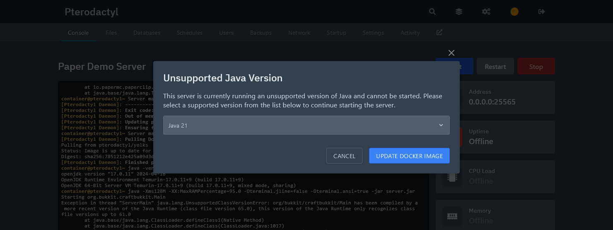
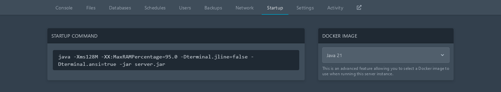

Installing Java is a critical first step to using or developing plugins for Paper and Velocity. 
This guide will walk you through the recommended installation steps for most major
platforms.

:::caution[Do not use headless variants of Java!]

There are `headless` variants of Java which usually have a suffix of `-headless` in their package
name. Those variants miss required dependencies for Paper. Therefore, using them is not recommended.

:::

:::tip

This guide focuses on Amazon's Corretto OpenJDK distribution. This is because it offers the best
installation experience on the most platforms. Corretto is, however, not the only OpenJDK vendor to
choose from. Many alternatives exist such as [Eclipse Adoptium](https://adoptium.net/),
[Microsoft](https://www.microsoft.com/openjdk) and
[Azul Zulu](https://www.azul.com/downloads/?package=jdk). Note that the JDK Oracle distributes,
while functionally identical, is **not** recommended due to an extremely unfriendly installer and
previous hostile licensing.

:::

## Linux

### Ubuntu/Debian

Installing Java 21 on Debian-based Linux distributions is very simple. First, ensure your system has
all required tools to successfully install Java.

```bash
sudo apt-get update && sudo apt-get upgrade
sudo apt-get install ca-certificates apt-transport-https gnupg wget
```

Second, import the Amazon Corretto public key and apt repository.

```bash
wget -O - https://apt.corretto.aws/corretto.key | sudo gpg --dearmor -o /usr/share/keyrings/corretto-keyring.gpg && \
echo "deb [signed-by=/usr/share/keyrings/corretto-keyring.gpg] https://apt.corretto.aws stable main" | sudo tee /etc/apt/sources.list.d/corretto.list
```

Then, install Java 21 and other dependencies using the following command:

```bash
sudo apt-get update
sudo apt-get install -y java-21-amazon-corretto-jdk libxi6 libxtst6 libxrender1
```

Proceed to [verify your installation](#verifying-installation).

### RPM-based

To install Java 21 on CentOS, RHEL, Fedora, openSUSE, SLES, or any other RPM-based Linux
distribution, execute the following commands depending on your package manager. Once you have
finished, precede to [verify your installation](#verifying-installation).

#### DNF

DNF is used on Fedora, CentOS/RHEL 7+, and related distributions.

```bash
sudo rpm --import https://yum.corretto.aws/corretto.key
sudo curl -Lo /etc/yum.repos.d/corretto.repo https://yum.corretto.aws/corretto.repo
sudo dnf -y install java-21-amazon-corretto-devel
```

#### Zypper

Zypper is used on openSUSE, SLES, and related distributions.

```bash
sudo zypper addrepo https://yum.corretto.aws/corretto.repo
sudo zypper refresh
sudo zypper install java-21-amazon-corretto-devel
```

#### YUM

YUM is used on older releases of CentOS/RHEL, and excessively old releases of Fedora.

```bash
sudo rpm --import https://yum.corretto.aws/corretto.key
sudo curl -Lo /etc/yum.repos.d/corretto.repo https://yum.corretto.aws/corretto.repo
sudo yum -y install java-21-amazon-corretto-devel
```

## Windows 10 & 11

If you're on Windows 10 or 11, installing Java is just like installing any other program. Download
the Amazon Corretto installer from
[their website](https://corretto.aws/downloads/latest/amazon-corretto-21-x64-windows-jdk.msi).

Once you have run the installer, it is safe to click "next" through the whole process. No additional
bloatware or toolbars will be installed, and all the required features are enabled out of the box.

Now, open a command prompt and precede to [verify your installation](#verifying-installation).

## macOS/OS X

If you're on macOS, the best way to manage Java installations is with a tool called
[Homebrew](https://brew.sh). Follow the instructions on their homepage to install it. Then, in your
terminal run the following command:

```bash
brew install openjdk@21
```

Once this command has completed, continue to [verify your installation](#verifying-installation).

## Pterodactyl

:::note

On Pterodactyl versions lower than `1.2.0`, an administrator account is required to change the Java
version. These instructions will not apply.

:::

If you have started a Paper server with an incorrect Java version, Pterodactyl will automatically
prompt you to update like this:



If this does not show up for you, the Java version can be manually changed. Navigate to the
"Startup" tab of your server, select `Java 21` from the "Docker Image"
dropdown as shown in the image below.



:::note

If you don't see `Java 21` in the dropdown, an administrator account is required to update the Paper egg.

:::

The Verifying Installation section does not apply for Pterodactyl.

## Verifying Installation

Now that you have installed Java 21, run this command in your terminal to ensure the process was
successful.

```bash
java -version
```

The output should be similar to this. The important parts to look out for is that it starts with
`openjdk 21` and contains `64-Bit` in the last line. If the output you get is similar to
`java: command not found`, try creating a new terminal session.

```
openjdk version "21" 2023-09-19 LTS
OpenJDK Runtime Environment Corretto-21.0.0.35.1 (build 21+35-LTS)
OpenJDK 64-Bit Server VM Corretto-21.0.0.35.1 (build 21+35-LTS, mixed mode, sharing)
```

If your installation has failed, do not hesitate to reach out in the `#paper-help` channel of our
[Discord](https://discord.gg/papermc) for support.
