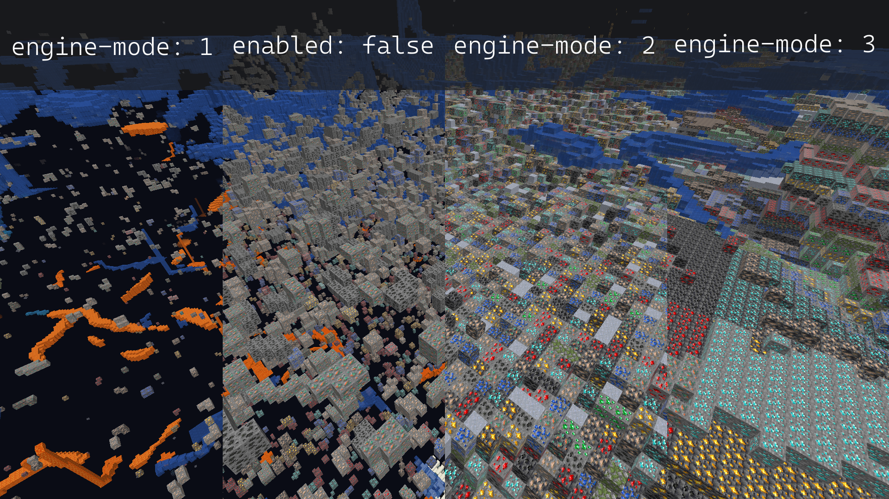
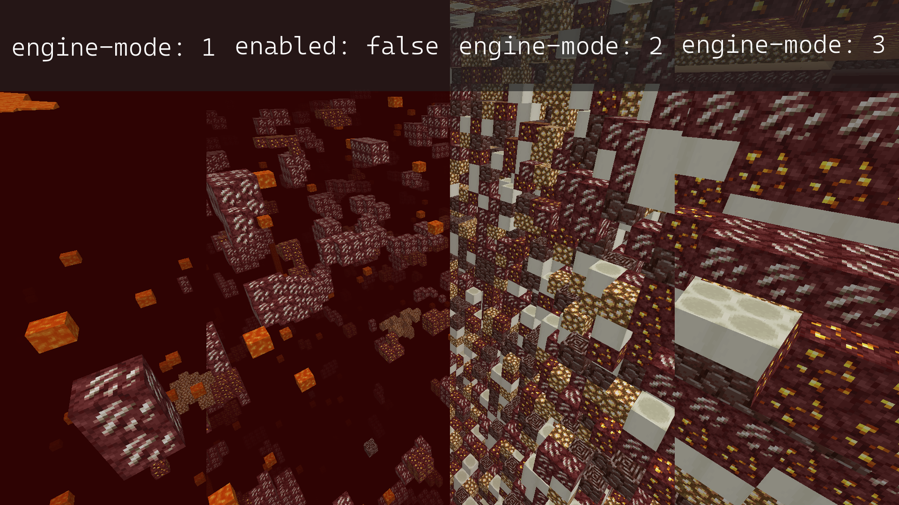

# Configuring Anti-Xray

> Originally written and maintained by [stonar96](https://github.com/stonar96).

Paper includes an obfuscation-based Anti-Xray with two modes, configurable on a per world basis.

:::info Per World Configuration

If you aren't already familiar with per world configuration, please take a moment to familiarize
yourself with the [Configuration Guide](configuration.md).

:::

This guide is a step-by-step walk-through for configuring Anti-Xray. For reference documentation,
refer to the Anti-Xray section of the
[Per-World Configuration Reference](../reference/world-configuration.md#anti-xray).

Anti-Xray has two different modes. `engine-mode: 1` replaces specified blocks (`hidden-blocks`) with
other "fake" blocks, `stone` (`deepslate` at y < 0), `netherrack`, or `end_stone` based on the
dimension. In contrast, `engine-mode: 2` will replace both `hidden-blocks` and `replacement-blocks`
with randomly generated `hidden-blocks`.

The following images[^1] show how each mode will look for a player using Xray with the recommended
configuration in both the overworld and nether.

[^1]:
    Image design by `Oberfail`, initially posted in the
    [PaperMC Discord](https://discord.gg/papermc). ​




Especially on the client side, `engine-mode: 1` is much less computationally intensive, while
`engine-mode: 2` may better prevent Xray. With `engine-mode: 1`, only ores that are entirely covered
by solid blocks will be hidden. Ores exposed to air in caves or water from a lake will not be
hidden. With `engine-mode: 2`, fake ores obstruct the view of real blocks. If `air` is added to
`hidden-blocks`, `engine-mode: 2` will effectively hide all ores, even those exposed to air.

:::caution Anti-Xray Bypasses

**Range Extension**: While Anti-Xray alone will prevent the majority of users from Xraying on your
server, it is not by any means infallible. Because of how Anti-Xray is (and has to be) implemented,
it is possible to, on a default server, extend the range of real ores you can see by a not
insignificant amount. This can be mitigated by any competent anti-cheat plugin; however, this is not
included out of the box.

**Seed Reversing**: Another attack vector is the deterministic nature of Minecraft's world
generation. If the client is able to obtain the world seed, it is able to know the real location of
every generated ore, completely bypassing Anti-Xray. This can be partially worked around by making
it harder for the client to reverse the world seed with the
[`feature-seeds` configuration](../reference/world-configuration.md#feature-seeds), in conjunction
with the structure seed options in `spigot.yml`. Note that this is not a complete solution, and it
may still be possible for a client to obtain the server's world seed. Using a different seed for
each world may also be beneficial.

**Ores Exposed to Air**: In both `engine-mode: 1` and `engine-mode: 2`, it is possible for a client
to view ores that are exposed to air. This can be mitigated in `engine-mode: 2` by adding `air` to
the `hidden-blocks` list. However, doing this may cause client performance issues (FPS drops) for
some players.

:::

## Recommended Configuration

The recommended configuration for both `engine-mode: 1` and `engine-mode: 2` is as follows:

:::tip Spacing

YAML cares about whitespace! The example configuration below is already formatted correctly. Ensure
formatting remains unchanged by using the "copy" button in the top right of each example.

:::

### `engine-mode: 1`

<details>
  <summary>Default World Configuration</summary>

Replace the existing `anticheat.anti-xray` block in `paper-world-defaults.yml` with the following:

<!-- prettier-ignore -->
```yaml title="paper-world-defaults.yml"
anticheat:
  anti-xray:
    enabled: true
    engine-mode: 1
    hidden-blocks:
    # There's no chance to hide dungeon chests as they are entirely surrounded by air, but buried treasures will be hidden.
    - chest
    - coal_ore
    - deepslate_coal_ore
    - copper_ore
    - deepslate_copper_ore
    - raw_copper_block
    - diamond_ore
    - deepslate_diamond_ore
    - emerald_ore
    - deepslate_emerald_ore
    - gold_ore
    - deepslate_gold_ore
    - iron_ore
    - deepslate_iron_ore
    - raw_iron_block
    - lapis_ore
    - deepslate_lapis_ore
    - redstone_ore
    - deepslate_redstone_ore
    lava-obscures: false
    # As of 1.18 some ores are generated much higher.
    # Please adjust the max-block-height setting at your own discretion.
    # https://minecraft.fandom.com/wiki/Ore might be helpful.
    max-block-height: 64
    replacement-blocks:
    # The replacement-blocks list is not used in engine-mode: 1. Changing this will have no effect.
    - stone
    - oak_planks
    - deepslate
    update-radius: 2
    use-permission: false
```

</details>

<details>
  <summary>Nether Configuration</summary>

Copy and paste into your `paper-world.yml` within your nether world folder. See the
[Configuration Guide](configuration.md) for more information.

<!-- prettier-ignore -->
```yml title="world_nether/paper-world.yml"
anticheat:
  anti-xray:
    enabled: true
    engine-mode: 1
    hidden-blocks:
    - ancient_debris
    - nether_gold_ore
    - nether_quartz_ore
    lava-obscures: false
    max-block-height: 128
    replacement-blocks: []
    update-radius: 2
    use-permission: false
```

</details>

<details>
  <summary>End Configuration</summary>

Copy and paste into your `paper-world.yml` within your end world folder. See the
[Configuration Guide](configuration.md) for more information.

<!-- prettier-ignore -->
```yml title="world_the_end/paper-world.yml"
anticheat:
  anti-xray:
    enabled: false
```

</details>

### `engine-mode: 2`

<details>
  <summary>Default World Configuration</summary>

Replace the existing `anticheat.anti-xray` block in `paper-world-defaults.yml` with the following:

<!-- prettier-ignore -->
```yaml title="paper-world-defaults.yml"
anticheat:
  anti-xray:
    enabled: true
    engine-mode: 2
    hidden-blocks:
    # You can add air here such that many holes are generated.
    # This works well against cave finders but may cause client FPS drops for all players.
    - air
    - copper_ore
    - deepslate_copper_ore
    - raw_copper_block
    - diamond_ore
    - deepslate_diamond_ore
    - gold_ore
    - deepslate_gold_ore
    - iron_ore
    - deepslate_iron_ore
    - raw_iron_block
    - lapis_ore
    - deepslate_lapis_ore
    - redstone_ore
    - deepslate_redstone_ore
    lava-obscures: false
    # As of 1.18 some ores are generated much higher.
    # Please adjust the max-block-height setting at your own discretion.
    # https://minecraft.fandom.com/wiki/Ore might be helpful.
    max-block-height: 64
    replacement-blocks:
    # Chest is a tile entity and can't be added to hidden-blocks in engine-mode: 2.
    # But adding chest here will hide buried treasures, if max-block-height is increased.
    - chest
    - amethyst_block
    - andesite
    - budding_amethyst
    - calcite
    - coal_ore
    - deepslate_coal_ore
    - deepslate
    - diorite
    - dirt
    - emerald_ore
    - deepslate_emerald_ore
    - granite
    - gravel
    - oak_planks
    - smooth_basalt
    - stone
    - tuff
    update-radius: 2
    use-permission: false
```

</details>

<details>
  <summary>Nether Configuration</summary>

Copy and paste into your `paper-world.yml` within your nether world folder. See the
[Configuration Guide](configuration.md) for more information.

<!-- prettier-ignore -->
```yml title="world_nether/paper-world.yml"
anticheat:
  anti-xray:
    enabled: true
    engine-mode: 2
    hidden-blocks:
    # See note about air and possible client performance issues above.
    - air
    - ancient_debris
    - bone_block
    - glowstone
    - magma_block
    - nether_bricks
    - nether_gold_ore
    - nether_quartz_ore
    - polished_blackstone_bricks
    lava-obscures: false
    max-block-height: 128
    replacement-blocks:
    - basalt
    - blackstone
    - gravel
    - netherrack
    - soul_sand
    - soul_soil
    update-radius: 2
    use-permission: false
```

</details>

<details>
  <summary>End Configuration</summary>

Copy and paste into your `paper-world.yml` within your end world folder. See the
[Configuration Guide](configuration.md) for more information.

<!-- prettier-ignore -->
```yml title="world_the_end/paper-world.yml"
anticheat:
  anti-xray:
    enabled: false
```

</details>
