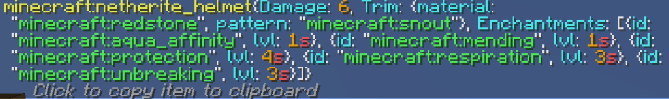

# Built-In Commands

Paper includes a few commands by default.

## The `/paper` command
Permission: `bukkit.command.paper`

It contains many subcommands.


### `/paper debug`
Permission: `bukkit.command.paper.debug` <br>
Usage: `/paper debug chunks`

When executed, a file with info for the server will be generated in the `debug` folder.


### `/paper mobcaps`
Permission: `bukkit.command.paper.mobcaps` <br>
Usage: `/paper mobcaps [world]` Replace [world] with a specific world name.

Not done


### `/paper syncloadinfo`
Permission: `bukkit.command.paper.syncloadinfo`
:::note
This command requires the `-Dpaper.debug-sync-loads=true` startup flag.
:::

If the user has the `bukkit.command.paper.syncloadinfo` permission, they can use the command.
When executed it dumps a file from the sync chunk load debugging system. The file can be found in the `debug` folder.


### `/paper playermobcaps`
Permission: `bukkit.command.paper` <br>
Usage: `/paper playermobcaps`

Not done


### `/paper version`
Permission: `bukkit.command.paper.version`

When you execute the command, it returns the current Paper version and the previous one. If the version is the latest one, it will return that it's up to date.
If the server is not using the latest version, it will return how many versions Paper is behind and a download link.

Example Output:
```
You are 12 version(s) behind
Download the new version at: https://papermc.io/downloads/paper
Previous version: git-Paper-448 (MC: 1.20.4)
```

### `/paper chunkinfo`
Permission: `bukkit.command.paper.chunkinfo` <br>
Usage: `/paper chunkinfo [world]` Replace [world] with a specific world name or leave it empty to see chunk info for all worlds.

Gives info for all chunks in a specified world or in all worlds.

Example Output from the console:
```
[00:00:00 INFO]: Chunks in world:
[00:00:00 INFO]: Total: 529 Inactive: 0 Full: 88 Block Ticking: 80 Entity Ticking: 361
[00:00:00 INFO]: Chunks in world_nether:
[00:00:00 INFO]: Total: 529 Inactive: 0 Full: 88 Block Ticking: 80 Entity Ticking: 361
[00:00:00 INFO]: Chunks in world_the_end:
[00:00:00 INFO]: Total: 529 Inactive: 0 Full: 88 Block Ticking: 80 Entity Ticking: 361
[00:00:00 INFO]: Chunks in ExtraWorld:
[00:00:00 INFO]: Total: 529 Inactive: 0 Full: 88 Block Ticking: 80 Entity Ticking: 361
[00:00:00 INFO]: Chunks in all listed worlds:
[00:00:00 INFO]: Total: 2116 Inactive: 0 Full: 352 Block Ticking: 320 Entity Ticking: 1444
```


### `/paper reload`
Permission: `bukkit.command.paper.reload` <br>
Usage: `/paper reload`
:::warning
This command is not supported by Paper and may cause issues.
If you encounter any issues use the /restart command to restart your server.
:::

Reloads Paper when the command is executed.


### `/paper fixlight`
Permission: `bukkit.command.paper.fixlight` <br>
Usage: `/paper fixlight`

Not done


### `/paper dumplisteners`
Permission: `bukkit.command.paper.dumplisteners` <br>
Usage: `/paper dumplisteners tofile|<className>`

:::tip
The command is useful for debugging when some of your plugins is a suspect for canceling an event.
:::

When executed dumps information about plugin listeners. It takes a name of the listener and dumps information about what plugins that  are listening to that event.


### `/paper dumpitem`
Permission: `bukkit.command.paper.dumpitem` <br>
Usage: `/paper dumpitem`

Dumps info about the item that the player is holding. It can only be used by plyers!

Example Dump: 


### `/paper holderinfo`
Permission: `bukkit.command.paper.holderinfo` 
When executed it dumps info about the chunk system state.

Example Output:
```
[00:00:00 INFO]: Chunks in world:
[00:00:00 INFO]: Total: 2209 Unloadable: 0 Null: 1680 ReadOnly: 0 Proto: 0 Full: 529
[00:00:00 INFO]: Chunks in world_nether:
[00:00:00 INFO]: Total: 2209 Unloadable: 0 Null: 1680 ReadOnly: 0 Proto: 0 Full: 529
[00:00:00 INFO]: Chunks in world_the_end:
[00:00:00 INFO]: Total: 2209 Unloadable: 0 Null: 1680 ReadOnly: 0 Proto: 0 Full: 529
[00:00:00 INFO]: Chunks in ExtraWorld:
[00:00:00 INFO]: Total: 2209 Unloadable: 0 Null: 1680 ReadOnly: 0 Proto: 0 Full: 529
[00:00:00 INFO]: Chunks in all listed worlds:
[00:00:00 INFO]: Total: 8836 Unloadable: 0 Null: 6720 ReadOnly: 0 Proto: 0 Full: 2116
```

### `/paper heap`
Permission: `bukkit.command.paper.heap`
:::warning
The heap dump contains detailed information about your server, which can is sensitive.
Be very careful with who you share the generated heap dump!
:::

When executed it creates a heap dump in the `dumps` folder.


### `/paper entity`
Usage: `/paper entity list [filter] [world]`
**Replace [world] with a specific world name and [filter] with a entity type.**
Example: `/paper entity list minecraft:wolf world`


When executed it dumps shows info for a specified entity (or all entities) in a specific world.

Example Output:
```
[00:00:00 INFO]: Total Ticking: 190, Total Non-Ticking: 19
[00:00:00 INFO]:   27 (0) : minecraft:creeper
[00:00:00 INFO]:   15 (5) : minecraft:chicken
[00:00:00 INFO]:   20 (0) : minecraft:skeleton
[00:00:00 INFO]:   15 (1) : minecraft:pig
[00:00:00 INFO]:   15 (0) : minecraft:bat
[00:00:00 INFO]:   12 (2) : minecraft:chest_minecart
[00:00:00 INFO]:   14 (0) : minecraft:tropical_fish
[00:00:00 INFO]:   13 (0) : minecraft:zombie
[00:00:00 INFO]:   12 (0) : minecraft:sheep
[00:00:00 INFO]:   11 (0) : minecraft:cow
[00:00:00 INFO]:   4 (5) : minecraft:horse
[00:00:00 INFO]:   6 (0) : minecraft:spider
[00:00:00 INFO]:   5 (0) : minecraft:glow_squid
[00:00:00 INFO]:   4 (0) : minecraft:squid
[00:00:00 INFO]:   3 (0) : minecraft:donkey
[00:00:00 INFO]:   2 (1) : minecraft:enderman
[00:00:00 INFO]:   2 (0) : minecraft:cod
[00:00:00 INFO]:   2 (0) : minecraft:drowned
[00:00:00 INFO]:   2 (0) : minecraft:item
[00:00:00 INFO]:   0 (2) : minecraft:ocelot
[00:00:00 INFO]:   2 (0) : minecraft:pufferfish
[00:00:00 INFO]:   0 (2) : minecraft:turtle
[00:00:00 INFO]:   1 (0) : minecraft:boat
[00:00:00 INFO]:   1 (0) : minecraft:dolphin
[00:00:00 INFO]:   1 (0) : minecraft:falling_block
[00:00:00 INFO]:   1 (0) : minecraft:player
[00:00:00 INFO]:   0 (1) : minecraft:wolf
[00:00:00 INFO]: * First number is ticking entities, second number is non-ticking entities
```
