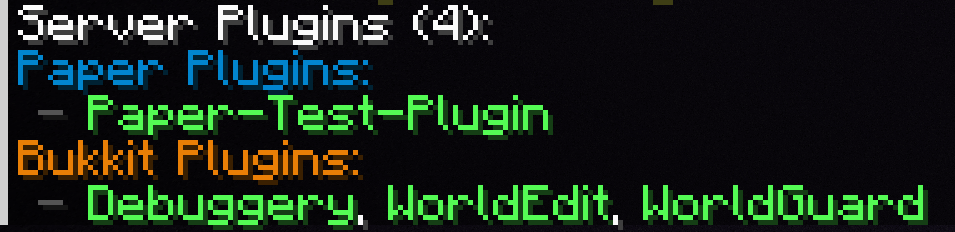

# Lifecycle Plugins

This documentation page serves to explain all the new semantics and possible confusions that lifecycle plugins may introduce.

:::info

Developers can get more information on lifecycle plugins [here](docs/paper/dev/advanced/lifecycle-plugins.mdx).

:::

## What are they?

Lifecycle plugins are plugins which are loaded by Paper's new plugin loading framework. Lifecycle plugins are used by developers to
take advantage of modern systems Mojang provides, for example, datapacks.

## What is the difference?

When enabled, lifecycle plugins are **identical** to traditional paper plugins. This allows plugins to still fully communicate and support each other, meaning that even if a
plugin is a traditional paper plugin or lifecycle plugin, they are both able to depend on each other just fine.

Lifecycle plugins only support being loaded by Paper's Plugin Loader and may use new API unavailable to Bukkit plugins.

### How do I add Lifecycle plugins?

Lifecycle plugins are added the same as traditional paper plugins, therefore, you can follow [this guide](docs/paper/admin/getting-started/adding-plugins.md).

### Cyclic plugin loading

With the introduction of lifecycle plugins, Paper introduces a new plugin loader that fixes some odd issues.
However, as a result, this now causes [cyclic loading](docs/paper/dev/advanced/lifecycle-plugins.mdx#cyclic-plugin-loading) between plugins to no longer be supported.

If Paper detects a loop, your server will be shut down with an error.

:::danger[Legacy]

If your server **requires** this circular loading, you can enable this by adding the [`-Dpaper.useLegacyPluginLoading=true`](system-properties.md#paperuselegacypluginloading) startup flag.
Please note that this may not be supported in the future.

:::
