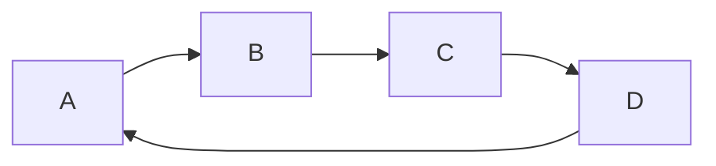

# Paper Plugins

This documentation page serves to explain all the new semantics and possible confusions that Paper plugins may introduce.

*As a developer, you can get more information [here](docs/paper/dev/getting-started/paper-plugins.md)*

## What are they?

Paper plugins are plugins which are loaded by Paper's new plugin loading framework. Paper plugins are used by developers to
take advantage of modern systems Mojang provides, for example, datapacks.


## What is the difference?

When enabled, Paper plugins are **identical** to Bukkit plugins. This allows plugins to still fully communicate and support each other, meaning that even if a
plugin is a Bukkit or Paper plugin, they are both able to depend on each other just fine.

Paper plugins only support being loaded by Paper's Plugin Loader and may use new API unavailable to Bukkit plugins.

### How do I add Paper plugins?

Paper plugins are added the same as Bukkit plugins, therefore, you can follow [this guide](docs/paper/admin/getting-started/adding-plugins.md)

### Cyclic Plugin Loading

With the introduction of Paper plugins, Paper introduces a new plugin loader that fixes some odd issues.
However, as a result, this now causes [cyclic loading](#cyclic-plugin-loading) between plugins to no longer be supported. 



Cyclic loading describes the phenomena when a plugin loading causes a loop which eventually will cycle back to the original plugin.

If Paper detects a loop, your server will be shut down with an error similar to this:
```
Circular plugin loading detected!
Circular load order:
 MyPlugin -> MyOtherPlugin -> MyWorldPlugin -> MyPlugin
Please report this to the plugin authors of the first plugin of each loop or join the PaperMC Discord server for further help.
If you would like to still load these plugins, acknowledging that there may be unexpected plugin loading issues, run the server with -Dpaper.useLegacyPluginLoading=true
Failed to start the minecraft server
```

It is up to plugin developers to resolve these circular loading issues, however, you are able to use the legacy plugin loader if you 
absolutely are unable to resolve this loading loop.


:::danger[Legacy]

If your server **requires** this circular loading, you can enable this by adding the **-Dpaper.useLegacyPluginLoading=true** startup flag.
Please note that this may not be supported in the future.
:::