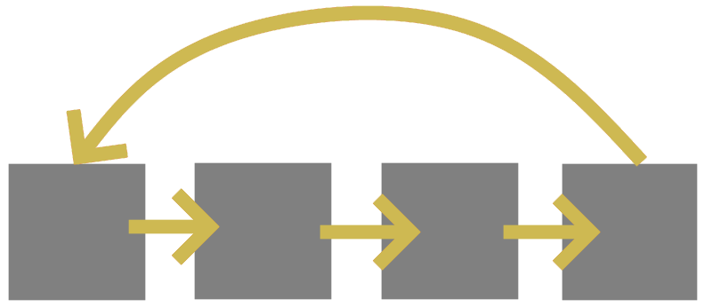

# Paper Plugins

This documentation page serves to explain all the new semantics and possible confusions that Paper plugins may introduce.

*As a developer, you can get more information [here](docs/paper/dev/getting-started/paper-plugins.md)*

## What are they?

Paper plugins are plugins which are loaded by Paper's new plugin loading framework. Paper plugins are used by developers to
take advantage of modern systems Mojang provides, for example, datapacks.


## What is the difference?

When enabled, Paper plugins are **identical** to Bukkit plugins. This allows plugins to still fully communicate and support each other, meaning that even if a
plugin is a Bukkit or Paper plugin, they are both able to depend on each other just fine.

Paper plugins simply note that they may only support being loaded by Paper's Plugin Loader, and may use new modern API that 
Bukkit plugins are not able to utilize.

## How do I add Paper plugins?

Paper plugins are added the same as Bukkit plugins, therefor, you can follow [this guide](docs/paper/admin/getting-started/adding-plugins.md)

## Cyclic Dependency Detection

With the introduction of Paper Plugins, Paper has introduced new modern plugin loading logic that avoids some odd issues of the old system.
However, as a result, this now causes cyclic dependencies between plugins to no longer be supported. 



Cyclic dependencies are when a plugin depends on another plugin which eventually will cycle back to the original plugin.
Essentially, there is a loop causing the plugins to depend on each other, however, this is an infinite cycle.

You can see if you have a cyclic dependency if your server shuts down with an error similar to this:
```
Circular dependencies detected!
You have a plugin that is depending on a plugin which refers back to that plugin. Your server will shut down until these are resolved, or the strategy is changed.
Circular dependencies:
MyPlugin depends on MyPluginDependency depends on MyPlugin...
```

It is up to plugin developers to resolve these circular dependency issues, however, you are able to use the legacy plugin loader if you 
absolutely are unable to resolve this dependency loops.


:::danger Legacy

If your server **requires** these circular dependencies, you can enable this by adding the **-Dpaper.useLegacyPluginLoading=true** startup flag.
Please note that this may not be supported in the future.
:::