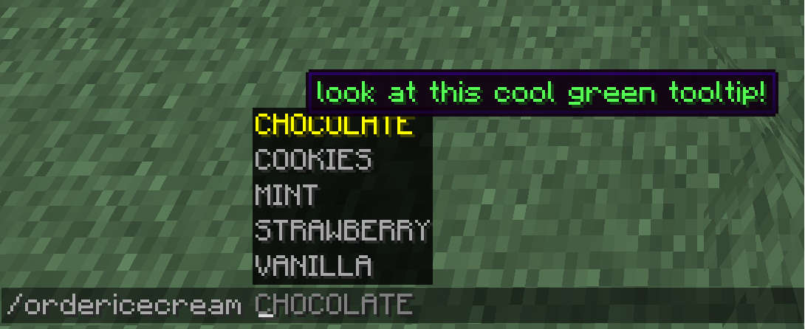
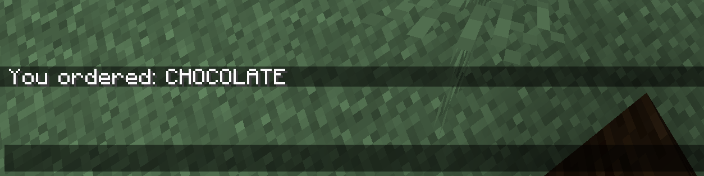

# Arguments

Argument types are datatypes that we can use instead of strings.

:::danger[Experimental]

Paper's command system is still experimental and may change in the future.

:::

## Basic usage of arguments

You can add arguments to a command by doing the following:
```java title="YourPluginClass.java"
public class YourPluginClass extends JavaPlugin {
    @Override
    public void onEnable() {
        final LifecycleEventManager<Plugin> manager = this.getLifecycleManager();
        manager.registerEventHandler(LifecycleEvents.COMMANDS, event -> {
            final Commands commands = event.registrar();
            commands.register(
                Commands.literal("enchantmentargumentcommand")
                .then(
                    Commands.argument("enchantmentargument", ArgumentTypes.resource(RegistryKey.ENCHANTMENT))
                        .executes(ctx -> {
                            ctx.getSource().getSender().sendPlainMessage(
                                ctx.getArgument("enchantmentargument", Enchantment.class).getKey().toString()
                            );
                            return Command.SINGLE_SUCCESS;
                        })
                ).build()
            );
        });
    }
}
```

This command has one argument of the `Enchantment` datatype. When the command is executed, the command
sender will get a message containing the key of the enchantment they selected.

## Advantages over string-based arguments

- Direct conversion to usable type
- Client-side error handling
- Custom types
- Non-alphanumerical sorting

## Argument types

By default, you can use [the registry API](../registries) to get simple argument types like
blocks, items, potions and many more. In the example above, we used the Enchantment
Argument type, but there are many others:

### Predefined types (Registry)

| Registry key name   | Return datatype class | Description                                                                                 |
|---------------------|-----------------------|---------------------------------------------------------------------------------------------|
| GAME_EVENT          | GameEvent             | [Game events](https://minecraft.wiki/w/Sculk_Sensor#Vibration_frequencies)                  |
| STRUCTURE_TYPE      | StructureType         | [Structure types](https://minecraft.wiki/w/Structure#Overworld)                             |
| MOB_EFFECT          | PotionEffectType      | [Potion effect](https://minecraft.wiki/w/Effect#List)                                       |
| BLOCK               | BlockType             | [Block type](https://minecraft.wiki/w/Block#List_of_blocks)                                 |
| ITEM                | ItemType              | [Item type](https://minecraft.wiki/w/Item#List_of_items)                                    |
| CAT_VARIANT         | Cat.Type              | [Cat variants](https://minecraft.wiki/w/Cat#Appearance)                                     |
| FROG_VARIANT        | Frog.Variant          | [Frog variants](https://minecraft.wiki/w/Frog)                                              |
| VILLAGER_PROFESSION | Villager.Profession   | [Villager professions](https://minecraft.wiki/w/Villager#Professions)                       |
| VILLAGER_TYPE       | Villager.Type         | [Villager biome specific type](https://minecraft.wiki/w/Villager#Professions)               |
| MAP_DECORATION_TYPE | MapCursor.Type        | [Types of sprites displayed on a map](https://minecraft.wiki/w/Map#Map_icons)               |
| MENU                | MenuType              | [Menu type](https://minecraft.wiki/w/Minecraft_Wiki:Projects/wiki.vg_merge/Inventory)       |
| ATTRIBUTE           | Attribute             | [Entity attribute](https://minecraft.wiki/w/Attribute)                                      |
| FLUID               | Fluid                 | [Fluid types](https://minecraft.wiki/w/Fluid)                                               |
| SOUND_EVENT         | Sound                 | [Events that trigger sound effects](https://minecraft.wiki/w/Sounds.json#Sound_events)      |
| BIOME               | Biome                 | [Biome type](https://minecraft.wiki/w/Biome#Biome_types)                                    |
| STRUCTURE           | Structure             | [Structures](https://minecraft.wiki/w/Structure#Overworld)                                  |
| TRIM_MATERIAL       | TrimMaterial          | [Materials used to trim armor](https://minecraft.wiki/w/Smithing#Material)                  |
| TRIM_PATTERN        | TrimPattern           | [Trim patterns](https://minecraft.wiki/w/Smithing#Trimming)                                 |
| DAMAGE_TYPE         | DamageType            | [All types of damage dealt to an entity](https://minecraft.wiki/w/Damage_type)              |
| WOLF_VARIANT        | Wolf.Variant          | [Wolf variants](https://minecraft.wiki/w/Wolf#Variants)                                     |
| ENCHANTMENT         | Enchantment           | [Enchantment type](https://minecraft.wiki/w/Enchanting#Summary_of_enchantments)             |
| JUKEBOX_SONG        | JukeboxSong           | Music disc songs                                                                            |
| BANNER_PATTERN      | PatternType           | [Banner patterns](https://minecraft.wiki/w/Banner_Pattern#Variants)                         |
| PAINTING_VARIANT    | Art                   | [Painting variants](https://minecraft.wiki/w/Painting#Canvases)                             |
| INSTRUMENT          | MusicInstrument       | [Goat horns](https://minecraft.wiki/w/Goat_Horn#Playing)                                    |
| ENTITY_TYPE         | EntityType            | [Every entity type](https://minecraft.wiki/w/Entity#Types_of_entities)                      |
| PARTICLE_TYPE       | Particle              | [Every particle type](https://minecraft.wiki/w/Particles_(Java_Edition)#Types_of_particles) |
| POTION              | PotionType            | [Every potion type](https://minecraft.wiki/w/Potion#Effect_potions)                         |
| MEMORY_MODULE_TYPE  | MemoryKey             | Keys for saving per-entity data                                                             |

Paper specifies many more argument types. For more information on them, see <Javadoc name={"io.papermc.paper.command.brigadier.argument.ArgumentTypes"}>ArgumentTypes</Javadoc>.

### Custom types

Custom arguments can be created by implementing the <Javadoc name={"io.papermc.paper.command.brigadier.argument.CustomArgumentType"}>CustomArgumentType</Javadoc>
interface.

Now, let's say that we want to implement a command which lets you order ice cream. For that,
we add an enum that specifies all available values for our custom type.

```java title="IceCreamType.java"
public enum IceCreamType {
    VANILLA,
    CHOCOLATE,
    STRAWBERRY,
    MINT,
    COOKIES
}
```
Now, we have to define the argument itself. We do this by implementing the <Javadoc name={"io.papermc.paper.command.brigadier.argument.CustomArgumentType$Converted"}>CustomArgumentType.Converted</Javadoc> interface:

```java title="IceCreamTypeArgument.java"
public class IceCreamTypeArgument implements CustomArgumentType.Converted<IceCreamType, String> {

    @Override
    public IceCreamType convert(String nativeType) throws CommandSyntaxException {
        try {
            return IceCreamType.valueOf(nativeType.toUpperCase(Locale.ENGLISH));
        } catch (IllegalArgumentException ignored) {
            Message message = MessageComponentSerializer.message().serialize(Component.text("Invalid flavor %s!".formatted(nativeType), NamedTextColor.RED));

            throw new CommandSyntaxException(new SimpleCommandExceptionType(message), message);
        }
    }

    @Override
    public ArgumentType<String> getNativeType() {
        return StringArgumentType.word();
    }

    @Override
    public <S> CompletableFuture<Suggestions> listSuggestions(CommandContext<S> context, SuggestionsBuilder builder) {
        for (IceCreamType flavor : IceCreamType.values()) {
            builder.suggest(flavor.name(), MessageComponentSerializer.message().serialize(Component.text("look at this cool green tooltip!", NamedTextColor.GREEN)));
        }

        return builder.buildFuture();
    }
}
```

We implemented the <Javadoc name={"io.papermc.paper.command.brigadier.argument.CustomArgumentType$Converted"}>CustomArgumentType.Converted</Javadoc>
interface. This interface takes two type arguments: our custom enum, T, and a native Java type called N.

- `convert()` converts the native type (in this case `String`) into our custom type.

- `getNativeType()` returns the type of string that our command argument uses. This uses a single word, so we return `StringArgumentType.word()`.

- `listSuggestions()` returns `CompletableFuture<Suggestions>` so that the client
can suggest all available options. We can even add tooltips to the suggestions to explain them in greater
detail.

We then need to register the command:

```java title="TestPlugin.java"
@Override
public void onEnable() {
    final LifecycleEventManager<Plugin> manager = this.getLifecycleManager();
    manager.registerEventHandler(LifecycleEvents.COMMANDS, event -> {
        final Commands commands = event.registrar();
        commands.register(Commands.literal("ordericecream")
            .then(
                Commands.argument("flavor", new IceCreamTypeArgument())
                    .executes(ctx -> {
                        IceCreamType argumentResponse = ctx.getArgument("flavor", IceCreamType.class);
                        ctx.getSource().getSender().sendMessage(Component.text("You ordered: " + argumentResponse));
                        return Command.SINGLE_SUCCESS;
                    })
            ).build()
        );
    });
}
```

Now that we have registered the command, we can execute it in-game:


Look, we can even see our tooltip and if we execute the command, we get the message we specified:


