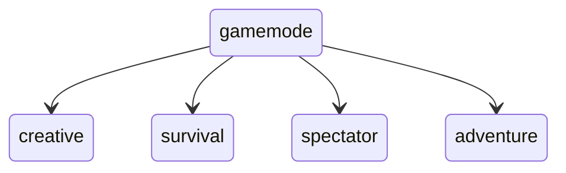

import ValidFloatInput from "./assets/in-game/valid-float.png"
import SmallFloatInput from "./assets/in-game/small-float.png"
import BigFloatInput from "./assets/in-game/big-float.png"
import StringArguments from "./assets/in-game/string-arguments.gif"

# Arguments and Literals

:::note

In the previous site we have looked at the structure of Brigadier commands and how to build up a command tree. If you haven't looked at that site yet, we really recommend doing that
before reading about arguments and literals. You can check out that site [by clicking here](./command-tree)

:::

Each `.then(...)` method of a `LiteralArgumentBuilder<CommandSourceStack>` takes in an abstract `ArgumentBuilder<CommandSourceStack, ?>` object. That abstract ArgumentBuilder
has two implementations: `RequiredArgumentBuilder` and `LiteralArgumentBuilder`. When coding with Brigadier, we create these objects by running either `Commands.literal(String)`
for the `LiteralArgumentBuilder` and `Commands.argument(String, ArgumentType)` for the `RequiredArgumentBuilder`.

For the sake of simplicity, We refer to the `RequiredArgumentBuilder` as a generic argument builder, and the `LiteralArgumentBuilder` as a generic literal builder.

As an explanation to what the difference is, you can picture it like this:
* An argument is a variable input by the user. It is semi-unpredictable, but will always return a valid entry of the object that it is backing.
* A literal is a non-variable input by the user. It is mainly defined as a way to define predictable input, since each literal is a new branch on our command tree.

## Literals
In code, literals generally can not be accessed. Yet, due to the nature of our command tree, we can always know on what literal branch we currently are:
```java
Commands.literal("plant")
    .then(Commands.literal("tree") /* Here we are on /plant tree */)
    .then(Commands.literal("grass") /* Here we are on /plant grass */);
```

This makes literals perfect for a command like `/gamemode`. The gamemode command has only 4 valid input: `creative`, `survival`, `spectator`, and `adventure`.
We can represent this gamemode command using the following tree:
<p align="center">

</p><br></br>
In code, it would look like this:
```java
Commands.literal("gamemode")
    .then(Commands.literal("creative")
        .executes(ctx -> /* Set player's gamemode to creative */)
    )

    .then(Commands.literal("survival")
        .executes(ctx -> /* Set player's gamemode to survival */)
    )

    .then(Commands.literal("spectator")
        .executes(ctx -> /* Set player's gamemode to spectator */)
    )

    .then(Commands.literal("adventure")
        .executes(ctx -> /* Set player's gamemode to adventure */)
    );
```

You may have noticed the use of the `.executes(...)` method. This method defines the execution logic of a node. If the player sends `/gamemode`, without any arguments, it
will not even run, as our root node does not have a executor defined. Contrary, if the player executes `/gamemode creative`, it will run the code in the first `executes` method.
We are not going to go into detail of the stuff that you can do inside a `execute` method, as that is out of scope for this site. If you want to read up on those, you should
check out the [Extensive Guide on Command Execution](./command-executors) after you finish reading this.

## Arguments
Arguments are slightly more complex. They also define a new branch in a tree, but they are not directly predictable. Each argument is created using `Commands.argument(String, ArgumentType<T>)`.
That method returns a `RequiredArgumentBuilder`. The T type parameter declares the return type of the argument, which you can then use inside your `executes` method. That means that
if you put in an `ArgumentType<Integer>`, you can retrieve the value of that argument as an integer, requiring no manual parsing! The only issue is, how do we create an `ArgumentType`
object? There are a few build-in, primitive argument types that you should definitely be aware of:

|               Name                | Return value  |  Possible Input   |                                    Description                                     |
|-----------------------------------|---------------|-------------------|------------------------------------------------------------------------------------|
| BoolArgumentType.bool()           | Boolean       | true/false        | Only allows a boolean value                                                        |
| IntegerArgumentType.integer()     | Integer       | 253, -123, 0      | Any valid integer                                                                  |
| LongArgumentType.longArg()        | Long          | 25418263123783    | Any valid long                                                                     |
| FloatArgumentType.floatArg()      | Float         | 253.2, -25.0      | Any valid float                                                                    |
| DoubleArgumentType.doubleArg()    | Double        | 4123.242, -1.1    | Any valid double                                                                   |
| StringArgumentType.word()         | String        | no_spaces         | A single word. May only contain letters and underscores                            |
| StringArgumentType.string()       | String        | "with spaces"     | A single word, or a valid string with spaces, if quoted                            |
| StringArgumentType.greedyString() | String        | unquoted spaces   | The literal written input. May contain any characters. Has to be the last argument |

### Boolean argument type and argument parsing
The BoolArgumentType can be used for enabling/disabling options. Like if we have a `/serverflight` command, which toggles every members ability to fly, we could add a boolean argument
onto that, which would allow for `/serverflight true` and `/serverflight false`:
```java title="ServerFlightCommand.java"
Commands.literal("serverflight")
    .then(Commands.argument("allow", BoolArgumentType.bool())
        .executes(ctx -> {
            boolean allowed = ctx.getArgument("allow", boolean.class);
            /* Toggle server flying with this value now */

            return Command.SINGLE_SUCCESS;
        })
    );
```
Here, you can see how one would access an argument in-code. The first parameter for the `Commands.argument(String, ArgumentType)` method takes in the node name. This is not required
by literals, as their name is the same as their value. But here we need a way to access the argument. The parameter of the executes-lambda has a method called 
`T getArgument(String, Class<T>)`. The first parameter is the name of the method we want to retrieve. The second parameter is the return value of the argument. As we are using
a boolean argument, we put in `boolean.class` and retrieve the argument value as such. Another thing to notice is the return clause. The executes method requires an integer to be returned.
This is mostly irrelevant, but the `Command` class has a static constant called `SINGLE_SUCCESS`, which you can return, marking the command as successfully executed.

### Number arguments
All of the number arguments (like `IntegerArgumentType.integer()`) have three overloads:

|                     Overload                      |                        Description                        |
|---------------------------------------------------|-----------------------------------------------------------|
| `IntegerArgumentType.integer()`                   | Any value between Integer.MIN_VALUE and Integer.MAX_VALUE |
| `IntegerArgumentType.integer(int min)`            | Any value between min and Integer.MAX_VALUE               |
| `IntegerArgumentType.integer(int min, int max)`   | Any value between min and max                             |

This is particularly useful for filtering out too high or too low input. As an example, we can define a `/flyspeed` command. As the `Player#setFlySpeed(float value)` method only 
accepts floats between -1 and 1, where -1 is an inverse direction, it would make sense to limit the values between 0 and 1 for allowed, non-negative speeds. That can be
achieved with the following command tree:
```java title="FlightSpeedCommand.java"
Commands.literal("flyspeed")
    .then(Commands.argument("speed", FloatArgumentType.floatArg(0, 1.0f))
        .executes(ctx -> {
            float speed = ctx.getArgument("speed", float.class);
            /* Set player's flight speed */
            return Command.SINGLE_SUCCESS;
        })
    );
```

Now, if we input a valid float between 0 and 1, the command would execute correctly:
<div style={{display: 'inline-block', width: '100%'}}>
    
</div>

But if we input a too small or too big float, it would throw an error **on the client**:
<div style={{display: 'inline-block', width: '100%'}}>
    
    
</div><br/><br/>

This is the main advantage of native arguments: The client itself performs simple error checking on the arguments, which makes user experience whilst running a command
way better, as they can see invalid input without sending the command to the server.

### String arguments
There is three string arguments: `word`, `string`, and `greedyString`.

The `word` string argument is the simplest one of these. It only accepts a single word without any quotes or special characters. The only special character you can use is a underscore.
* ✅ `this_is_valid_input`
* ❌ `this is invalid input`
* ❌ `"also_invalid"`
* ✅ `10_numbers_are_valid`
* ❌ `@_@`

The `string` argument is slightly more complicated. If unquoted, it follows the same rules as the `word` argument. Only letters and underscores. But if you put your string into quotes,
you can enter any combination of unicode characters you want to. Special characters, like quotes `"`, can be escaped using a backslash `\`.
* ✅ `this_is_valid_input`
* ✅ `"\"quotes\""`
* ❌ `this is invalid input`
* ✅ `"this is valid input again"`
* ✅ `"also_valid"`
* ✅ `"紙の神"`

The `greedyString` argument is the only argument which does not perform any parsing. Due to its "greedy" nature, it does not allow any arguments after its declaration. That also means, that
any input is completely valid and it requires no quotes. In fact, quotes are counted as literal characters.
* ✅ `this_is_valid_input`
* ✅ `this is valid as well input`
* ✅ `"this is valid input again"`
* ✅ `also_valid`
* ✅ `紙の神`

Here you can see the arguments in action:
<div style={{display: 'inline-block', width: '100%'}}>
    
</div>

## Further reference
It is suggested that you visit our [Extensive Guide on Command Execution](./command-executors) in order to read more about the `.executes(...)` method. It contains a lot of useful information
that is required for fully understanding Brigadier commands. 

### Minecraft arguments
Apart from these build-in Brigadier arguments, countless custom arguments are defined by Paper as well. These can be accessed in a static context with the `ArgumentTypes` class. You
can read more about these **here**. (WIP).

### Custom arguments
Sometimes you want to define your own, custom arguments. For that you can implement the `CustomArgumentType<T, N>` interface. For more details, you should check out **this** site. (WIP).