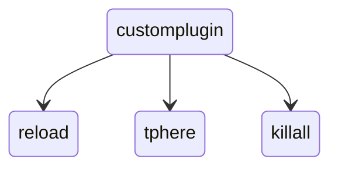
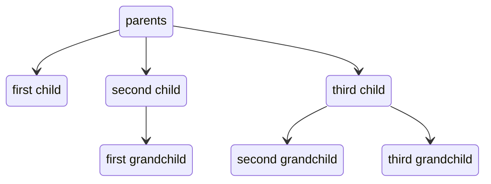

import Tree from './assets/forest/tree.png'
import DescribedTree from './assets/forest/tree-descriptions.png'

# Brigadier Command Trees
What is a command tree and in what way does it have anything to do with the usage of .then(...)? If you are confused, this is the page for you! Here we will take an 
extensive look at everything you need to know to understands command tree!

:::note

This is meant as a full-on course about the structure of Brigadier commands. This site provides no information about executing branches or general arguments, only literals.
It is suggested that you look in here if you are new to Brigadier programming.

:::

## So - What is a tree?
When talking about trees, the first that comes to mind is a tree in the wild. One that may look like this:

<CenteredImage src={Tree} width={300}/>
So, what does this have to do with our commands now? Well imagine a command that looks like this: 
```yml title="A Generic Command"
/customplugin reload
/customplugin tphere
/customplugin killall
```
<br></br>
For the sake of simplicity, we will refer to `/customplugin` (without any arguments) as our "command" or "tree" root. Each argument after our "root" is referred to as a "branch".
You can visualize this on our generic tree like this:

<CenteredImage src={DescribedTree} width={300}/>
<br></br>

Having to draw a tree each time like this is exhausting and usually does not get to the point though. We can visualize trees using a **tree diagram**. This would look like this:
<p align="center">

</p>

It is way easier to understand the root/branch relationship of elements now. The root is the element that does is not owned by another element. Which is 'customplugin' here.
The other elements have an arrow pointing **at** then. That means they are a branch of that element, also called a child. Visualizing trees as a parent/child relationships can be quite
useful for understand it too. They follow a similar structure:
<p align="center">

</p><br></br>

It is important to remember that this tree-like structure is not only important for Brigadier. It is a fairly often used concept. Paper's included **Adventure API** also operates using
a tree. Why is this important for using Brigadier though? Well, it allows for explicit command declaration. Being at a node, you know exactly where you are. That means you do not have
to, like in standard Bukkit way, first check whether the amount of arguments is 2 and the first argument is `tphere`. Because you are at that exact `tphere` node, you can just start writing
your logic. If you want to learn more about the execute logic of Brigadier commands, it is suggested that you check out our [Extensive Guide on Command Execution](./command-execution.mdx).

## How can we visualize a tree in-code?
Well, we can define our root like this:
```java
Commands.literal("customplugin");
```
<br></br>
This method returns a `LiteralArgumentBuilder<CommandSourceStack>`. That is a class that allows us to add branches to it using the `.then(...)` method, like this:
```java
LiteralArgumentBuilder<CommandSourceStack> root = Commands.literal("customplugin");
root.then(Commands.literal("reload"));
root.then(Commands.literal("tphere"));
root.then(Commands.literal("killall"));
```
<br></br>
Each of these `.then(...)` methods adds a new branch to our root. You may have noticed the repeated use of `Commands.literal(String)` here. It does not only define the root of the root
of our command, but also our "subcommands" (`reload`, `tphere`, and `killall`). Each "child" literal is referred to as a subcommand of its parent. So as example, here, `b` would be
considered a subcommand of `a`:
```java title="Subcommands"
Commands.literal("a").then(Commands.literal("b"));
```

## Creating a more advanced command
But what if we want a more complex command? Let's say we want to define the following command:
```yml title="Advanced Command"
/advanced
 ┣━┳ killall
 ┃ ┣━━ entities
 ┃ ┣━━ players
 ┃ ┗━━ zombies
 ┗━┳ eat
   ┣━━ ice-cream
   ┗━━ main-dish
```
Which allows for the following command executions in-game:
```
/advanced killall entities
/advanced killall players
/advanced killall zombies
/advanced eat ice-cream
/advanced eat main-dish
```

As this is a fairly complicated command, we can visualize it as a tree graph first in order to we have a better understanding on what is going on:

<p align="center">

</p>

Having defined our target command, how can we go about this now? There is a few possible ways, but the simplest one is defining **furthest from root** first. That means we are first
defining the last branches of our entire tree. So those, which have no subcommands:
```java
LiteralArgumentBuilder<CommandSourceStack> entities = Commands.literal("entities");
LiteralArgumentBuilder<CommandSourceStack> players = Commands.literal("players");
LiteralArgumentBuilder<CommandSourceStack> zombies = Commands.literal("zombies");

LiteralArgumentBuilder<CommandSourceStack> iceCream = Commands.literal("ice-cream");
LiteralArgumentBuilder<CommandSourceStack> mainDish = Commands.literal("main-dish");
```
This grants us the deepest elements in our tree.
<p align="center">

</p><br></br>

Now, we can define the next layer of literals: So the `killall` and `eat` ones:
```java
LiteralArgumentBuilder<CommandSourceStack> killall = Commands.literal("killall");
LiteralArgumentBuilder<CommandSourceStack> eat = Commands.literal("eat");
```
Visualized in our tree graph:
<p align="center">

</p><br></br>

With these defined, we can add our child elements to their parent element, like this:
```java
killall.then(entities);
killall.then(players);
killall.then(zombies);

eat.then(iceCream);
eat.then(mainDish);
```
Which gives us this, somewhat tree-like structure
<p align="center">

</p><br></br>

Finally, we can create our **root node** and add our `killall` and `eat` subcommands to it:
```java
LiteralArgumentBuilder<CommandSourceStack> advancedCommandRoot = Commands.literal("advanced");
advancedCommandRoot.then(killall);
advancedCommandRoot.then(eat);
```
And this returns the final command tree:
<p align="center">

</p><br></br>
And we are done!

## Chaining 'then' method calls together
You might have noticed that it feels unnecessarily verbose to have to store every child node in its own variable. But here is where the `.then()` argument
comes to rescue. It returns the same element as it was called on. That means if we were to run this code:
```java
LiteralArgumentBuilder<CommandSourceStack> value = killall.then(entities);
if (value == killall) {
    logger.info("The return value is the same as killall");
}
```
We would always have "The return value is the same as killall" printed out. And we can take advantage of that by **chaining the `then(...)` calls together**, like this:
```java
killall.then(entities).then(players).then(zombies);
```
Due to the unreadable nature of chained method calls, we should give each branch a new line:
```java
killall
    .then(entities)
    .then(players)
    .then(zombies);
```
<br></br>

With this, we also do not have to store every single literal in its own variable, instead we can directly pass them into the `.then(...)` method:
```java
killall
    .then(Commands.literal("entities"))
    .then(Commands.literal("players"))
    .then(Commands.literal("zombies"));
```
<br></br>
The same can be done for the `eat` subcommand:
```java
eat
    .then(Commands.literal("ice-cream"))
    .then(Commands.literal("main-dish"));
```
<br></br>

Taking even more advantage of the **builder pattern of the .then() method**, we can put these chained branches directly on the initial creation of our subcommand. Like this:
```java
LiteralArgumentBuilder<CommandSourceStack> eat = Commands.literal("eat")
    .then(Commands.literal("ice-cream"))
    .then(Commands.literal("main-dish"));

LiteralArgumentBuilder<CommandSourceStack> killall = Commands.literal("eat")
    .then(Commands.literal("entities"))
    .then(Commands.literal("players"))
    .then(Commands.literal("zombies"));


LiteralArgumentBuilder<CommandSourceStack> advancedCommandRoot = Commands.literal("advanced");
advancedCommandRoot.then(killall);
advancedCommandRoot.then(eat);
```
<br></br>
Now then, you might know where we are going with this. As our root node also registers its branches using the `.then(...)` method, we can do the same there:
```java
LiteralArgumentBuilder<CommandSourceStack> advancedCommandRoot = Commands.literal("advanced")
    .then(Commands.literal("eat")
        .then(Commands.literal("ice-cream"))
        .then(Commands.literal("main-dish"))
    )
    .then(Commands.literal("eat")
        .then(Commands.literal("entities"))
        .then(Commands.literal("players"))
        .then(Commands.literal("zombies"))
    );
```

:::warning

You have to be extremely careful when nesting branches, as the command turns into a completely different one when you misplace a bracket. __Click here__ for more information
on that (WIP)

:::

## Additional resources
Hopefully, you understand Brigadier's tree structure now. For more resources on Brigadier, check out these other sites:
* **Arguments and Literals**
* **Advanced Usages of Literals**
* **FAQ**