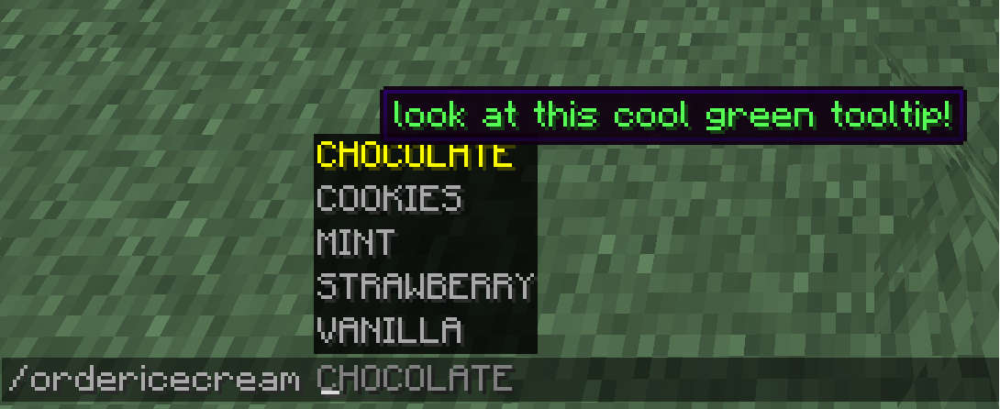

# Arguments

Argumenttypes are datatypes that we can use instead of strings.

:::danger[Experimental]

Paper's command system is still experimental and may change in the future.

:::

## Basic usage of arguments

You can add arguments to a command by doing the following:
```java title="YourPluginClass.java"
public class YourPluginClass extends JavaPlugin {
    @Override
    public void onEnable() {
        LifecycleEventManager<Plugin> manager = this.getLifecycleManager();
        manager.registerEventHandler(LifecycleEvents.COMMANDS, event -> {
            final Commands commands = event.registrar();
            commands.register(
                Commands.literal("enchantmentargumentcommand")
                .then(
                    Commands.argument("enchantmentargument", ArgumentTypes.resource(RegistryKey.ENCHANTMENT))
                        .executes(ctx -> {
                            ctx.getSource().getSender().sendPlainMessage(
                                ctx.getArgument("enchantmentargument", Enchantment.class).getKey().asString()
                            );
                            return Command.SINGLE_SUCCESS;
                        })
                ).build()
            );
        });
    }
}
```

This command has one argument of the `Enchantment` datatype. When the command is executed, the command
sender will get a message containing the key of the enchantment they selected.

## Advantage over string-based arguments

- Direct conversion to usable type
- Client-side error handling
- Custom types
- Non alphanumerical sorting

## Enchantment types

By default, you can use [registries](../registries) to get simple argument types like
blocks, items, potions and many more. In the example above, we used the Enchantment 
Argument type but there are many others:

### Predefined types (Registry)

| Registry key name   | Return datatype class | Description                                                                                                                                                                                                                                                                                  |
|---------------------|-----------------------|----------------------------------------------------------------------------------------------------------------------------------------------------------------------------------------------------------------------------------------------------------------------------------------------|
| GAME_EVENT          | GameEvent             | Events in the game (eating, flying with an elytra etc.)                                                                                                                                                                                                                                      |
| STRUCTURE_TYPE      | StructureType         | [Structures](https://minecraft.wiki/w/Structure#Overworld)
| INSTRUMENT          | CraftMusicInstrument  | [Note block instrument](https://minecraft.wiki/w/Note_Block)                                                                                                                                                                                                                                 |
| ENCHANTMENT         | Enchantment           | [Enchantment type](https://minecraft.wiki/w/Enchanting#Summary_of_enchantments)                                                                                                                                                                                                                                     |
| MOB_EFFECT          | PotionEffectType      | [Potion effect](https://minecraft.wiki/w/Effect#List)                                                                                                                                                                                                                                             |
| BLOCK               | BlockType             | [Block type - not modifiable](https://minecraft.wiki/w/Block#List_of_blocks)                                                                                                                                                                                                                                                          |
| ITEM                | ItemType              | [Item type - not modifiable](https://minecraft.wiki/w/Item#List_of_items)                                                                                                                                                                                                                                                                            |
| BIOME               | Biome                 | [Biome type](https://minecraft.wiki/w/Biome#Biome_types)                                                                                                                                                                                                                                     |
| TRIM_MATERIAL       | TrimMaterial          | [Materials used to trim armor](https://minecraft.wiki/w/Smithing#Material)                                                                                                                                                                                                                   |
| TRIM_PATTERN        | TrimPattern           | [Trim patterns](https://minecraft.wiki/w/Smithing#Trimming)                                                                                                                                                                                                                                  |
| DAMAGE_TYPE         | DamageType            | [All types of damage dealt to an entity](https://minecraft.wiki/w/Damage_type)                                                                                                                                                                                                               |
| WOLF_VARIANT        | Wolf.Variant          | [Wolf variants since 1.20.5](https://minecraft.wiki/w/Wolf#Variants)                                                                                                                                                                                                                         |
| PAINTING_VARIANT    | Art                   | [All paintings](https://minecraft.wiki/w/Painting#Canvases)                                                                                                                                                                                                                                  |
| ATTRIBUTE           | Attribute             | [Entity attribute](https://minecraft.wiki/w/Attribute)                                                                                                                                                                                                                                       |
| BANNER_PATTERN      | PatternType           | [Armor Pattern type](https://minecraft.wiki/w/Banner_Pattern#Variants)                                                                                                                                                                                                                       |
| CAT_VARIANT         | Cat.Type              | [Cat variants](https://minecraft.wiki/w/Cat#Appearance)                                                                                                                                                                                                                                      |
| ENTITY_TYPE         | EntityType            | [Every entity type](https://minecraft.wiki/w/Entity#Types_of_entities)                                                                                                                                                                                                                                         |
| PARTICLE_TYPE       | Particle              | [Every particle type](https://minecraft.wiki/w/Particles_(Java_Edition)#Types_of_particles)                                                                                                                                                                                                                     |
| POTION              | PotionType            | [Every potion type](https://minecraft.wiki/w/Potion#Effect_potions)                                                                                                                                                                                                                          |
| SOUND_EVENT         | Sound                 | [Events that trigger sound effects](https://minecraft.wiki/w/Sounds.json#Sound_events)                                                                                                                                                                                                       |
| VILLAGER_PROFESSION | Villager.Profession   | [Villager professions](https://minecraft.wiki/w/Villager#Professions)                                                                                                                                                                                                                        |
| VILLAGER_TYPE       | Villager.Type         | [Villager biome specific type](https://minecraft.wiki/w/Villager#Professions)                                                                                                                                                                                                                |
| MEMORY_MODULE_TYPE  | MemoryKey             | Keys for saving per-entity data                                                                                                                                                                                                                                                              |
| FROG_VARIANT        | Frog.Variant          | [Frog variants](https://minecraft.wiki/w/Frog)                                                                                                                                                                                                                                               |
| MAP_DECORATION_TYPE | MapCursor.Type        | [Types of sprites displayed on a map](https://minecraft.wiki/w/Map#Map_icons)                                                                                                                                                                                                                |
| FLUID               | Fluid                 | [Fluid types](https://minecraft.wiki/w/Fluid)     

Brigadier itself also specifies many argument types. For more information on them, see <Javadoc name={"io.papermc.paper.command.brigadier.argument.ArgumentTypes"}>LifecycleEventManager</Javadoc>

### Custom types

Custom arguments can be created by implementing the <Javadoc name={"io.papermc.paper.command.brigadier.argument.CustomArgumentType"}>CustomArgumentType</Javadoc> 
interface. 

Now, lets say that we want to implement a command which lets you order ice cream. For that,
we add an enum that specifies all available values for our custom type.

```java 
public enum IceCreamType {
    VANILLA,
    CHOCOLATE,
    STRAWBERRY,
    MINT,
    COOKIES
}
```
Now, we have to define the argument itself. We do this by implementing the <Javadoc name={"io.papermc.paper.command.brigadier.argument.CustomArgumentType$Converted"}>CustomArgumentType.Converted</Javadoc> interface:

```java
public class IceCreamTypeArgument implements CustomArgumentType.Converted<IceCreamType, String> {

    @Override
    public @NotNull IceCreamType convert(String nativeType) throws CommandSyntaxException {
        try {
            return IceCreamType.valueOf(nativeType.toUpperCase());
        } catch (Exception e) {
            Message message = MessageComponentSerializer.message().serialize(Component.text("Invalid flavor %s!".formatted(nativeType), NamedTextColor.RED));

            throw new CommandSyntaxException(new SimpleCommandExceptionType(message), message);
        }
    }

    @Override
    public @NotNull ArgumentType<String> getNativeType() {
        return StringArgumentType.word();
    }

    @Override
    public <S> CompletableFuture<Suggestions> listSuggestions(CommandContext<S> context, SuggestionsBuilder builder) {
        for (IceCreamType flavor : IceCreamType.values()) {
            builder.suggest(flavor.name(), MessageComponentSerializer.message().serialize(Component.text("look at this cool green tooltip!", NamedTextColor.GREEN)));
        }

        return CompletableFuture.completedFuture(
                builder.build()
        );
    }
}
```

That's a lot of code, so let's start from the top. We implemented the <Javadoc name={"io.papermc.paper.command.brigadier.argument.CustomArgumentType$Converted"}>CustomArgumentType.Converted</Javadoc>
interface. This interface takes two type arguments: our custom enum, T, and a type that is native to 
Minecraft, such as String, Integer, etc., called N. The native type exists so that the client can use
the input data, as it doesn't know what our custom `IceCreamType` is.

The first method called `convert()` converts the native type (in this case `String`)
into our own custom type called `IceCreamType`, as the name suggests. This is so we 
can keep using our custom type internally. If we wouldn't do that, there would be no point in using a 
custom type. If the specified input isn't found in our enum of available flavors, we
output an error.

The second method called `getNativeType()` returns the type of string that our command argument uses.
In our case, we're using a single word, so we return `StringArgumentType.word()`.

In the last method, `listSuggestions()`, we return `CompletableFuture<Suggestions>` so that the client
can suggest all available options. We can even add tooltips to the suggestions to explain them in greater
detail. 

As a last step, we need to register the Command:

```java
public void onEnable() {
    LifecycleEventManager manager = this.getLifecycleManager();
    manager.registerEventHandler(LifecycleEvents.COMMANDS, event -> {
        final Commands commands = event.registrar();
        commands.register(Commands.literal("ordericecream")
            .then(
                Commands.argument("flavor", new IceCreamTypeArgument()).executes((commandContext -> {
                    IceCreamType argumentResponse = commandContext.getArgument("flavor", IceCreamType.class); 
                    commandContext.getSource().getSender().sendMessage(Component.text("You ordered: " + argumentResponse));
                    return 1;
                }))
            ).build()
        );
    });
}
```

Now that we have registered the command, we can execute it ingame:


Look, we can even see our tooltip and if we execute the command, we get the message we specified


