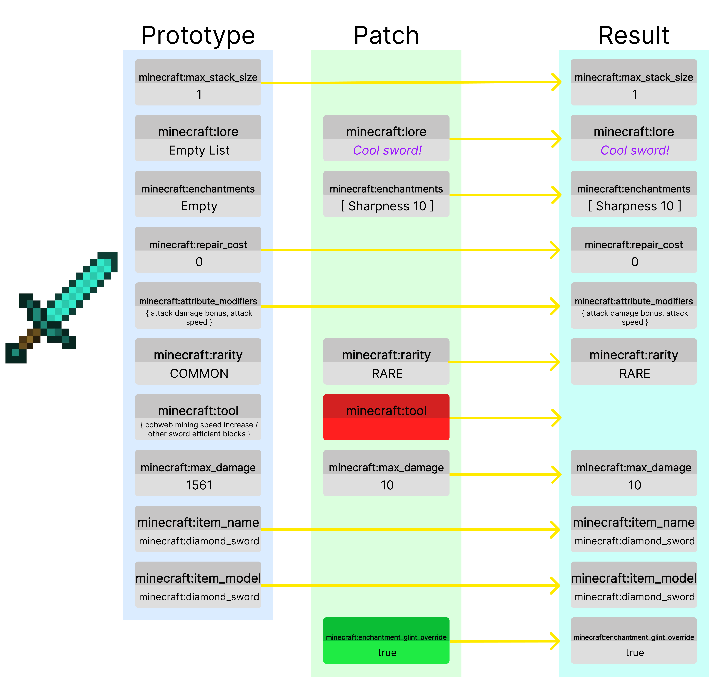

# Data Component API

:::danger[Experimental]
The DataComponent API is currently experimental, and is additionally subject to change across versions.
:::

The Data Component API provides a version-specific, programmatic interface for accessing and manipulating item data that is otherwise not representable by the `ItemMeta` API. Through this API, you can read and write properties of an item—called "data components"—in a stable and object-oriented manner.

## Introduction

### What is a Data Component?
A data component represents a piece of data associated with an item. Vanilla items can have properties such as custom model data, container loot contents, banner patterns, or potion effects.
### Structure

See implementation [here](#example-cool-sword)

#### The Prototype (Default Values)
Items come with an initial set of components that we call the prototype.
These components are defined on the `ItemType` of the `ItemStack`. They control the base behavior
of the item, representing a brand new item without any modifications.

The prototype gives items their initial properties such as if they are food, a tool, a weapon, etc.

#### The Patch
The patch represents the modifications made to the item. This may include giving it a custom name,
modifying the enchantments, damaging it, or adding to the lore. The patch is applied ontop of the prototype,
allowing us to make modifications to an item.

The patch also allows for removing components that were previously in the prototype, this is shown by
the `minecraft:tool` example in red. We are removing this component, so this sword item will no longer
break cobweb / other sword blocks faster.

We can also add new components, as seen from the new `minecraft:enchantment_glint_override` component, which
allows us to make it appear with a glint.


## Differences Compared to `ItemMeta`

The `ItemMeta` API provides methods to modify `ItemStack`s in a hierarchical manner, such `CompassMeta` allowing you to modify the components of a `minecraft:compass`.
While `ItemMeta` is still very useful, it does not properly represent this new prototype/patch relationship that Minecraft items now use.

### Key Differences

#### Expanded Data Model
The Data Component API exposes a much broader and more detailed set of item properties than `ItemMeta`.
DataComponents allow the entire component to be modified in a fashion that better represents how Minecraft does item modifications.

#### Version-Specific
The Data Component API is designed to adapt to version changes. The Data Component API may experience breaking changes on version updates as Minecraft makes changes to components.
Backwards compatability is not promised.

Because ItemMeta is represented in a different format, breaking changes made to components by Mojang may not result in breaking changes to `ItemMeta`.

#### Builders and Immutability
Many complex data components require a builder approach for construction and editing. All data types that are returned by the api are also immutable, so they will not directly modify the component.

#### Patch-Only
ItemMeta represents the patch of an ItemStack only. This means that you cannot get the original properties (prototype) of the ItemStack, such as its default
durability or default attributes.

#### No Snapshot
Currently, ItemMeta represents a *Snapshot* of an ItemStack's patched map.
This is expensive as it requires the entire patch to be read, even values that you may not be using.

The DataComponent API integrates directly with `ItemStack`. Although conceptually similar, the Data Component API focuses on explicit, strongly typed data retrieval and updates without this additional overhead.

### When should I use `DataComponents` or `ItemMeta`?
#### `ItemMeta`
- Simple changes to `ItemStacks`
- Keep the most version compatability with your plugin
#### `DataComponent`
- More complicated `ItemStack` modifications
- Do not care about cross-version compatability
- Want to access default (prototype) values
- Want to remove components from an ItemStack's prototype

## Basic Usage
The DataComponent API will fetch values according to the behavior seen in game. So, if the patch removes the `minecraft:tool` component,
trying to get that component will return null.

### Getting a Default (Prototype) value

```java
// Get the default durability of diamond sword
int defaultDurability = Material.DIAMOND_SWORD.getDefaultData(DataComponentTypes.MAX_DAMAGE)
```

### Checking for a Data Component

```java
// Check if this item has a custom name data component
boolean hasCustomName = stack.hasData(DataComponentTypes.CUSTOM_NAME);
System.out.println("Has custom name? " + hasCustomName);
```

### Getting a Valued Data Component

```java
// Suppose we want to read the damage (durability) of an item
Integer damageValue = stack.getData(DataComponentTypes.DAMAGE);
if (damageValue != null) {
    System.out.println("Current damage: " + damageValue);
} else {
    System.out.println("This item doesn't have a damage component set.");
}

// Return the max stack size, which will always be present either on the patch or the prototype
Integer maxStackSize = stack.getData(DataComponentTypes.MAX_STACK_SIZE);
```

### Setting a Valued Data Component

```java
// Set a custom model data value on this item
 stack.setData(DataComponentTypes.CUSTOM_MODEL_DATA, CustomModelData.customModelData()
            .addFloat(0.5f)
            .addFlag(true)
            .build()
        );
```

### Removing or Resetting a Data Component

```java
// Remove an existing component (e.g., tool)
stack.unsetData(DataComponentTypes.TOOL);

// Reset a component to the default (prototype value) for its item type (e.g., max stack size)
stack.resetData(DataComponentTypes.MAX_STACK_SIZE);
```

### Non-Valued Data Components

Some components are only flags, and dont carry any sort of value:

```java
// Make the item unbreakable
stack.setData(DataComponentTypes.UNBREAKABLE);

// Remove the unbreakable flag
stack.unsetData(DataComponentTypes.UNBREAKABLE);
```

## Advanced Usage with Builders

Many data components have complex structures that require builders.

### Modifying pre-existing (prototype) component values

```java
ItemStack itemStack = ItemStack.of(Material.DIAMOND_HELMET);
// Get the equippable component for this item, and make it a builder.
// Note: Not all types have .toBuilder() methods
// This is the prototype value of the diamond helmet.
Equippable.Builder builder = itemStack.getData(DataComponentTypes.EQUIPPABLE).toBuilder();

// Make the helmet look like netherite
// We get the prototype equippable value from NETHERITE_HELMET
builder.assetId(Material.NETHERITE_HELMET.getDefaultData(DataComponentTypes.EQUIPPABLE).assetId());
// And give it a spooky sound when putting it on
builder.equipSound(Registry.SOUNDS.getKeyOrThrow(Sound.ENTITY_GHAST_HURT));

// Set our new item
itemStack.setData(DataComponentTypes.EQUIPPABLE, builder);
```
This will create a diamond helmet that looks like a netherrite helmet when equipped, but plays a spooky
ghast sound when equipped.

### Example: Written Book

```java
ItemStack writtenBook = ItemStack.of(Material.WRITTEN_BOOK);
WrittenBookContent.Builder bookBuilder = WrittenBookContent.writtenBookContent("My Book", "AuthorName");

// Add a page
bookBuilder.addPage(Component.text("This is a new page!"));

// Add a page that shows differently for people who have swear filtering on
// For people who have filtering off, hate will be shown, while those with filtering on will see love.
bookBuilder.addFilteredPage(
    Filtered.of(Component.text("I hate Paper!"), Component.text("I love paper!"))
);

// Change generation
bookBuilder.generation(1);

// Apply changes
writtenBook.setData(DataComponentTypes.WRITTEN_BOOK_CONTENT, bookBuilder.build());
```

### Example: Cool Sword
```java
ItemStack itemStack = ItemStack.of(Material.DIAMOND_SWORD);
itemStack.setData(DataComponentTypes.LORE, ItemLore.lore().addLine(Component.text("Cool sword!")).build());
itemStack.setData(DataComponentTypes.ENCHANTMENTS, ItemEnchantments.itemEnchantments().add(Enchantment.SHARPNESS, 10).build());
itemStack.setData(DataComponentTypes.RARITY, ItemRarity.RARE);

itemStack.unsetData(DataComponentTypes.TOOL); // Remove the cool component

itemStack.setData(DataComponentTypes.MAX_DAMAGE, 10);
itemStack.setData(DataComponentTypes.ENCHANTMENT_GLINT_OVERRIDE, true); // Make it glow!
```

## Matching Items Without Certain Data Components

Ignore certain properties when comparing items:
For example, ignoring damage.

```java
ItemStack damagedSword = new ItemStack(Material.DIAMOND_SWORD);
damagedSword.setData(DataComponentTypes.DAMAGE, 100);
ItemStack originalSword = new ItemStack(Material.DIAMOND_SWORD);

boolean match = damagedSword.matchesWithoutData(originalSword, Set.of(DataComponentTypes.DAMAGE), false);
System.out.println("Match ignoring damage? " + match);
```
