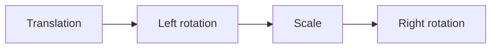

# Display Entities

Added in 1.19.4, [display entities](https://minecraft.wiki/w/Display) are a way to display various
things in the world, like blocks, items and text.

By default, these entities have no hitbox, don't move, make sounds or take damage,
making them the perfect for all kinds of applications, like holograms.

## Types

:::tip[Decorative displays]

Use the <Javadoc name={"org.bukkit.entity.Entity#setVisibleByDefault(boolean)"}>`Entity#setVisibleByDefault()`</Javadoc>
and <Javadoc name={"org.bukkit.entity.Player#showEntity(org.bukkit.plugin.Plugin,org.bukkit.entity.Entity)"}>`Player#showEntity()`</Javadoc>/
<Javadoc name={"org.bukkit.entity.Player#hideEntity(org.bukkit.plugin.Plugin,org.bukkit.entity.Entity)"}>`Player#hideEntity()`</Javadoc>
methods to make displays visible to only specific players.

If you plan to use the display only temporarily, e.g. for decoration purposes, make sure to remove
it with <Javadoc name={"org.bukkit.entity.Entity#remove()"}>`Entity#remove()`</Javadoc> afterward.

```java
TextDisplay display = player.getWorld().spawn(player.getLocation(), TextDisplay.class, entity -> {
    // ...

    entity.setVisibleByDefault(false); // hide it for everyone
    entity.setPersistent(false); // don't save the entity, it's temporary
});

player.showEntity(plugin, display); // show it to our player
display.remove(); // done with the entity
```

:::

### Text

Text can be displayed via a <Javadoc name={"org.bukkit.entity.TextDisplay"}>`TextDisplay`</Javadoc>
entity.

```java
TextDisplay display = world.spawn(location, TextDisplay.class, entity -> {
    // customize the entity!
    entity.text(Component.text("Some awesome content", NamedTextColor.BLACK));
    entity.setBillboard(Display.Billboard.VERTICAL); // pivot only around the vertical axis
    entity.setBackgroundColor(Color.RED); // make the background red

    // see the Display and TextDisplay Javadoc, there are many more options
});
```

### Items

Items can be displayed via an <Javadoc name={"org.bukkit.entity.ItemDisplay"}>`ItemDisplay`</Javadoc>
entity.

```java
ItemDisplay display = world.spawn(location, ItemDisplay.class, entity -> {
    // customize the entity!
    entity.setItemStack(new ItemStack(Material.SKELETON_SKULL));
});
```

### Blocks

Blocks can be displayed via an <Javadoc name={"org.bukkit.entity.BlockDisplay"}>`BlockDisplay`</Javadoc>
entity.

```java
BlockDisplay display = world.spawn(location, BlockDisplay.class, entity -> {
    // customize the entity!
    entity.setBlock(Material.GRASS_BLOCK.createBlockData());
});
```

## Transformation

Displays can have an arbitrary affine transformation applied to them, allowing you to position and
warp them as you choose in 3D space.

Transformations are applied in this order:



:::tip[Visualizing transformations]

Use the [Transformation Visualizer](https://misode.github.io/transformation/) website to visualize
a transformation for quick prototyping!

:::

### Scale

The most basic transformation is scaling, let's take a grass block and scale it up:

```java
world.spawn(location, BlockDisplay.class, entity -> {
    entity.setBlock(Material.GRASS_BLOCK.createBlockData());
    entity.setTransformation(
        new Transformation(
                new Vector3f(), // no translation
                new AxisAngle4f(), // no left rotation
                new Vector3f(2, 2, 2), // scale up by a factor of 2 on all axes
                new AxisAngle4f() // no right rotation
        )
    );
});
```

### Rotation

You can also rotate it, let's tip it on its corner:

```java
world.spawn(location, BlockDisplay.class, entity -> {
    entity.setBlock(Material.GRASS_BLOCK.createBlockData());
    entity.setTransformation(
        new Transformation(
                new Vector3f(), // no translation
                // highlight-next-line
                new AxisAngle4f((float) -Math.toRadians(45), 1, 0, 0), // rotate -45 degrees on the X axis
                new Vector3f(2, 2, 2), // scale up by a factor of 2 on all axes
                // highlight-next-line
                new AxisAngle4f((float) Math.toRadians(45), 0, 0, 1) // rotate +45 degrees on the Z axis
        )
    );
});
```

### Translation

Finally, we can also apply a translation transformation (position offset) to the display, for example:

```java
world.spawn(location, BlockDisplay.class, entity -> {
    entity.setBlock(Material.GRASS_BLOCK.createBlockData());
    entity.setTransformation(
        new Transformation(
                // highlight-next-line
                new Vector3f(0.5F, 0.5F, 0.5F), // offset by half a block on all axes
                new AxisAngle4f((float) -Math.toRadians(45), 1, 0, 0), // rotate -45 degrees on the X axis
                new Vector3f(2, 2, 2), // scale up by a factor of 2 on all axes
                new AxisAngle4f((float) Math.toRadians(45), 0, 0, 1) // rotate +45 degrees on the Z axis
        )
    );
});
```

## Interpolation

A transformation can be linearly interpolated by the client to create a smooth animation,
switching from one transformation to the next.

An example of this would be smoothly rotating a block/item/text in-place. In conjunction with the
[Scheduler API](../scheduler.mdx), the animation can be restarted after it's done,
making the display spin indefinitely:

```java
ItemDisplay display = loc.getWorld().spawn(loc, ItemDisplay.class, entity -> {
    entity.setItemStack(new ItemStack(Material.GOLDEN_SWORD));
});

int duration = 5 * 20; // duration of half a revolution (5 * 20 ticks = 5 seconds)

Quaternionf rotation = new Quaternionf();
Bukkit.getScheduler().runTaskTimer(plugin, task -> {
    if (!display.isValid()) { // display was removed from the world, abort task
        task.cancel();
        return;
    }

    display.setTransformation(
            new Transformation(
                    new Vector3f(), // no translation
                    rotation,
                    new Vector3f(1, 1, 1), // no scaling
                    rotation.rotateY(((float) Math.toRadians(180)) + 0.1F /* prevent the client from interpolating in reverse */)
            )
    );
    display.setInterpolationDelay(0); // no delay to the interpolation
    display.setInterpolationDuration(duration); // set the duration of the interpolated rotation
}, 1 /* delay the initial transformation by one tick from display creation */, duration);
```
