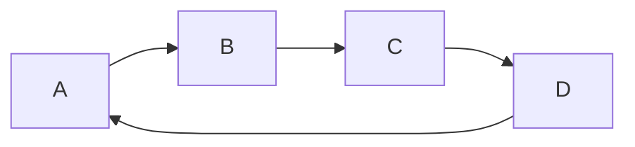

# Paper Plugins

Paper plugins allow developers to take advantage of more modern concepts introduced by Mojang, such as datapacks, to
expand the field of what the Paper API is able to introduce.

:::warning[Experimental]

This is experimental and may be subject to change.

:::

- [Bootstrapper](#bootstrapper)
- [Loader](#loaders)
- [Differences](#differences)

## How do I use them?
Similarly to Bukkit plugins, you have to introduce a `paper-plugin.yml` file into your jar resources folder.
This will not act as a drop-in replacement for `plugin.yml`, as some things, as outlined in this guide, need to be declared differently.

It should be noted you still have the ability to include both `paper-plugin.yml` and `plugin.yml` in the same jar.

Here is an example configuration.
```yml
name: Paper-Test-Plugin
version: '1.0'
main: io.papermc.testplugin.TestPlugin
description: Paper Test Plugin
api-version: '1.20'
bootstrapper: io.papermc.testplugin.TestPluginBootstrap
loader: io.papermc.testplugin.TestPluginLoader
```

### Dependency Declaration

Paper Plugins change how to declare dependencies in your `paper-plugin.yml`:

```yml
dependencies:
  bootstrap:
    # Lets say that RegistryPlugin registers some data that your plugin needs to use
    # We don't need this during runtime, so it's not required in the server section. However
    # can be added to both if needed
    RegistryPlugin:
      load: BEFORE
      required: true
      join-classpath: true # Defaults to true
  server:
    # Add a required "RequiredPlugin" dependency, which will load AFTER your plugin.
    RequiredPlugin:
      load: AFTER
      required: true
      # This means that your plugin will not have access to their classpath
      join-classpath: false
```

With Paper Plugins, dependencies are split into two sections:
- `bootstrap` - These are dependencies that you will be using in the [bootstrap](#bootstrapper).
- `server` - These are dependencies that are used for the core functionality of your plugin, whilst the server is running.

Let's take a look at a dependency:
```yml
RegistryPlugin:
  load: BEFORE # Defaults to OMIT
  required: true # Defaults to true
  join-classpath: true # Defaults to true
```

- `load`: (`BEFORE`|`AFTER`|`OMIT`) Specifies whether this plugin should before or after **your** plugin. Note: Omit has undefined ordering behavior.
- `required`: Whether this plugin is required for your plugin to load.
- `join-classpath`: Whether your plugin should have access to their classpath. This is used for plugins that need to access other plugins internals directly.

:::note[Cyclic Loading]

Note that in certain cases, plugins may be able to introduce cyclic loading loops, which will prevent the server from starting.
Please read the [cyclic loading guide](#cyclic-plugin-loading) for more information.

:::

Here are a couple of examples:
```yml
# Suppose we require ProtocolLib to be loaded for our plugin
ProtocolLib:
  load: AFTER
  required: true

# Now, we are going to register some details for a shop plugin
# So our plugin should load before the shop plugin
SuperShopsXUnlimited:
  load: AFTER
  required: false

# Now, we are going to need to access a plugins classpath
# So that we can properly interact with it.
SuperDuperTacoParty:
  required: true
  join-classpath: true
```

## What is it used for?
Paper plugins lay down the framework for some future API. Our goals are to open more modern API that better aligns 
with Vanilla. Paper plugins allow us to do just that by making a new way to load plugin resources before the server 
has started by using [Bootstrappers](#bootstrapper).

## Bootstrapper
Paper plugins are able to identify their own bootstrapper by implementing `io.papermc.paper.plugin.bootstrap.PluginBootstrap` and adding
the class of your implementation to the bootstrapper field in the `paper-plugin.yml`.
```java
public class TestPluginBootstrap implements PluginBootstrap {

    @Override
    public void bootstrap(@NotNull BootstrapContext context) {

    }

    @Override
    public @NotNull JavaPlugin createPlugin(@NotNull PluginProviderContext context) {
        return new TestPlugin("My custom parameter");
    }

}
```
A Bootstrapper allows you to also override how your plugin is initiated, allowing you to pass values into your plugin constructor.
Currently, bootstrappers do not offer much new API, and are highly experimental. This may be subject to change once more API is introduced.

## Loaders
Paper plugins are able to identify their own plugin loader by implementing `io.papermc.paper.plugin.loader.PluginLoader` and adding
the class of your implementation to the loader field in the `paper-plugin.yml`.

The goal of the plugin loader is the creation of an expected/dynamic environment for the plugin to load into.
This, as of right now, only applies to creating the expected classpath for the plugin, e.g. supplying external libraries to the plugin.
```java
public class TestPluginLoader implements PluginLoader {

    @Override
    public void classloader(@NotNull PluginClasspathBuilder classpathBuilder) {
        classpathBuilder.addLibrary(new JarLibrary(Path.of("dependency.jar")));

        MavenLibraryResolver resolver = new MavenLibraryResolver();
        resolver.addDependency(new Dependency(new DefaultArtifact("com.example:example:version"), null));
        resolver.addRepository(new RemoteRepository.Builder("paper", "default", "https://repo.papermc.io/repository/maven-public/").build());

        classpathBuilder.addLibrary(resolver);
    }
}
```
Currently, you are able to add two different library types, `JarLibrary`, and `MavenLibraryResolver`.

## Differences

### Bukkit Serialization System
Paper plugins still support the serialization system (`org.bukkit.configuration.serialization`) that Bukkit uses. However, custom classes will not be
automatically registered for serialization. In order to use `ConfigurationSection#getObject`, 
you **must** call `ConfigurationSerialization.registerClass(Class)` before you attempt to fetch objects from configurations.

### Classloading Isolation
Paper plugins are not able to access each other unless given explicit access by depending on another plugin, etc. This
helps prevent Paper plugins from accidentally accessing each other's dependencies, and in general helps ensure that 
plugins are only able to access what they explicitly depend on.

Paper plugins have the ability to bypass this, being able to access OTHER plugins' classloaders by adding 
```yml
Plugin:
  join-classpath: true # Means you have access to their classpath
```
to your ``paper-plugin.yml``. Note, other Paper plugins will still be unable to access your classloader.


### Load Order Logic Split
In order to better take advantage of classloading isolation, Paper plugins do **not** use the `dependencies` field to determine load order.
This was done for a variety of reasons, mostly to allow better control and allow plugins to properly share classloaders.

See [declaring dependencies](#dependency-declaration) for more information on how to declare the load order of your plugin.

### Cyclic Plugin Loading

Cyclic loading describes the phenomena when a plugin loading causes a loop which eventually will cycle back to the original plugin.
Unlike Bukkit plugins, Paper plugins will not attempt to resolve cyclic loading issues.



However, if Paper detects a loop that cannot be resolved, you will get an error that looks like this:
```
[ERROR]: [LoadOrderTree] =================================
[ERROR]: [LoadOrderTree] Circular plugin loading detected:
[ERROR]: [LoadOrderTree] 1) Paper-Test-Plugin1 -> Paper-Test-Plugin -> Paper-Test-Plugin1
[ERROR]: [LoadOrderTree]    Paper-Test-Plugin1 loadbefore: [Paper-Test-Plugin]
[ERROR]: [LoadOrderTree]    Paper-Test-Plugin loadbefore: [Paper-Test-Plugin1]
[ERROR]: [LoadOrderTree] Please report this to the plugin authors of the first plugin of each loop or join the PaperMC Discord server for further help.
[ERROR]: [LoadOrderTree] =================================
```

It is up to you to resolve these cyclical loading issues.
