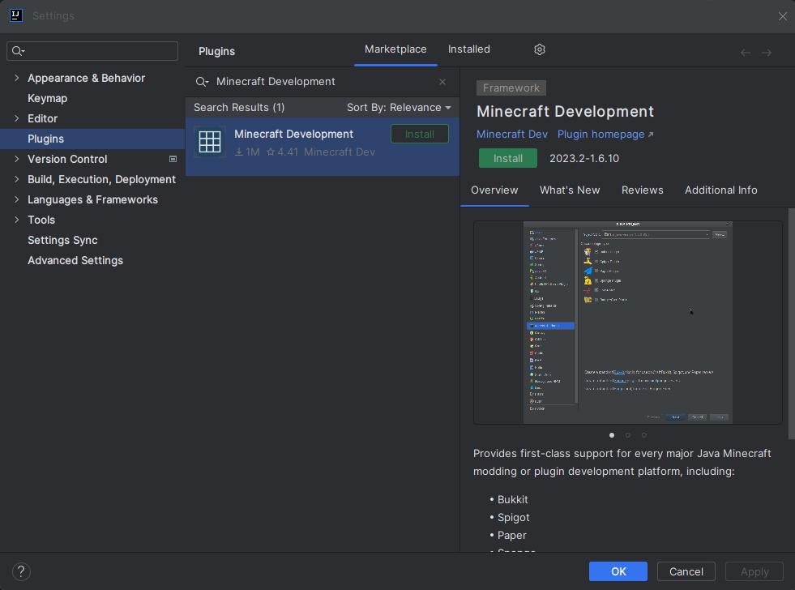

# MCDev Project Setup
If you are new to plugin development you might be a little overwhelmed by the amount of things you need to do to get started.
This guide aims to help you get started with setting up a new project using the MinecraftDev IntelliJ plugin.

:::note

This tutorial only works with IntelliJ IDEA. If you are using another IDE, please follow the [manual project setup guide](./project-setup.md).

:::

# Installing the Minecraft Development plugin
The first thing you need to do is install the [Minecraft Development](https://plugins.jetbrains.com/plugin/8327-minecraft-development) plugin.
You can do this by going to `File > Settings > Plugins` and searching for `Minecraft Development` under the `Marketplace` section.

Once you have installed the plugin, you will need to restart IntelliJ.
To do that you can click the `Restart IDE` button that appears after installing the plugin.

# Creating a new project
Once you have installed the plugin, you can create a new project by going to `File > New > Project...` and selecting `Minecraft` from the list of options.

You will be asked to provide some information about your project.

| Field                 | Explanation                                                                                                                                                                                                                                                               |
|-----------------------|---------------------------------------------------------------------------------------------------------------------------------------------------------------------------------------------------------------------------------------------------------------------------|
| **Name**              | The name of your project.                                                                                                                                                                                                                                                 |
| **Location**          | The location of your project. This is where the project files will be stored.                                                                                                                                                                                             |
| **Platform Type**     | The platform type you are developing for. This should be `Plugin`.                                                                                                                                                                                                        |
| **Platform**          | The platform you are developing for. This should be `Paper`.                                                                                                                                                                                                              |
| **Minecraft Version** | The version of Minecraft you are developing for.                                                                                                                                                                                                                          |
| **Plugin Name**       | The name of your plugin.                                                                                                                                                                                                                                                  |
| **Main Class**        | The main class of your plugin. This should be the class that extends `JavaPlugin`.                                                                                                                                                                                        |
| **Optional Settings** | Here you can define things like authors, website, description, etc. These are optional and not required for the plugin to work.                                                                                                                                           |
| **Build System**      | The build system you want to use. Paper recommends using Gradle but you can use Maven if you prefer.                                                                                                                                                                      |
| **Paper Manifest**    | Whether you want to use the new Paper Plugins or not. For now this is not recommended as it is still in development.                                                                                                                                                      |
| **Group ID**          | The group ID of your project. This is used for Maven and Gradle. This is usually your domain name in reverse. If you don't know what you should put here, you can use something like `io.github.<yourname>` or if you don't have github you can just use `me.<yourname>`. |
| **Artifact ID**       | The artifact ID of your project. This is used for Maven and Gradle. This is usually the name of your project. This is usually the same as the `Name` field.                                                                                                               |
| **Version**           | The version of your project. This is used for Maven and Gradle. This is usually `1.0-SNAPSHOT` and does not really matter for now.                                                                                                                                        |
| **JDK**               | The JDK you want to use. This can be anything from Java 17 and above.                                                                                                                                                                                                     |

Now you can click on the `Create` button and IntelliJ will create the project for you.
If everything went well, you should see something like this:

### Conclusion

You should now have a project set up with Paper as a dependency.
All you have left to do now is to compile your plugin and run it on a Paper server.

:::note

If you want to streamline the process of testing a plugin, you can use the [Run-Task](https://github.com/jpenilla/run-task) Gradle plugin.
It will automatically download a Paper server and run it for you.

:::

:::info

If you are using IntelliJ, you can use the Gradle GUI `Build` menu to compile your plugin - found on the top right of your IDE.
The output jar of your plugin will be in the `build/libs` directory.

:::
