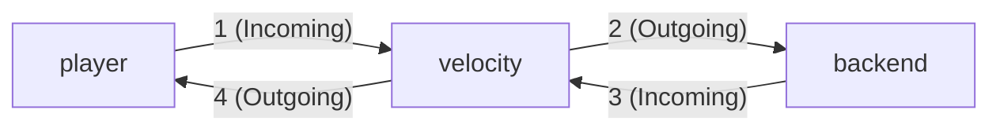

# Plugin Messaging

First introduced in [2012](https://web.archive.org/web/20220711204310/https://dinnerbone.com/blog/2012/01/13/minecraft-plugin-channels-messaging/),
Plugin messaging is a way for Velocity plugins to communicate with clients and backend servers. 

Velocity manages connections in both directions,
for both the client and backend server.

This means Velocity plugins need to consider 4 main cases. 



Additionally, BungeeCord channel compatability is included, which may remove the need for a companion velocity plugin certain cases.

## Case 1: Receiving a Plugin Message from a Player

When you need to handle or inspect the contents of a plugin message sent by a player.

This requires registering with the ChannelRegistrar for the event to be fired.

An example use might be logging messages from a mod that reports what features are enabled.

```java
public static final MinecraftChannelIdentifier IDENTIFIER = MinecraftChannelIdentifier.from("custom:main");

@Subscribe
public void onProxyInitialization(ProxyInitializeEvent event) {
    proxyServer.getChannelRegistrar().register(IDENTIFIER);
}

@Subscribe
public void onPluginMessageFromPlayer(PluginMessageEvent event) {
    if (!(event.getSource() instanceof Player)) {
        return;
    }
    Player player = (Player) event.getSource();
    // Ensure the identifier is what you expect before trying to handle the data
    if (event.getIdentifier() != IDENTIFIER) {
        return;
    }
    
    ByteArrayDataInput in = ByteStreams.newDataInput(event.getData());
    // handle packet data
}
```


## Case 2: Sending a Plugin Message to a Backend Server

When you need to send a message to a backend server.

There are two methods to send a plugin message to the backend, depending on what you need to achieve

:::warning

When Listening for these messages on a backend server, ensure you are actually talking to an (allowed) instance of your proxy plugin.

If you don't, you run the risk that these can be spoofed by a player with a modded client.

:::

### Using any connected Player

This is useful if you just want to communicate something relevant to the entire server,
or otherwise can be derived from its content.


An example use might be telling the server to shut down.


```java
public boolean sendPluginMessageToBackend(RegisteredServer server, ChannelIdentifier identifier, byte[] data) {
    boolean success = server.sendPluginMessage(identifier, data);
    return success;
}
```

### Using a specific player's connection

This is useful if you want to communicate something about a specific player to their current backend server.
You may want additional checks to ensure it will be handled correctly on the backend the player is on.

An example use might be telling the backend server to give the player a specific item.

```java
public boolean sendPluginMessageToBackendUsingPlayer(Player player, ChannelIdentifier identifier, byte[] data) {
    Optional<ServerConnection> connection = player.getCurrentServer();
    boolean success = false;
    if (connection.isPresent()) {
        success = connection.get().serverConnection.sendPluginMessage(identifier, data);
    }
    return success;
}
```

## Case 3: Receiving a Plugin Message from a Backend server

When you need to Receive messages from your backend server.

This requires registering with the ChannelRegistrar for the event to be fired.

An example use might be handing a request to transfer the player to another server.

```java
public static final MinecraftChannelIdentifier IDENTIFIER = MinecraftChannelIdentifier.from("custom:main");

@Subscribe
public void onProxyInitialization(ProxyInitializeEvent event) {
    proxyServer.getChannelRegistrar().register(IDENTIFIER);
}

@Subscribe
public void onPluginMessageFromBackend(PluginMessageEvent event) {
    if (!(event.getSource() instanceof ServerConnection)) {
        return;
    }
    ServerConnection backend = (ServerConnection) event.getSource();
    // Ensure the identifier is what you expect before trying to handle the data
    if (event.getIdentifier() != IDENTIFIER) {
        return;
    }

    ByteArrayDataInput in = ByteStreams.newDataInput(event.getData());
    // handle packet data
}
```
## Case 4: Sending a Plugin Message to a Player

When you need to send a message to a player.

An example use might be instructing a client side mod to disable certain features.

```java
public boolean sendPluginMessageToPlayer(Player player, ChannelIdentifier identifier, byte[] data) {
    boolean success = player.sendPluginMessage(identifier, data);
    return success;
}
```

## BungeeCord Channel Compatability

This allows your backend servers to communicate with Velocity
in a way compatible with BungeeCord

By default, your Velocity server will respond to the `bungeecord:main` channel if `bungee-plugin-message-channel` is enabled in [the configuration](/velocity/configuration#advanced-section).

:::tip[The "bungeecord" specification]

See [here](/paper/dev/plugin-messaging#bungeecord-plugin-message-types) for a list of all the built-in plugin messages that BungeeCord / Velocity supports.

:::
