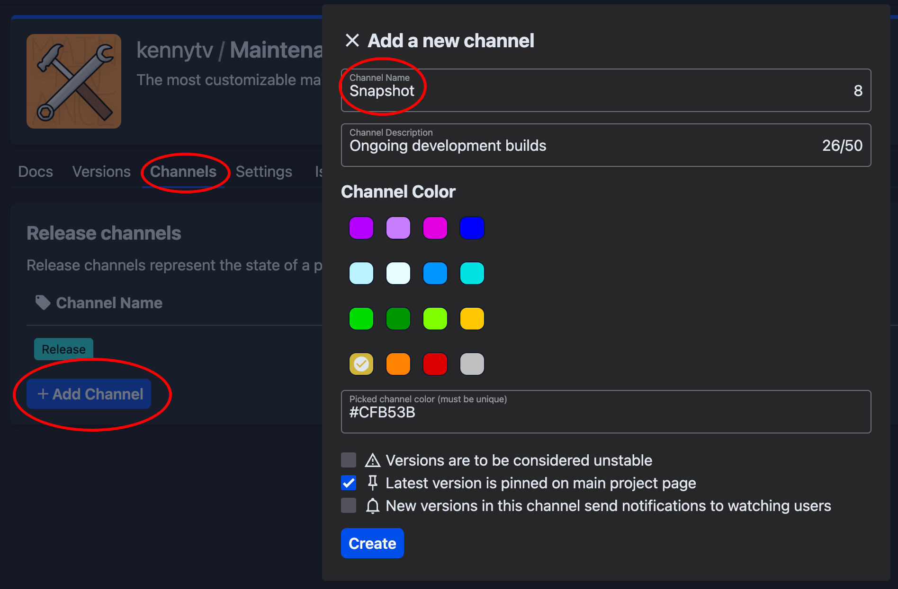
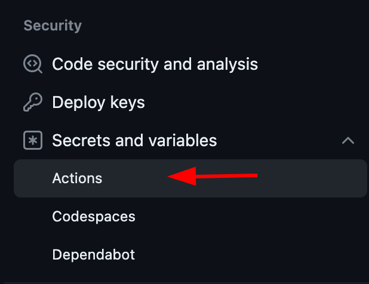

If you want to automatically publish your plugin to [Hangar](https://hangar.papermc.io/) on commits, you can use
our [Gradle plugin](https://github.com/HangarMC/hangar-publish-plugin).

After you have added the required `hangarPublish` configuration, you can manually publish it by
running `./gradlew build publishPluginPublicationToHangar`, or have GitHub Actions automatically publish a version on
every commit.

## Prerequisites

### Gradle

Your plugin project needs to use Gradle as its build tooling.

:::tip

If you are using
Maven, [switching to a Gradle setup is easy](https://docs.gradle.org/current/userguide/migrating_from_maven.html) and in
general recommended due to higher configurability and support for other plugins, such as
when [compiling against an unobfuscated Minecraft server](/paper/dev/userdev).

The provided examples use Kotlin DSL, but you can also do the same using Groovy. Online converters (even ChatGPT)
are able to convert the example code.

:::

### Creating the `Snapshot` release channel

The builds script below will publish non-release builds under a `Snapshot` channel. You need to create this channel in
your Hangar project's channel page first.



### Adding the `HANGAR_API_TOKEN` repository secret

First, you need to create a Hangar API token. Go to your Hangar settings in the profile dropdown and click on "Api keys" on the left. Then, tick
the `create_version` permission box, give the key a name and create it. **At the top**, you should be given your secret API
token. **Do not share this with anyone**; you will need it in the next step.

The GitHub Actions workflow provided uses a repository secret to store your Hangar API key. Go to your GitHub project settings,
then click on "Actions" under the Security tab and click the "New repository secret" button. Name the
secret `HANGAR_API_TOKEN` and paste the Hangar API token from the previous step into the Secret field.



## Project files

The files below are simple examples that require little manual changes for you to use, but you can still adapt them
depending on your needs. Take a look at the comments and especially the TODOs to figure out what you still need to
change.

### `gradle.properties`

Create a `gradle.properties` file in your project root directory if it does not already exist. In there, you define the
platform versions your plugin is compatible with. Simply remove the platforms you don't need and put in the correct
versions.

Hangar allows version ranges (such as `1.19-1.20.2`) and wildcards (such as `1.20.x`).

```properties
# Specify the platform versions for Paper and Velocity.
# Hangar also allows version ranges (such as 1.19-1.20.2) and wildcards (such as 1.20.x).
# TODO: Remove the platforms you don't need and put in the correct versions.
paperVersion=1.12.2, 1.16.5, 1.19-1.20.2
velocityVersion=3.2
waterfallVersion=1.20
```

### `build.gradle.kts`

In the plugins block of your `build.gradle.kts` build script, add the publish plugin:

```kotlin title="build.gradle.kts"
plugins {
    id("io.papermc.hangar-publish-plugin") version "0.1.2"
}
```

Then you simply need to add the `hangarPublish` configuration block and make sure you do the following:

- If your plugin is not a Paper plugin, or supports Velocity/Waterfall as well, copy the register block with a different
  platform and change the property used instead of `paperVersion` (as declared in the `gradle.properties` file).
- Insert the correct project namespace
- Insert your plugin dependencies, if any
- You need to have the `HANGAR_API_TOKEN` repository secret set up if you are using the Actions file below, otherwise add the
  API key in some other way.

```kotlin
import io.papermc.hangarpublishplugin.model.Platforms

// ...

hangarPublish {
    publications.register("plugin") {
        version.set(project.version as String)
        channel.set("Snapshot") // We're using the 'Snapshot' channel
        // TODO: Edit the project name to match your Hangar project
        id.set("hangar-project")
        apiKey.set(System.getenv("HANGAR_API_TOKEN"))
        platforms {
            // TODO: Use the correct platform(s) for your plugin
            register(Platforms.PAPER) {
                // TODO: If you're using ShadowJar, replace the jar lines with the appropriate task:
                //   jar.set(tasks.shadowJar.flatMap { it.archiveFile })
                // Set the JAR file to upload
                jar.set(tasks.jar.flatMap { it.archiveFile })

                // Set platform versions from gradle.properties file
                val versions: List<String> = (property("paperVersion") as String)
                        .split(",")
                        .map { it.trim() }
                platformVersions.set(versions)

                // TODO: Configure your plugin dependencies, if any
                dependencies {
                    // Example for a dependency found on Hangar
                    hangar("Maintenance") {
                        required.set(false)
                    }
                    // Example for an external dependency
                    url("Debuggery", "https://github.com/PaperMC/Debuggery") {
                        required.set(true)
                    }
                }
            }
        }
    }
}
```

### Optional: Going deeper

With the following channels, any version that contains a hyphen (`-`) will be published under the `Snapshot` channel
that you need to create on Hangar. By editing the `channel.set(...)` line, you can change this to any channel you would
like. For example, you could further split builds depending on the branch you are currently on into `Alpha` builds.

:::caution

Make sure you never publish ongoing development builds to the `Release` channel.

:::

```kotlin
import java.io.ByteArrayOutputStream

// ...

// Helper methods
fun executeGitCommand(vararg command: String): String {
    val byteOut = ByteArrayOutputStream()
    exec {
        commandLine = listOf("git", *command)
        standardOutput = byteOut
    }
    return byteOut.toString(Charsets.UTF_8.name()).trim()
}

fun latestCommitMessage(): String {
    return executeGitCommand("log", "-1", "--pretty=%B")
}

val versionString: String = version as String
val isRelease: Boolean = !versionString.contains('-')

val suffixedVersion: String = if (isRelease) {
    versionString
} else {
    // Give the version a unique name by using the GitHub Actions run number
    versionString + "+" + System.getenv("GITHUB_RUN_NUMBER")
}

// Use the commit description for the changelog
val changelogContent: String = latestCommitMessage()

// If you would like to publish releases with their proper changelogs manually, simply add an if statement with the `isRelease` variable here.
hangarPublish {
    publications.register("plugin") {
        version.set(suffixedVersion)
        channel.set(if (isRelease) "Release" else "Snapshot")
        changelog.set(changelogContent)
        // ... (see above)
    }
}
```

### GitHub Actions workflow

You don't necessarily need to publish via GitHub Actions, but it is an easy way to do so. If you want to use it, create
a `publish.yml` file in the `.github/workflows` directory of your project root folder and make sure
you [add the repository secret](#adding-the-hangar_api_token-repository-secret).

You can add and remove branches to be published by editing the `branches` section.

```yaml
name: Publish to Hangar
on:
  push:
    branches:
      # Add any additional branches you want to automatically publish from
      - main # Assuming your main branch is called 'main'

jobs:
  publish:
    # TODO: Optional, make sure the task only runs on pushes to your repository and doesn't fail on forks. Uncomment the line below and put the repo owner into the quotes
    # if: github.repository_owner == '<YOUR USER/ORG NAME>'
    runs-on: ubuntu-22.04
    steps:
      - name: Checkout Repository
        uses: actions/checkout@v3
      - name: Validate Gradle Wrapper
        uses: gradle/wrapper-validation-action@v1
      - name: Set up JDK 17
        uses: actions/setup-java@v3
        with:
          distribution: 'temurin'
          java-version: 17
      - name: Publish
        env:
          # Make sure you have added a repository secret in the repository's settings
          HANGAR_API_TOKEN: ${{ secrets.HANGAR_API_TOKEN }}
        run: ./gradlew build publishPluginPublicationToHangar --stacktrace
```
