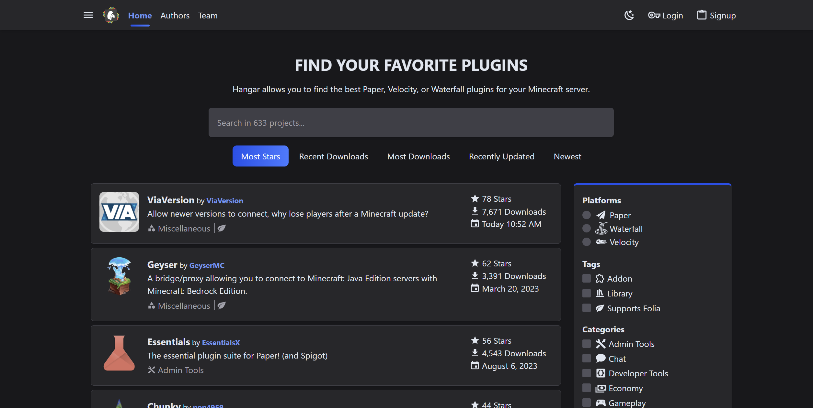

Now that you have your server up and running, there are a few things you should do to ensure that your server is running smoothly.

## Configuration

One of the first things you should do is ensure your server is configured to your specifications.
Paper is highly configurable, and you can change many settings to suit your needs. We outline where
you can find these settings in the [Configuration](/paper/reference/configuration) guide.

## Plugins

One of the main reasons to use Paper is to take advantage of the many plugins which make use of our
expansive API. We have our own plugin repository, [Hangar](https://hangar.papermc.io/), where you can
find many plugins to use on your server. We also have a guide on how to install plugins
[here](/paper/adding-plugins).

## Security

### Whitelisting

If you want to restrict who can join your server, you can use the whitelist feature. This allows you to
specify who can join your server, and stops anyone else from joining. You can use the whitelist from
the server console, or by editing the `whitelist.json` file in your server directory.

### Permissions

Permissions are a way to control what players can and cannot do on your server. You can use permissions
to restrict who can use certain commands, or who can access certain areas of your server. It is
common for plugins to use permissions to control who can use their features. You can use permission
plugins such as [LuckPerms](https://luckperms.net/) to manage the permissions which players will be granted.

### Offline Mode/InSecure Mode

Its highly recemmeded to use online mode.piracy isn't a good thing but if you do activate Offline mode:
   1. Hackers can change their usernames to match someone op and cheat
   2. Hackers can fake their identity as someone else
   3. The Clients will not be checked to verify its pirated or not!
   

## Backups

It's important to keep backups of your server. If something goes wrong, you can restore your server to a
previous state. We cover how to do this in the [Updating](/paper/updating) guide.

## Optimization

Out of the box, Paper is optimized for performance. However, there are many things you can do to further
optimize your server. One of the most common things to do is to make sure that you are running the
correct startup flags for your server. We have a tool that allows you to automatically generate a
startup script with the correct flags for your server. You can find this tool
[here](/misc/tools/start-script-gen). Beyond this, a guide such as [this one](https://paper-chan.moe/paper-optimization/)
will help you to further optimize your server.

## Making your server public

If you want to make your server public, you will need to port forward your server. This allows people
from outside your network to connect to your server. There is a guide made by
[NordVPN](https://nordvpn.com/blog/open-ports-on-router/) which explains what port forwarding is and how
to do it for your Paper server.
:::tips[Tips To Follow For better security]
You can use your ip on an domain using cloudflare so you don't have to endanger your ip to ddos or hacking

For a Better tutorial and insight checkout:
Cloudflare : [Cybrancee](https://cybrancee.com/learn/knowledge-base/how-to-connect-a-domain-cloudflare-to-a-minecraft-server/))
Fleek dns panel: [Cybrancee](https://cybrancee.com/learn/knowledge-base/how-to-connect-a-domain-to-a-minecraft-server/)
::
  

## Troubleshooting

If you encounter any issues with your server, you can follow our [Troubleshooting](/paper/basic-troubleshooting)
guide to help you diagnose and fix the issue. If you are unable to fix the issue, you can come and
ask for help in our [Discord](https://discord.gg/papermc) server!
