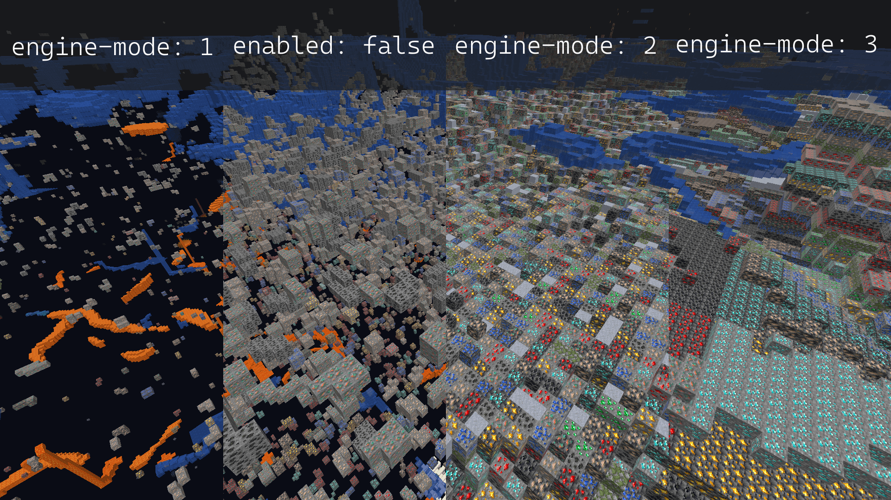
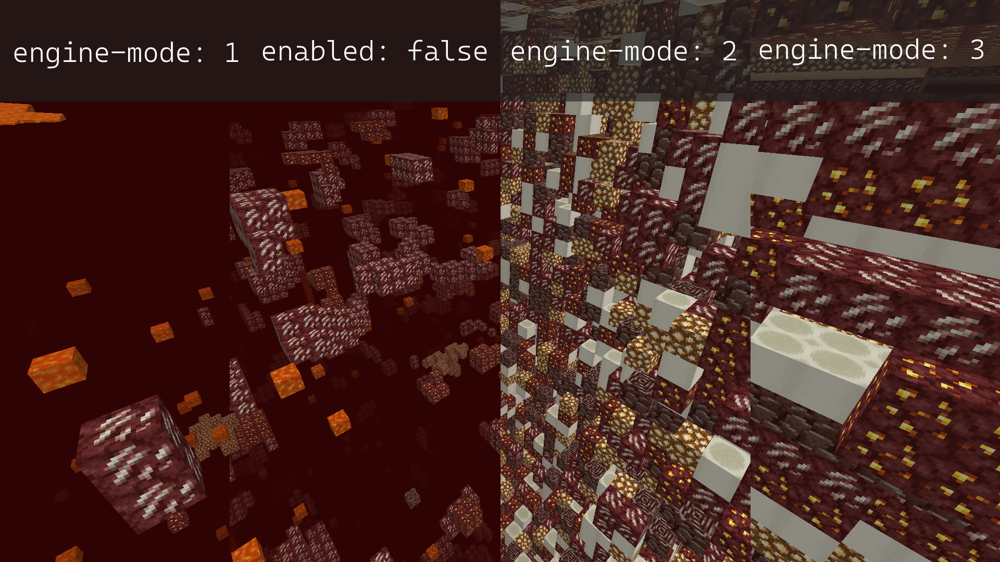

> Originally written and maintained by [stonar96](https://github.com/stonar96).

Paper includes an obfuscation-based Anti-Xray with three modes, configurable on a per world basis.

:::note[Per World Configuration]

If you aren't already familiar with per world configuration, please take a moment to familiarize
yourself with the [Configuration Guide](/paper/reference/configuration).

:::

This guide is a step-by-step walk-through for configuring Anti-Xray. For reference documentation,
refer to the Anti-Xray section of the
[Per-World Configuration Reference](/paper/reference/world-configuration#anticheat_anti_xray).

Anti-Xray has three different modes. `engine-mode: 1` replaces specified blocks (`hidden-blocks`) with
other "fake" blocks, `stone` (`deepslate` at y < 0), `netherrack`, or `end_stone` based on the
dimension. In contrast, `engine-mode: 2` will replace both `hidden-blocks` and `replacement-blocks`
with randomly generated `hidden-blocks`. `engine-mode: 3` works similarly to `engine-mode: 2`, but instead of
randomizing every block, it randomizes the block for each layer of a chunk.

The following images[^1] show how each mode will look for a player using Xray with the recommended
configuration in both the overworld and nether.

[^1]:
    Image design by `Oberfail`, initially posted in the
    [PaperMC Discord](https://discord.gg/papermc).

{/*

Seed: -7943468717341609647

# Overworld:
/tp @p -581.976 67.85076 -4924.106 47 36

# Nether:
/tp @p 789.437 117.38012 -319.064 -137.4 28
*/}




Especially on the client side, `engine-mode: 1` is much less computationally intensive, while
`engine-mode: 2` may better prevent Xray. With `engine-mode: 1`, only ores that are entirely covered
by solid blocks will be hidden. Ores exposed to air in caves or water from a lake will not be
hidden. With `engine-mode: 2`, fake ores obstruct the view of real blocks. If `air` is added to
`hidden-blocks`, `engine-mode: 2` will effectively hide all ores, even those exposed to air. `engine-mode: 3` can reduce network load when joining by a factor of ~2 and helps with chunk packet compression.

:::caution[Anti-Xray Bypasses]

**Range Extension**: While Anti-Xray alone will prevent the majority of users from Xraying on your
server, it is not by any means infallible. Because of how Anti-Xray is (and has to be) implemented,
it is possible to, on a default server, extend the range of real ores you can see by a not
insignificant amount. This can be mitigated by any competent anti-cheat plugin; however, this is not
included out of the box.

**Seed Reversing**: Another attack vector is the deterministic nature of Minecraft's world
generation. If the client is able to obtain the world seed, it is able to know the real location of
every generated ore, completely bypassing Anti-Xray. This can be partially worked around by making
it harder for the client to reverse the world seed with the
[`feature-seeds` configuration](/paper/reference/world-configuration#feature_seeds), in conjunction
with the structure seed options in `spigot.yml`. Note that this is not a complete solution, and it
may still be possible for a client to obtain the server's world seed. Using a different seed for
each world may also be beneficial.

**Ores Exposed to Air**: In `engine-mode: 1`, `engine-mode: 2` and `engine-mode: 3`, it is possible for a client
to view ores that are exposed to air. This can be mitigated in `engine-mode: 2` and `engine-mode: 3` by adding `air` to
the `hidden-blocks` list. However, doing this may cause client performance issues (FPS drops) for
some players.

:::

## Recommended configuration

The recommended configuration for `engine-mode: 1`, `engine-mode: 2` and `engine-mode: 3` is as follows:

:::tip[Spacing]

YAML cares about whitespace! The example configuration below is already formatted correctly. Ensure
formatting and indentation remains unchanged by using the "copy" button in the top right of each
example. Especially ensure that no tabulators are accidentally inserted. Check your editor's options
for using spaces instead of tabulators for indentation. If your configuration file already contains
other important changes, it is recommended to make a backup before editing it.

:::

### `engine-mode: 1`

<details>
  <summary>Default World Configuration</summary>

Replace the existing `anticheat.anti-xray` block in `paper-world-defaults.yml` with the following:

```yaml title="paper-world-defaults.yml"
anticheat:
  anti-xray:
    enabled: true
    engine-mode: 1
    hidden-blocks:
    # There's no chance to hide dungeon chests as they are entirely surrounded by air, but buried treasures will be hidden.
    - chest
    - coal_ore
    - deepslate_coal_ore
    - copper_ore
    - deepslate_copper_ore
    - raw_copper_block
    - diamond_ore
    - deepslate_diamond_ore
    - emerald_ore
    - deepslate_emerald_ore
    - gold_ore
    - deepslate_gold_ore
    - iron_ore
    - deepslate_iron_ore
    - raw_iron_block
    - lapis_ore
    - deepslate_lapis_ore
    - redstone_ore
    - deepslate_redstone_ore
    lava-obscures: false
    # As of 1.18 some ores are generated much higher.
    # Please adjust the max-block-height setting at your own discretion.
    # https://minecraft.wiki/w/Ore might be helpful.
    max-block-height: 64
    # The replacement-blocks list is not used in engine-mode: 1. Changing this will have no effect.
    replacement-blocks: []
    update-radius: 2
    use-permission: false
```

</details>

<details>
  <summary>Nether Configuration</summary>

Copy and paste into your `paper-world.yml` within your nether world folder. See the
[Configuration Guide](/paper/reference/configuration) for more information.

```yml title="world_nether/paper-world.yml"
anticheat:
  anti-xray:
    enabled: true
    engine-mode: 1
    hidden-blocks:
    - ancient_debris
    - nether_gold_ore
    - nether_quartz_ore
    lava-obscures: false
    max-block-height: 128
    # The replacement-blocks list is not used in engine-mode: 1. Changing this will have no effect.
    replacement-blocks: []
    update-radius: 2
    use-permission: false
```

</details>

<details>
  <summary>End Configuration</summary>

Copy and paste into your `paper-world.yml` within your end world folder. See the
[Configuration Guide](/paper/reference/configuration) for more information.

```yml title="world_the_end/paper-world.yml"
anticheat:
  anti-xray:
    enabled: false
```

</details>

### `engine-mode: 2`

<details>
  <summary>Default World Configuration</summary>

Replace the existing `anticheat.anti-xray` block in `paper-world-defaults.yml` with the following:

```yaml title="paper-world-defaults.yml"
anticheat:
  anti-xray:
    enabled: true
    engine-mode: 2
    hidden-blocks:
    # You can add air here such that many holes are generated.
    # This works well against cave finders but may cause client FPS drops for all players.
    - air
    - copper_ore
    - deepslate_copper_ore
    - raw_copper_block
    - diamond_ore
    - deepslate_diamond_ore
    - gold_ore
    - deepslate_gold_ore
    - iron_ore
    - deepslate_iron_ore
    - raw_iron_block
    - lapis_ore
    - deepslate_lapis_ore
    - redstone_ore
    - deepslate_redstone_ore
    lava-obscures: false
    # As of 1.18 some ores are generated much higher.
    # Please adjust the max-block-height setting at your own discretion.
    # https://minecraft.wiki/w/Ore might be helpful.
    max-block-height: 64
    replacement-blocks:
    # Chest is a tile entity and can't be added to hidden-blocks in engine-mode: 2.
    # But adding chest here will hide buried treasures, if max-block-height is increased.
    - chest
    - amethyst_block
    - andesite
    - budding_amethyst
    - calcite
    - coal_ore
    - deepslate_coal_ore
    - deepslate
    - diorite
    - dirt
    - emerald_ore
    - deepslate_emerald_ore
    - granite
    - gravel
    - oak_planks
    - smooth_basalt
    - stone
    - tuff
    update-radius: 2
    use-permission: false
```

</details>

<details>
  <summary>Nether Configuration</summary>

Copy and paste into your `paper-world.yml` within your nether world folder. See the
[Configuration Guide](/paper/reference/configuration) for more information.

```yml title="world_nether/paper-world.yml"
anticheat:
  anti-xray:
    enabled: true
    engine-mode: 2
    hidden-blocks:
    # See note about air and possible client performance issues above.
    - air
    - ancient_debris
    - bone_block
    - glowstone
    - magma_block
    - nether_bricks
    - nether_gold_ore
    - nether_quartz_ore
    - polished_blackstone_bricks
    lava-obscures: false
    max-block-height: 128
    replacement-blocks:
    - basalt
    - blackstone
    - gravel
    - netherrack
    - soul_sand
    - soul_soil
    update-radius: 2
    use-permission: false

```

</details>

<details>
  <summary>End Configuration</summary>

Copy and paste into your `paper-world.yml` within your end world folder. See the
[Configuration Guide](/paper/reference/configuration) for more information.

```yml title="world_the_end/paper-world.yml"
anticheat:
  anti-xray:
    enabled: false
```
</details>


### `engine-mode: 3`

<details>
  <summary>Default World Configuration</summary>

Replace the existing `anticheat.anti-xray` block in `paper-world-defaults.yml` with the following:

```yaml title="paper-world-defaults.yml"
anticheat:
  anti-xray:
    enabled: true
    engine-mode: 3
    hidden-blocks:
    # You can add air here such that many holes are generated.
    # This works well against cave finders but may cause client FPS drops for all players.
    - air
    - copper_ore
    - deepslate_copper_ore
    - raw_copper_block
    - diamond_ore
    - deepslate_diamond_ore
    - gold_ore
    - deepslate_gold_ore
    - iron_ore
    - deepslate_iron_ore
    - raw_iron_block
    - lapis_ore
    - deepslate_lapis_ore
    - redstone_ore
    - deepslate_redstone_ore
    lava-obscures: false
    # As of 1.18 some ores are generated much higher.
    # Please adjust the max-block-height setting at your own discretion.
    # https://minecraft.wiki/w/Ore might be helpful.
    max-block-height: 64
    replacement-blocks:
    # Chest is a tile entity and can't be added to hidden-blocks in engine-mode: 2.
    # But adding chest here will hide buried treasures, if max-block-height is increased.
    - chest
    - amethyst_block
    - andesite
    - budding_amethyst
    - calcite
    - coal_ore
    - deepslate_coal_ore
    - deepslate
    - diorite
    - dirt
    - emerald_ore
    - deepslate_emerald_ore
    - granite
    - gravel
    - oak_planks
    - smooth_basalt
    - stone
    - tuff
    update-radius: 2
    use-permission: false
```

</details>

<details>
  <summary>Nether Configuration</summary>

Copy and paste into your `paper-world.yml` within your nether world folder. See the
[Configuration Guide](/paper/reference/configuration) for more information.

```yml title="world_nether/paper-world.yml"
anticheat:
  anti-xray:
    enabled: true
    engine-mode: 3
    hidden-blocks:
    # See note about air and possible client performance issues above.
    - air
    - ancient_debris
    - bone_block
    - glowstone
    - magma_block
    - nether_bricks
    - nether_gold_ore
    - nether_quartz_ore
    - polished_blackstone_bricks
    lava-obscures: false
    max-block-height: 128
    replacement-blocks:
    - basalt
    - blackstone
    - gravel
    - netherrack
    - soul_sand
    - soul_soil
    update-radius: 2
    use-permission: false
```

</details>

<details>
  <summary>End Configuration</summary>

Copy and paste into your `paper-world.yml` within your end world folder. See the
[Configuration Guide](/paper/reference/configuration) for more information.

```yml title="world_the_end/paper-world.yml"
anticheat:
  anti-xray:
    enabled: false
```

</details>

## FAQ, common pitfalls and support

<details>
  <summary>I can still see (some) ores / use X-ray</summary>

As described above, there are several reasons why you might still see (some) ores even though you
have enabled Anti-Xray:

* The ores are above the configured `max-block-height` value.
* Anti-Xray cannot hide ores exposed to air or other transparent blocks (in caves for example). In
  principle this is also the case for `engine-mode: 2` and `engine-mode: 3`, however, usually the fake ores obstruct the
  view of real blocks. Hiding those exposed ores too requires additional plugins.
* The `use-permission` option is enabled and you have the Anti-Xray bypass permission (`paper.antixray.bypass`) or you have
  operator status.
* The block type is missing in the configured block lists. This can be the result of using an
  outdated configuration file.

</details>

<details>
  <summary>I have added fake blocks but X-ray doesn't show them</summary>

If you use `engine-mode: 2` or `engine-mode: 3` and you have added fake blocks to the `hidden-blocks` list but you can't
see them in-game using X-ray, this can have the following reasons:

* The added block types are tile entities. Anti-Xray can hide (replace) tile entities (such as
  chests), provided that they are not exposed to air or other transparent blocks. However, Anti-Xray
  can't place tile entities as fake blocks into the chunk.
* The block is disabled in your client's X-ray mod or not shown by your X-ray resource pack.

</details>

<details>
  <summary>It doesn't work below y = 0 or in certain other places.</summary>

* Your configuration file is probably outdated and missing important blocks in the
  `replacement-blocks` list, such as `deepslate` or biome-specific blocks, such as `basalt`. You
  might also want to check if the `hidden-blocks` list includes all important ores and their
  `deepslate` variants.
* If it doesn't work above a certain y-level, check your `max-block-height` setting.

</details>

<details>
  <summary>It still doesn't work, further troubleshooting</summary>

* Make sure to always restart your server after making changes to the Anti-Xray configuration.
  Changes won't be applied automatically.
* Do not use the `/reload` command. To apply Anti-Xray configuration changes a restart is required.
* After restarting the server, verify that the configuration is applied correctly by inspecting the
  config sections with timings or spark.

</details>

<details>
  <summary>How and where do I ask for support if it still doesn't work?</summary>

If the above bullet points don't solve your problem or if you have further questions about
Anti-Xray, please don't hesitate to ask us on the [PaperMC Discord](https://discord.gg/papermc)
using the #paper-help channel. Please try to provide as much detail as possible about your problem.
"It doesn't work" isn't very helpful when asking for support. Describe what you want to achieve,
what you have tried, what you expect and what you observe. Ideally include a timings or spark link
and a picture what you observe in-game.

</details>
