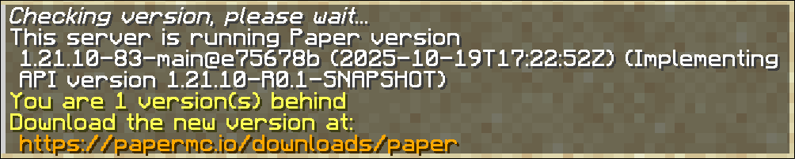

This page explains all commands which are added by Paper.

## Bukkit commands

These commands are located under the `bukkit:` namespace.

### version (aliases: ver, about)

The version command displays the version information about the server, the output may look like this:



You can also use this command to display version information about specific plugins.


### plugins (alias: pl)

The plugins command displays the list of all loaded plugins. Paper differentiates between two types of
plugins: **Paper plugins** and **Bukkit plugins**. The difference is generally only relevant to plugin
developers ([guide to paper-plugin.yml](/paper/dev/getting-started/paper-plugins)). Plugins are marked
as **green** if no issues occurred whilst enabling them and their functionality can be assumed working.
Plugins marked **red** failed to load or were disabled. Check the startup logs for more information if
that happens.

Bukkit plugins furthermore have the possibility of being loaded **with legacy support** enabled. These
are marked with a **yellow star** in front of their name. That usually means the plugin was made for a
very old version of the game or the plugin author simply forgot to specify a target Minecraft version
for their plugin.

You can click on the plugins' names to display version information about that plugin. The click action
is equivalent to running `/version <plugin_name>`.


### help (alias: ?)

The help command displays descriptions for all registered commands. It acts
as a quick reference to both built-in commands and any plugin-added commands.

### reload (alias: spigot reload)

:::danger[Deprecation]

The reload command is deprecated for removal. You should instead restart your server
if you wish to update your plugins, as the reload is known for causing issues with plugins.

If you are looking to reload the Paper configs, you can use [/paper reload](#reload).

:::

## Performance profiling

The `/mspt` and `/tps` commands, whilst working fine, are superseded by the `/spark` command,
and you should therefore switch to the `/spark` command instead.

### spark

The only command you should rely on for performance information is the `/spark` command.
The spark subcommands are documented [in the dedicated spark wiki](https://spark.lucko.me/docs/Command-Usage).

### tps

The tps command is a simple command to get the TPS (ticks per second, how often the game loop
is run per second. The higher, the better. Target TPS is 20.0) from the past 1, 5, and 15 minutes.

### mspt

The mspt command is another simple command to get the average, min, and max MSPT (milliseconds per tick, how much time
a tick takes. The lower, the better. MSPT should be below 50 for 20 TPS) of the server from the last 5, 10, and 60 seconds.

### timings

:::danger[Deprecation]

The timings command is deprecated for removal. You should instead use the [spark command](#spark) as a replacement.

More information can be viewed here: https://github.com/PaperMC/Paper/discussions/10565.

:::

## restart

The `/restart` command is part of Spigot's restart mechanism, which makes the server restart when it crashes
or the command is run manually.

:::note

For help setting up the restart script, see
[this gist by Prof_Bloodstone](https://gist.github.com/Prof-Bloodstone/6367eb4016eaf9d1646a88772cdbbac5).

:::

## paper
This section is dedicated to the subcommands of the in-game `/paper` command.

### chunkinfo
The `/paper chunkinfo [<worldname>]` command is used for displaying information about loaded chunks in a world.
You can specify the world to get info about with the `[<worldname>]` argument. If you set it to `*` or leave it
out, it will list information for all worlds.

The output differentiates between multiple types of loaded chunks. Here is a quick rundown of each type.
A more complete documentation may be found in the [Minecraft wiki](https://minecraft.wiki/w/Chunk).

- `Total` As the name suggests, this number describes **all chunks** currently loaded.
- `Inactive` More commonly referred to as "inaccessible", are chunks which are not ticked, but where chunk generation occurs.
- `Full` Usually called **border chunks**. No ticking is happening, but entities and blocks are loaded and accessible.
- `Block Ticking` All game aspects work as expected, except that entities are not spawned naturally or ticked, but still accessible. Also called **lazy chunks**.
- `Entity Ticking` The chunk is being ticked fully.

### debug
The `/paper debug <chunks>` command is used to dump information about all currently loaded chunks to a file. The content
of this file is generally irrelevant for most server admins and is intended to be used by developers.

### dumpitem
The `/paper dumpitem [all]` command can be used to retrieve the data component representation of your currently held
item. Simply running `/paper dumpitem` will yield the item data, which you can use to represent this item in
commands which expect an item argument. `/paper dumpitem all` yields the **full data component representation**,
including default data components you do not have to explicitly declare.

### dumplisteners
The `/paper dumplisteners toFile|<className>` command is primarily intended for developers trying to figure out why
their event handlers might not be working as expected. Using `/paper dumplisteners toFile` will write all
currently registered event handlers to a file, whilst `/paper dumplisteners <className>` will print the registered
event handlers only for the specific event.

### dumpplugins
The `/paper dumpplugins` command is intended for developers trying to figure out issues with their dependencies or
loading order in relation to other plugins. It can also be used to debug bootstrapper providers, general load order,
and listing class loaders for the plugins.

### entity
The `/paper entity list [<filter>] [<world>]` command can be used to list all currently ticking entities.

The `[<filter>]` argument is used to filter the listed entities types and acts similar to a **regular expression**:
- You can use `*` to list **all** entities, which is the default value for this argument.
- You can list individual entities by providing `minecraft:<entity_type>` as the argument. The namespace here is very important.
- To list multiple entities, you can use the `*` as a greedy wildcard expression. For example, to list all entities,
  whose names start with **e**, you could use `minecraft:e*`.
- You can also use the `?` single-character wildcard expression. For example, to list `pig` and `piglin`, but **not**
  `piglin_brute`, you can provide `minecraft:pig???` as the filter.

The `[<world>]` argument declares the world you want to check the entities in. This defaults to the current world
of a player or to the overworld for the console.

The output will look similar to this:

```
Total Ticking: -78, Total Non-Ticking: 92
  10 (3) : minecraft:pig
  1 (0) : minecraft:piglin
* First number is ticking entities, second number is non-ticking entities
```

The comment at the end already clearly describes the purpose of the numbers.

### fixlight
The `/paper fixlight` command is a simple command to trigger a full re-calculation of the light map of all currently
loaded chunks. This can be used to fix any lighting issues which commonly occur with plugins like WorldEdit.

### heap
The `/paper heap` is a developer debug command to dump the current JVM heap to a `.hprof` file, which can be analyzed
to detect to amount of memory used by certain objects. The output file can be rather big, so having a bit of free
space on your disk is recommended before running this command (as a general rule, the file is usually smaller
than the currently used memory. You can check the memory consumption using the `/spark healthreport` command).

### holderinfo
The `/paper holderinfo [<world>]` command is used to gather the number of different chunks currently held in memory.

The `[<world>]` argument can be used to define the world to get the chunk holder information for. Leave blank to
default to `*`, which prints the information for all chunks.

In general, the types have the following meanings:
- `Total` The total amount of in-memory chunk holders.
- `Unloadable` The number of chunks that are safe to be unloaded.
- `Null` Chunks, which have received the unload signal, but whose scheduling locks are still held.
- `ReadOnly` The number of chunk holders, which are readable, but not writable to.
- `Proto` A "prototype" chunk, which is a fully working chunk loaded in memory, but which is not currently placed in the world.
- `Full` Represents the number of chunks currently placed in the world.

### mobcaps
Not to be confused with the [playermobcaps](#playermobcaps) subcommand, the `/paper mobcaps [<world>]` command displays
the **global** mob caps for all players in a world. The `[<world>]` argument defaults to the overworld and
can be set to retrieve the mob caps for other worlds as well. The command also lists the number of
chunks in which mobs can spawn.

### playermobcaps
The `/paper playermobcaps [<player>]` command is used to list the local mob caps for a specific player. The `[<player>]`
argument defaults to the player, who ran the command, if one exists.

### reload
The `/paper reload` command is an unsupported command which allows for runtime Paper-config reloading. If you get any issues
after using this command, please make sure to reproduce this on a freshly-started server before asking for help or
reporting it. Do not that this command **does not** reload non-Paper configs, like the `spigot.yml`.

### syncloadinfo
The `/paper syncloadinfo [clear]` command requires the `-Dpaper.debug-sync-loads=true` JVM flag to be explicitly set
before running the command. The command was historically used for debugging purposes during Paper development, but
the mechanism behind the command is currently unused, meaning that the written file will **always** look
like this:

```json
{
 "worlds": []
}
```

Outside of checking for whether the command is allowed to be run, the JVM flag is otherwise unused.

### version
The `/paper version` command is an alias to the standard `/version` command.
