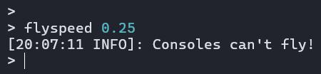
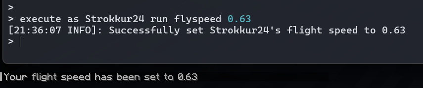

:::tip

This page requires knowledge about [Command Trees](/paper/dev/command-api/basics/command-tree) and [Arguments and Literals](/paper/dev/command-api/basics/arguments-and-literals). If you haven't read
through those articles, it is highly recommend to check those out beforehand!

:::

This page is dedicated to the `executes(...)` method from the `ArgumentBuilder` class.

## Examining the executes method
The `executes` method is defined as following:

```java title="ArgumentBuilder.java"
public T executes(Command<S> command);
```

The `Command<S>` interface is declared as a `FunctionalInterface`. That means that instead of putting in a class that implements it, we can just pass in a lambda statement.

```java title="Command.java"
@FunctionalInterface
public interface Command<S> {
    int SINGLE_SUCCESS = 1;

    int run(CommandContext<S> ctx) throws CommandSyntaxException;
}
```

Our lambda has one parameter and returns an integer. That is essentially that `run` method defined in that interface. The one parameter, `CommandContext<S>` is the one where
we get all the information about the sender who executed that command and all the command arguments. It has quite a few methods, but the main ones of use for us are
`S getSource()` and `V getArgument(String, Class<V>)`. We have taken a brief look at the `getArgument(...)` in the [Arguments and Literals](/paper/dev/command-api/basics/arguments-and-literals) chapter, but
in a nutshell, this is the method that we can retrieve arguments from. There will be more specific examples later on.

You should mainly notice the generic parameter S by the `getSource()` method. That is the type of the source of the command. For the executes method, this type is always a
`CommandSourceStack`. That class itself has three methods: `Location getLocation()`, `CommandSender getSender()`, and `@Nullable Entity getExecutor()`.
The most used method from that is `getSender()`, as that is the command sender who has actually run the command. For the target of a command, you should use `getExecutor()`,
which is relevant, if the command was ran via `/execute as <entity> run <our_command>`. It is not necessarily required, but is seen as good practice.

## Example: Flyspeed command
In the [Arguments and Literals](/paper/dev/command-api/basics/arguments-and-literals) chapter, we have briefly declared the structure for a `/flyspeed` command with the use of a ranged float argument.
But that command does not actually set the flyspeed of the executing player. In order to do that, we'd have to append an executor onto it, like this:

```java title="FlightSpeedCommand.java" {5-6}
Commands.literal("flyspeed")
    .then(Commands.argument("speed", FloatArgumentType.floatArg(0, 1.0f))
        .executes(ctx -> {
            float speed = FloatArgumentType.getFloat(ctx, "speed"); // Retrieve the speed argument
            CommandSender sender = ctx.getSource().getSender(); // Retrieve the command sender
            Entity executor = ctx.getSource().getExecutor(); // Retrieve the command executor, which may or may not be the same as the sender

            // Check whether the executor is a player, as you can only set a player's flight speed
            if (!(executor instanceof Player player)) {
                // If a non-player tried to set their own flight speed
                sender.sendPlainMessage("Only players can fly!");
                return Command.SINGLE_SUCCESS;
            }

            // Set the player's speed
            player.setFlySpeed(speed);

            if (sender == executor) {
                // If the player executed the command themselves
                player.sendPlainMessage("Successfully set your flight speed to " + speed);
                return Command.SINGLE_SUCCESS;
            }

            // If the speed was set by a different sender (Like using /execute)
            sender.sendRichMessage("Successfully set <playername>'s flight speed to " + speed, Placeholder.component("playername", player.name()));
            player.sendPlainMessage("Your flight speed has been set to " + speed);
            return Command.SINGLE_SUCCESS;
        })
    );
```

### Explanation
There is a lot to unpack, so let's break it down, top to bottom:

The first lines define a `/flyspeed` command root, with a float argument named "speed", which only allows values between 0 and 1.
We then add an executes clause to our argument branch and retrieves the speed argument by running `FloatArgumentType.getFloat`.

Note the highlighted lines. We first retrieve the `CommandSourceStack` from our `CommandContext<CommandSourceStack>` and then finally retrieve its sender and executor.
A `CommandSender` is an interface, which declares the `sendMessage(...)`, `getServer()`, and `getName()` methods. It is implemented by all entities, including players,
and the ConsoleCommandSender, which is used if a console executes a command.

Next up we check whether our executor object is also instance of a `Player` interface. If executor were null, this would be false, which is why we require no null check.
If the expression evaluates as true, we get a new `player` variable, which represents an actual player on the server that the command was executed by.

Next up, we set the player's flight speed using the value retrieved from the player-provided float argument and send them a message to confirm the operation.
It is always recommended to send a confirmation message whether the command was successful, because otherwise a player might get confused to why a command is "not working".
If the executor was not a player, we can send a form of error message. In our case, we assume the sender to be a console, as an entity usually does not try to send such
a command.

Finally, we just return from the lambda statement providing a return value. As our command succeeded, we can return `Command.SINGLE_SUCCESS`, whose value is `1`.
Don't forget to close all your braces!

Running the command now works correctly:



We can even run it as another player, using `/execute as`:


### Logic separation
Sometimes, if the command is too big or due to personal preference, you might not want to have your logic code in your executes method, as it might be unreadable
due of the amount of indentations. In such an event we can, instead of defining our logic in the lambda statement, use a method reference instead. For that we
can just pass a method reference to the executes method. This might look like this:

```java title="FlightSpeedCommand.java"
public class FlightSpeedCommand {

    public static LiteralArgumentBuilder<CommandSourceStack> createCommand() {
        return Commands.literal("flyspeed")
            .then(Commands.argument("speed", FloatArgumentType.floatArg(0, 1.0f))
                .executes(FlightSpeedCommand::runFlySpeedLogic)
            );
    }

    private static int runFlySpeedLogic(CommandContext<CommandSourceStack> ctx) {
        float speed = FloatArgumentType.getFloat(ctx, "speed"); // Retrieve the speed argument
        CommandSender sender = ctx.getSource().getSender(); // Retrieve the command sender
        Entity executor = ctx.getSource().getExecutor(); // Retrieve the command executor, which may or may not be the same as the sender

        // Check whether the executor is a player, as you can only set a player's flight speed
        if (!(executor instanceof Player player)) {
            // If a non-player tried to set their own flight speed
            sender.sendPlainMessage("Only players can fly!");
            return Command.SINGLE_SUCCESS;
        }

        // Set the player's speed
        player.setFlySpeed(speed);

        if (sender == executor) {
            // If the player executed the command themselves
            player.sendPlainMessage("Successfully set your flight speed to " + speed);
            return Command.SINGLE_SUCCESS;
        }

        // If the speed was set by a different sender (Like using /execute)
        sender.sendRichMessage("Successfully set <playername>'s flight speed to " + speed, Placeholder.component("playername", player.name()));
        player.sendPlainMessage("Your flight speed has been set to " + speed);
        return Command.SINGLE_SUCCESS;
    }
}
```

As you can see, we have made our command tree way easily readable whilst preserving the same functionality.
