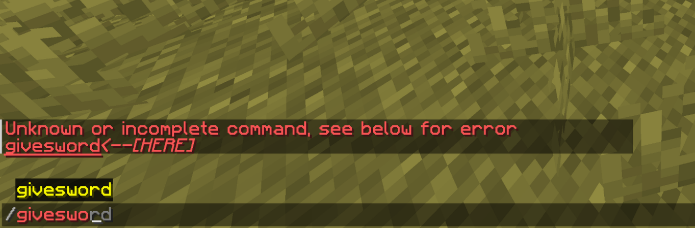
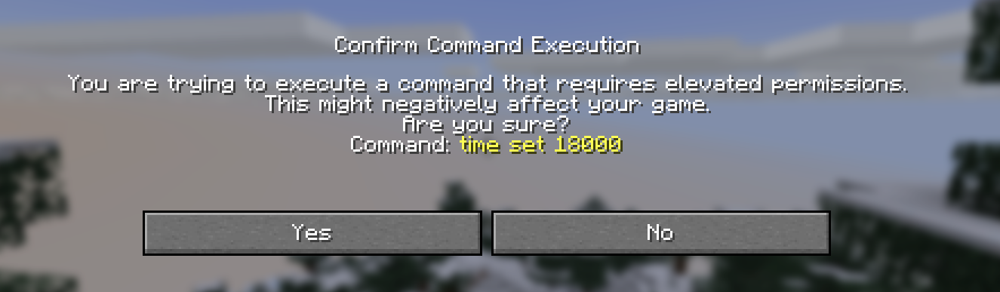
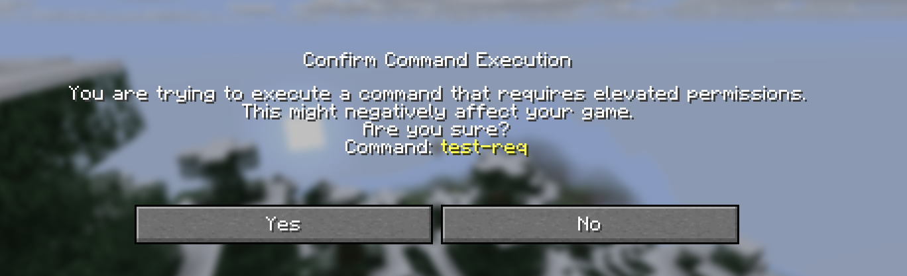

Sometimes you want to limit a player's ability to use and/or view certain commands or subcommands. Exactly for this purpose,
the `ArgumentBuilder<S>` class has a `requires(Predicate<S>)` method to define a requirement in order to use that specific branch of a command tree.
As always, the generic parameter `S` is just a `CommandSourceStack`, providing us with the executing entity, the command sender, and the location of the command.

## Defining permissions
One of the most common usecases for requirements are permissions. Usually, these are checked on the **command sender**, as that is the actual entity/console/object
which ran the command, even if it is run as someone else (the executor). A simple command with a permission might look like this:

```java
Commands.literal("testcmd")
    .requires(sender -> sender.getSender().hasPermission("permission.test"))
    .executes(ctx -> {
        ctx.getSource().getSender().sendRichMessage("<gold>You have permission to run this command!");
        return Command.SINGLE_SUCCESS;
    });
```

This command requires the `permission.test` permission to be had by a sender.
But you cannot only define permissions, you can also require a sender to be a server operator, like this:

```java
Commands.literal("testcmd")
    .requires(sender -> sender.getSender().isOp())
    .executes(ctx -> {
        ctx.getSource().getSender().sendRichMessage("<gold>You are a server operator!");
        return Command.SINGLE_SUCCESS;
    });
```

## Defining more advanced predicates
You don't have to limit yourself to checking just for permissions - since it is a predicate, any boolean can be returned. For example, you can check for whether
a player has a diamond sword in their inventory:

```java
Commands.literal("givesword")
    .requires(sender -> sender.getExecutor() instanceof Player player && !player.getInventory().contains(Material.DIAMOND_SWORD))
    .executes(ctx -> {
        if (ctx.getSource().getExecutor() instanceof Player player) {
            player.getInventory().addItem(ItemType.DIAMOND_SWORD.createItemStack());
        }

        return Command.SINGLE_SUCCESS;
    });
```

At first glance, this works just fine. But it does have a very big flaw - since the player's client is not aware of the requirement, it still shows the command
as executable, even if the requirement resolves as false. But if the client tries to run the command, the server reports that this command doesn't exist (meaning
the requirement was not met):



How can we solve this? The `Player` interface has a method called [`#updateCommands()`](jd:paper:org.bukkit.entity.Player#updateCommands()) just for this usecase. It resends the currently registered commands back to the
client in an attempt to reload commands. For now, we can create a new command with which the player can update its own commands in order to resync its command state:

```java
Commands.literal("reloadcommands")
    .executes(ctx -> {
        if (ctx.getSource().getExecutor() instanceof Player player) {
            player.updateCommands();
            player.sendRichMessage("<gold>Successfully updated your commands!");
        }

        return Command.SINGLE_SUCCESS;
    });
```

### Automating command reloads
Forcing a player to reload their own commands is not a viable option for user experience. For this reason, you can **automate** this behavior. It is safe to call
the update commands method as often as required, but it should generally be avoided as it can cost a great deal of bandwidth. If possible, you should instead place
these in very specific spots. Furthermore, this method is completely thread safe, meaning you are free to call it from an asynchronous context.

## Restricted commands
From 1.21.6 onwards, commands can now be restricted. This feature is used by Vanilla in order to make a player confirm whether they
really want to run a command from a run-command click event. That includes ones on text components or dialog buttons.
All Vanilla commands, which require operator status by default, are restricted:



### Restricting your commands
You can apply the same behavior to your commands by wrapping the predicate inside your `.requires` with `Commands.restricted(...)`.
A simple implementation might look like this:

```java
Commands.literal("test-req")
    .requires(Commands.restricted(source -> true))
    .executes(ctx -> {
        ctx.getSource().getSender().sendRichMessage("You passed!");
        return Command.SINGLE_SUCCESS;
    });
```



<br />

Inside the `.restricted` method you can put any logic which you would put into your `.requires` method.
It is nothing more but a simple wrapper around the usual `.requires` predicate:

```java
Commands.literal("mycommand")
    .requires(Commands.restricted(source -> source.getSender().hasPermission("my.custom.permission")
                                            && source.getExecutor() instanceof Player player
                                            && player.getGameMode() == GameMode.ADVENTURE))
    .executes(ctx -> {
        // Command logic
    });
```
