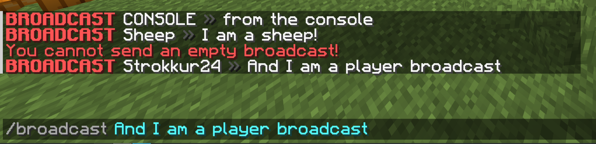

For very simple commands Paper has a way to declare Bukkit-style commands by implementing the [](jd:paper:io.papermc.paper.command.brigadier.BasicCommand) interface.

This interface has one method you have to override:
- `void execute(CommandSourceStack source, String[] args)`

And three more, optional methods which you can, but don't have to override:
- `Collection<String> suggest(CommandSourceStack source, String[] args)`
- `boolean canUse(CommandSender sender)`
- `@Nullable String permission()`

## Simple usage
Implementing the execute method, your class might look like this:
```java title="YourCommand.java"
public class YourCommand implements BasicCommand {

    @Override
    public void execute(final CommandSourceStack source, final String[] args) {

    }
}
```

With a `CommandSourceStack` you can retrieve basic information about the sender of the command, the location the command was send from,
and the entity for which the command was executed for. You can find more information on [our page on command executors](/paper/dev/command-api/basics/executors).

## The optional methods
You can freely choose whether to implement either of the mentioned, optional methods. Here is a quick overview on what which one does:

### `suggest(CommandSourceStack, String[])`
This method returns some sort of `Collection<String>` and takes in a `CommandSourceStack` and a `String[] args` as parameters. This is similar to the
`onTabComplete(CommandSender, Command, String, String[])` method of the `TabCompleter` interface, which is used for tab completion on Bukkit commands.

Each entry in the collection that you return will be send to the client to be shown as suggestions the same way as with Bukkit commands.

### `canUse(CommandSender)`
With this method, you can set up a basic `requires` structure from Brigadier commands. [You can read more on that here](/paper/dev/command-api/basics/requirements).
This method returns a `boolean`, which is required to return `true` in order for a command sender to be able to execute that command.

:::note

If you override this method, overriding `permission()` does nothing. This is because the default implementation
uses the return value of `permission()`, which wouldn't be used anymore if you were to override it.

```java title="BasicCommand.java"
default boolean canUse(final CommandSender sender) {
    final String permission = this.permission();
    return permission == null || sender.hasPermission(permission);
}
```

:::

### `permission()`
With the permission method you can, similar to the `canUse` method, set the permission required to be able to execute and view this command.

## Registering basic commands
Registering a `BasicCommand` is very simple: In your plugin's main class, you can simply call one of the
[`registerCommand(...)`](jd:paper:org.bukkit.plugin.java.JavaPlugin#registerCommand(java.lang.String,io.papermc.paper.command.brigadier.BasicCommand))
methods inside the `onEnable` method.

```java title="ExamplePlugin.java"
public final class ExamplePlugin extends JavaPlugin {

    @Override
    public void onEnable() {
        BasicCommand yourCommand = ...;
        this.registerCommand("mycommand", yourCommand);
    }
}
```

### Basic commands are functional interfaces
Because you only have to override one method, you can directly pass in a lambda expression. This is not recommended for styling
reasons, as it makes the code harder to read.

```java
@Override
public void onEnable() {
    this.registerCommand(
        "quickcmd",
        (source, args) -> source.getSender().sendRichMessage("<yellow>Hello!")
    );
}
```

## Example: Broadcast command
As an example, we can create a simple broadcast command. We start by declaring creating a class which implements `BasicCommand` and overrides `execute` and `permission`:

```java title="BroadcastCommand.java"
public class BroadcastCommand implements BasicCommand {

    @Override
    public void execute(final CommandSourceStack source, final String[] args) {

    }

    @Override
    public String permission() {
        return "example.broadcast.use";
    }
}
```

Our permission is set to `example.broadcast.use`. In order to give yourself that permission, it is suggested that you use a plugin like [LuckPerms](https://luckperms.net) or just give yourself
operator permissions. You can also set this permission to be `true` by default. For this, please check out the [plugin.yml documentation](/paper/dev/plugin-yml).

Now, in our `execute` method, we tell the sender that at least one argument is required in order to send a broadcast in case they defined no
arguments (meaning that `args` has a length of 0):

```java
if (args.length == 0) {
    source.getSender().sendRichMessage("<red>You cannot send an empty broadcast!");
    return;
}
```

Next, we can retrieve the name of the executor of that command. If we do not find one, we can just get the name of the command sender, like this:

```java
final Component name = Objects.requireNonNullElseGet(source.getExecutor(), source::getSender).name();
```

This makes sure that we cover all cases and even allow the command to work correctly with `/execute as`.

Finally, we can build our broadcast message by joining the arguments to a string and send it via `Bukkit.broadcast(Component)`:

```java
final String message = String.join(" ", args);
final Component broadcastMessage = MiniMessage.miniMessage().deserialize(
    "<red><bold>BROADCAST</red> <name> <dark_gray>»</dark_gray> <message>",
    Placeholder.component("name", name),
    Placeholder.unparsed("message", message)
);

Bukkit.broadcast(broadcastMessage);
```

And we are done! As you can see, this is a very simple way to define commands. Here is the final result of our class:

```java title="BroadcastCommand.java"
public class BroadcastCommand implements BasicCommand {

    @Override
    public void execute(final CommandSourceStack source, final String[] args) {
        if (args.length == 0) {
            source.getSender().sendRichMessage("<red>You cannot send an empty broadcast!");
            return;
        }

        final Component name = Objects.requireNonNullElseGet(source.getExecutor(), source::getSender).name();

        final String message = String.join(" ", args);
        final Component broadcastMessage = MiniMessage.miniMessage().deserialize(
            "<red><bold>BROADCAST</red> <name> <dark_gray>»</dark_gray> <message>",
            Placeholder.component("name", name),
            Placeholder.unparsed("message", message)
        );

        Bukkit.getServer().broadcast(broadcastMessage);
    }

    @Override
    public String permission() {
        return "example.broadcast.use";
    }
}
```

Registering the command looks like this:

```java
@Override
public void onEnable() {
    this.registerCommand("broadcast", new BroadcastCommand());
}
```

And this is how it looks like in-game:



### Adding suggestions
Our broadcast command works pretty well, but it is lacking on suggestions. A very common kind of suggestion for text based commands are player names.
In order to suggest player names, we can just map all online players to their name, like this:

```java
@Override
public Collection<String> suggest(final CommandSourceStack source, final String[] args) {
    return Bukkit.getOnlinePlayers().stream().map(Player::getName).toList();
}
```

This works great, but as you can see here, it will always suggest all players, regardless of user input, which can feel unnatural at times:


In order to fix this, we have to do some changes:

First, we early return what we already have in case there is no arguments, as we cannot filter by input then:

```java
if (args.length == 0) {
    return Bukkit.getOnlinePlayers().stream().map(Player::getName).toList();
}
```

After this, we can add a `filter` step to our stream, where we filter all names by whether they start with our current input, which is `args[args.length - 1]`:

```java
return Bukkit.getOnlinePlayers().stream()
    .map(Player::getName)
    .filter(name -> name.toLowerCase().startsWith(args[args.length - 1].toLowerCase()))
    .toList();
```

And we are done! As you can see, suggestions still work fine:


But when there is no player who starts with an input, it just suggests nothing:


### Final code
Here is the final code for our whole `BroadcastCommand` class, including the suggestions:

```java title="BroadcastCommand.java"
public class BroadcastCommand implements BasicCommand {

    @Override
    public void execute(final CommandSourceStack source, final String[] args) {
        if (args.length == 0) {
            source.getSender().sendRichMessage("<red>You cannot send an empty broadcast!");
            return;
        }

        final Component name = Objects.requireNonNullElseGet(source.getExecutor(), source::getSender).name();

        final String message = String.join(" ", args);
        final Component broadcastMessage = MiniMessage.miniMessage().deserialize(
            "<red><bold>BROADCAST</red> <name> <dark_gray>»</dark_gray> <message>",
            Placeholder.component("name", name),
            Placeholder.unparsed("message", message)
        );

        Bukkit.getServer().broadcast(broadcastMessage);
    }

    @Override
    public String permission() {
        return "example.broadcast.use";
    }

    @Override
    public Collection<String> suggest(final CommandSourceStack source, final String[] args) {
        if (args.length == 0) {
            return Bukkit.getOnlinePlayers().stream().map(Player::getName).toList();
        }

        return Bukkit.getOnlinePlayers().stream()
            .map(Player::getName)
            .filter(name -> name.toLowerCase().startsWith(args[args.length - 1].toLowerCase()))
            .toList();
    }
}
```
