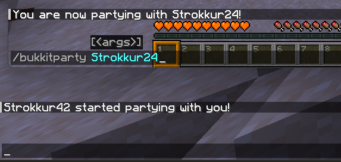
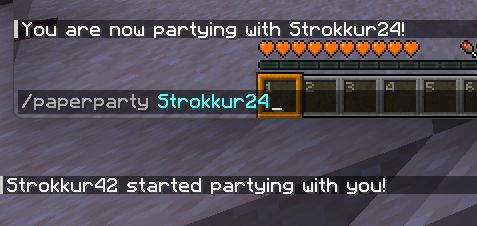

## Registering commands
### The old Bukkit way

In order to register Bukkit commands, you would define a class that extends `BukkitCommand`, and implements the `execute(...)` and `tabComplete(...)`
methods. This might look like this:
```java title="BukkitPartyCommand.java"
package your.package.name;

import org.bukkit.Bukkit;
import org.bukkit.command.CommandSender;
import org.bukkit.command.defaults.BukkitCommand;
import org.bukkit.entity.Player;
import org.jspecify.annotations.NullMarked;

import java.util.List;

@NullMarked
public class BukkitPartyCommand extends BukkitCommand {
    public BukkitPartyCommand(String name, String description, String usageMessage, List<String> aliases) {
        super(name, description, usageMessage, aliases);
    }

    @Override
    public boolean execute(CommandSender sender, String commandLabel, String[] args) {
        if (args.length == 0) {
            sender.sendPlainMessage("Please provide a player!");
            return false;
        }

        final Player targetPlayer = Bukkit.getPlayer(args[0]);
        if (targetPlayer == null) {
            sender.sendPlainMessage("Please provide a valid player!");
            return false;
        }

        targetPlayer.sendPlainMessage(sender.getName() + " started partying with you!");
        sender.sendPlainMessage("You are now partying with " + targetPlayer.getName() + "!");
        return true;
    }

    @Override
    public List<String> tabComplete(CommandSender sender, String alias, String[] args) throws IllegalArgumentException {
        if (args.length == 1) {
            return Bukkit.getOnlinePlayers().stream().map(Player::getName).toList();
        }

        return List.of();
    }
}
```

After that, you can define your command like this:

```java title="PluginClass.java"
this.getServer().getCommandMap().register(
    this.getName().toLowerCase(),
    new BukkitPartyCommand("bukkitparty", "Have a party", "/bukkitparty <player>", List.of())
);
```

As you can see, you have to do a lot of manual checking in order to register a single, very simple command. But how does
the Brigadier API do it?

### The new Paper way
First, we need to retrieve a `LiteralCommandNode<CommandSourceStack>`. That's a special Brigadier class that holds some sort of [command tree](/paper/dev/command-api/basics/command-tree).
In our case, it is the root of our command. We can do that by running `Commands.literal(final String literal)`, which returns a
`LiteralArgumentBuilder<CommandSourceStack>`, where we can define some arguments and executors. Once we are done, we can call
`LiteralArgumentBuilder#build()` to retrieve our build `LiteralCommandNode`, which we can then register. That sounds complicated at first,
but once you see it in action, it looks less terrifying:

```java title="PaperPartyCommand.java"
public static LiteralCommandNode<CommandSourceStack> createCommand(final String commandName) {
    return Commands.literal(commandName)
        .then(Commands.argument("target", ArgumentTypes.player())
            .executes(ctx -> {
                final PlayerSelectorArgumentResolver playerSelector = ctx.getArgument("target", PlayerSelectorArgumentResolver.class);
                final Player targetPlayer = playerSelector.resolve(ctx.getSource()).getFirst();
                final CommandSender sender = ctx.getSource().getSender();

                targetPlayer.sendPlainMessage(sender.getName() + " started partying with you!");
                sender.sendPlainMessage("You are now partying with " + targetPlayer.getName() + "!");

                return Command.SINGLE_SUCCESS;
            }))
        .build();
}
```

Each `.then(...)` defines a new branch in our tree, which can either be a literal (`Commands.literal(String)`) or an argument
(`Commands.argument(String, ArgumentType<T>)`). Each branch may or may not define an `.executes(Command)` executor. This is
where all the logic happens.

We will take a closer look at that in different pages, but for now, how do we register it? Paper uses a `LifecycleEventManager` system.
In a nutshell, that is a way to register commands (or tags) that get loaded each time the server reloads its resources, like using /reload.
Registering our command looks like this:
```java title="PluginClass.java"
this.getLifecycleManager().registerEventHandler(LifecycleEvents.COMMANDS, commands -> {
    commands.registrar().register(PaperPartyCommand.createCommand("paperparty"), "Have a nice party");
});
```

And we are done! As you can see here, both commands do the same thing:

<span style="display: flex;"> </span>
