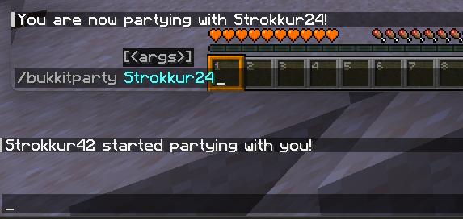
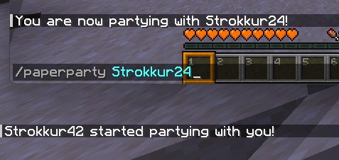

## Registering commands
### The old Bukkit way

In order to register Bukkit commands programmatically, you would define a class that extends `Command`, and implements the `execute(...)` and `tabComplete(...)`
methods. This might look like this:
```java title="BukkitPartyCommand.java"
public class BukkitPartyCommand extends Command {
    public BukkitPartyCommand(final String name, final String description, final String usageMessage, final List<String> aliases) {
        super(name, description, usageMessage, aliases);
    }

    @Override
    public boolean execute(final CommandSender sender, final String commandLabel, final String[] args) {
        if (args.length == 0) {
            sender.sendRichMessage("<red>Please provide a player!");
            return false;
        }

        final Player target = Bukkit.getPlayerExact(args[0]);
        if (target == null) {
            sender.sendRichMessage("<red>Please provide a valid player!");
            return false;
        }

        target.sendPlainMessage(sender.getName() + " started partying with you!");
        sender.sendPlainMessage("You are now partying with " + target.getName() + "!");
        return true;
    }

    @Override
    public List<String> tabComplete(final CommandSender sender, final String alias, final String[] args) throws IllegalArgumentException {
        if (args.length == 1) {
            return Bukkit.getOnlinePlayers().stream().map(Player::getName).toList();
        }

        return List.of();
    }
}
```

After that, you can define your command like this in your main class:

```java
this.getServer().getCommandMap().register(
    this.getName().toLowerCase(),
    new BukkitPartyCommand("bukkitparty", "Have a party", "/bukkitparty <player>", List.of())
);
```

As you can see, you have to do a lot of manual checking in order to register a single, very simple command. But how does
the Brigadier API do it?

### The new Paper way
First, we need to retrieve a `LiteralCommandNode<CommandSourceStack>`. That's a special Brigadier class that holds some sort of [command tree](/paper/dev/command-api/basics/command-tree).
In our case, it is the root of our command. We can do that by running `Commands.literal(String literal)`, which returns a
`LiteralArgumentBuilder<CommandSourceStack>`, where we can define some arguments and executors. Once we are done, we can call
`LiteralArgumentBuilder#build()` to retrieve our build `LiteralCommandNode`, which we can then register. That sounds complicated at first,
but once you see it in action, it looks less terrifying:

```java
public static LiteralCommandNode<CommandSourceStack> createCommand(final String commandName) {
    return Commands.literal(commandName)
        .then(Commands.argument("target", ArgumentTypes.player())
            .executes(context -> {
                final PlayerSelectorArgumentResolver resolver = context.getArgument("target", PlayerSelectorArgumentResolver.class);
                final Player target = resolver.resolve(context.getSource()).getFirst();
                final CommandSender sender = context.getSource().getSender();

                target.sendPlainMessage(sender.getName() + " started partying with you!");
                sender.sendPlainMessage("You are now partying with " + target.getName() + "!");

                return Command.SINGLE_SUCCESS;
            }))
        .build();
}
```

Each `.then(...)` defines a new branch in our tree, which can either be a literal (`Commands.literal(String)`) or an argument
(`Commands.argument(String, ArgumentType<T>)`). Each branch may or may not define an `.executes(Command)` executor. This is
where all the logic happens.

We will take a closer look at that in different pages, but for now, how do we register it? Paper uses a `LifecycleEventManager` system.
In a nutshell, that is a way to register commands (or tags) that get loaded each time the server reloads its resources, like using `/reload`.
Registering our command in the main class looks like this:
```java
this.getLifecycleManager().registerEventHandler(LifecycleEvents.COMMANDS, event -> {
    event.registrar().register(createCommand("paperparty"), "Have a nice party");
});
```

And we are done! As you can see here, both commands do the same thing:

<span style="display: flex;"> </span>
