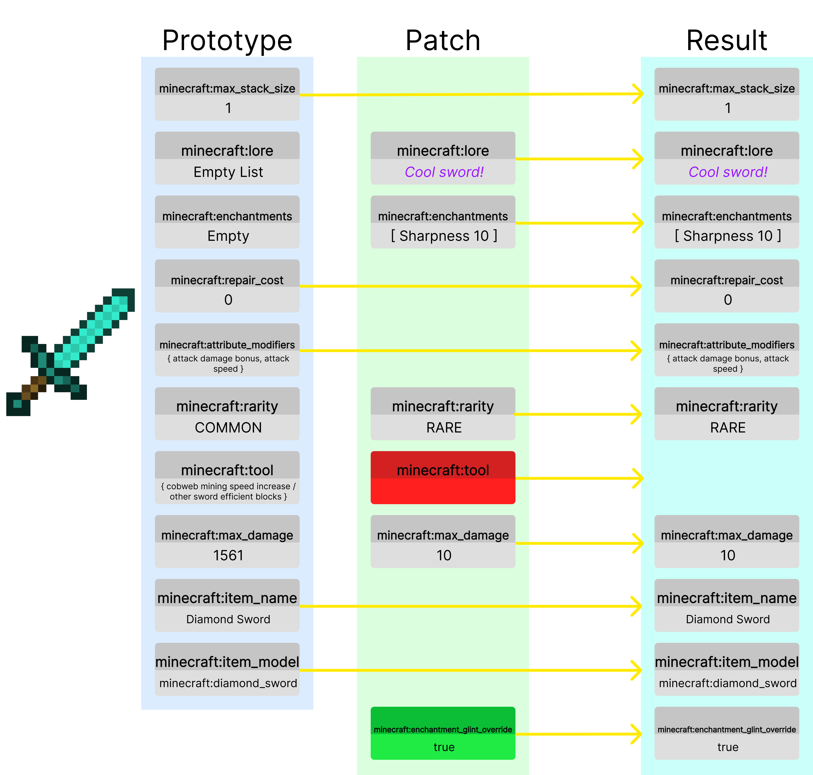

:::danger[Experimental]

The data component API is currently experimental, and is additionally subject to change across versions.

:::

The data component API provides a version-specific interface for accessing and manipulating item data that is otherwise not representable by the `ItemMeta` API.
Through this API, you can read and modify properties of an item, so called data components, in a stable and object-oriented manner.


## Introduction

### What is a data component?
A data component represents a piece of data associated with an item. Vanilla items can have properties such as custom model data, container loot contents, banner patterns, or potion effects.

### Structure

For implementation details, [click here](#example-cool-sword).

#### The prototype (default values)
Items come with an initial set of components that we call the prototype.
These components are defined on the `ItemType` of the `ItemStack`. They control the base behavior
of the item, representing a brand new item without any modifications.

The prototype gives items their initial properties such as if they are food, a tool, a weapon, etc.

#### The patch
The patch represents the modifications made to the item. This may include giving it a custom name,
modifying the enchantments, damaging it, or adding to the lore. The patch is applied ontop of the prototype,
allowing us to make modifications to an item.

The patch also allows for removing components that were previously in the prototype. This is shown by
the `minecraft:tool` example in red. We are removing this component, so this sword item will no longer
break cobweb or other sword blocks faster.

We can also add new components, as seen from the new `minecraft:enchantment_glint_override` component, which
allows us to make it appear as if it were enchanted.


## Differences compared to `ItemMeta`

The `ItemMeta` API provides methods to modify `ItemStack`s in a hierarchical manner, such as `CompassMeta`, which allows you to modify the components of a `minecraft:compass`.
While `ItemMeta` is still very useful, it does not properly represent the prototype/patch relationship that Minecraft items use.

### Key differences

#### Expanded data model
The data component API exposes a much broader and more detailed set of item properties than `ItemMeta`.
Data components allow the entire item to be modified in a fashion that better represents how Minecraft does item modifications.

#### Version-specific
The data component API is designed to adapt to version changes. The data component API may experience breaking changes on version updates as Minecraft makes changes to components.
Backwards compatibility is not promised.

Because `ItemMeta` is represented in a different format, breaking changes made to components by Mojang may not result in breaking changes to `ItemMeta`.

#### Builders and immutability
Many complex data components require a builder approach for construction and editing. All data types that are returned by the api are also immutable, so they will not directly modify the component.

#### Patch-only
`ItemMeta` only represents the patch of an `ItemStack`. This means that you cannot get the original properties (prototype) of the `ItemStack`, such as its default
durability or default attributes.

#### No snapshots
Currently, `ItemMeta` represents a **snapshot** of an `ItemStack`'s patched map.
This is expensive as it requires the entire patch to be read, even values that you may not be using.

The data component API integrates directly with `ItemStack`. Although conceptually similar, the data component API focuses on explicit, strongly typed data retrieval and updates without this additional overhead.

### When should I use `DataComponents` or `ItemMeta`?

You would want to use `ItemMeta` if you:
- Are doing only simple changes to `ItemStack`s
- Want to keep cross-version compatibility with your plugin

You would want to use data components if you:
- Want more complicated `ItemStack` modifications
- Do not care about cross-version compatibility
- Want to access default (prototype) values
- Want to remove components from an `ItemStack`'s prototype


## Basic usage
The data component API will fetch values according to the behavior seen in game. So, if the patch removes the `minecraft:tool` component,
trying to get that component will return null.

### Retrieving a prototype value

```java
// Get the default durability of diamond sword
int defaultDurability = Material.DIAMOND_SWORD.getDefaultData(DataComponentTypes.MAX_DAMAGE)
```

### Checking for a data component

```java
// Check if this item has a custom name data component
boolean hasCustomName = stack.hasData(DataComponentTypes.CUSTOM_NAME);
logger.info("Has custom name? " + hasCustomName);
```

### Reading a valued data component

```java
// The damage of an item can be null, so we require a null check
Integer damageValue = stack.getData(DataComponentTypes.DAMAGE);
if (damageValue != null) {
    logger.info("Current damage: " + damageValue);
} else {
    logger.info("This item doesn't have a damage component set.");
}

// Certain components, like the max stack size, will always be present on an item
Integer maxStackSize = stack.getData(DataComponentTypes.MAX_STACK_SIZE);
```

### Setting a valued data component

```java
// Set a custom model data value on this item
stack.setData(DataComponentTypes.CUSTOM_MODEL_DATA, CustomModelData.customModelData()
    .addFloat(0.5f)
    .addFlag(true)
    .build()
);
```

### Removing or resetting a data component

```java
// Remove an existing component (e.g. tool)
stack.unsetData(DataComponentTypes.TOOL);

// Reset a component to the default (prototype) value for its item type (e.g. max stack size)
stack.resetData(DataComponentTypes.MAX_STACK_SIZE);
```

### Non-valued data components

Some components are only flags and don't carry any sort of value:

```java
// Make the item a glider to be used like elytra (combined with the equippable component)
stack.setData(DataComponentTypes.GLIDER);

// Remove the glider flag
stack.unsetData(DataComponentTypes.GLIDER);
```

## Advanced usage with builders

Many data components have complex structures that require builders.

### Modifying prototype component values

```java
ItemStack helmet = ItemStack.of(Material.DIAMOND_HELMET);
// Get the equippable component for this item, and make it a builder.
// Note: Not all types have .toBuilder() methods
// This is the prototype value of the diamond helmet.
Equippable.Builder builder = helmet.getData(DataComponentTypes.EQUIPPABLE).toBuilder();

// Make the helmet look like netherite
// We get the prototype equippable value from NETHERITE_HELMET
builder.assetId(Material.NETHERITE_HELMET.getDefaultData(DataComponentTypes.EQUIPPABLE).assetId());
// And give it a spooky sound when putting it on
builder.equipSound(SoundEventKeys.ENTITY_GHAST_HURT);

// Set our new item
helmet.setData(DataComponentTypes.EQUIPPABLE, builder);
```
This will create a diamond helmet that looks like a netherite helmet and plays a spooky ghast sound when equipped.

### Example: Written book

```java
ItemStack book = ItemStack.of(Material.WRITTEN_BOOK);
WrittenBookContent.Builder builder = WrittenBookContent.writtenBookContent("My Book", "AuthorName");

// Add a page
builder.addPage(Component.text("This is a new page!"));

// Add a page that shows differently for people who have swear filtering on
// Players who have disabled filtering, will see "I hate Paper!", while those with filtering on will see the "I love Paper!".
builder.addFilteredPage(
    Filtered.of(Component.text("I hate Paper!"), Component.text("I love Paper!"))
);

// Change generation
builder.generation(1);

// Apply changes
book.setData(DataComponentTypes.WRITTEN_BOOK_CONTENT, builder.build());
```

### Example: Cool sword

```java
ItemStack sword = ItemStack.of(Material.DIAMOND_SWORD);
sword.setData(DataComponentTypes.LORE, ItemLore.lore().addLine(Component.text("Cool sword!")).build());
sword.setData(DataComponentTypes.ENCHANTMENTS, ItemEnchantments.itemEnchantments().add(Enchantment.SHARPNESS, 10).build());
sword.setData(DataComponentTypes.RARITY, ItemRarity.RARE);

sword.unsetData(DataComponentTypes.TOOL); // Remove the tool component

sword.setData(DataComponentTypes.MAX_DAMAGE, 10);
sword.setData(DataComponentTypes.ENCHANTMENT_GLINT_OVERRIDE, true); // Make it glow!
```

## Matching items without certain data components

When comparing items, you sometimes want to ignore certain values. For this, we can use the
[`ItemStack#matchesWithoutData`](jd:paper:org.bukkit.inventory.ItemStack#matchesWithoutData(org.bukkit.inventory.ItemStack,java.util.Set))
method.

For example, here we compare two diamond swords whilst ignoring their durability:

```java
ItemStack originalSword = ItemStack.of(Material.DIAMOND_SWORD);
ItemStack damagedSword = ItemStack.of(Material.DIAMOND_SWORD);
damagedSword.setData(DataComponentTypes.DAMAGE, 100);

boolean match = damagedSword.matchesWithoutData(originalSword, Set.of(DataComponentTypes.DAMAGE), false);
logger.info("Do the sword match? " + match); // -> true
```
