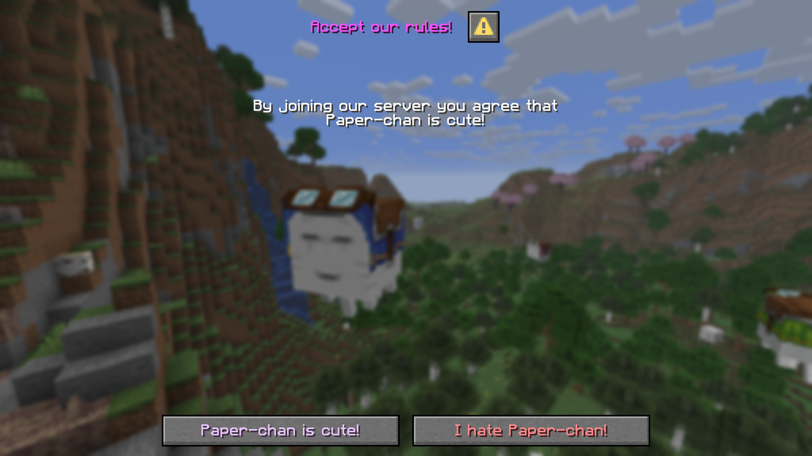
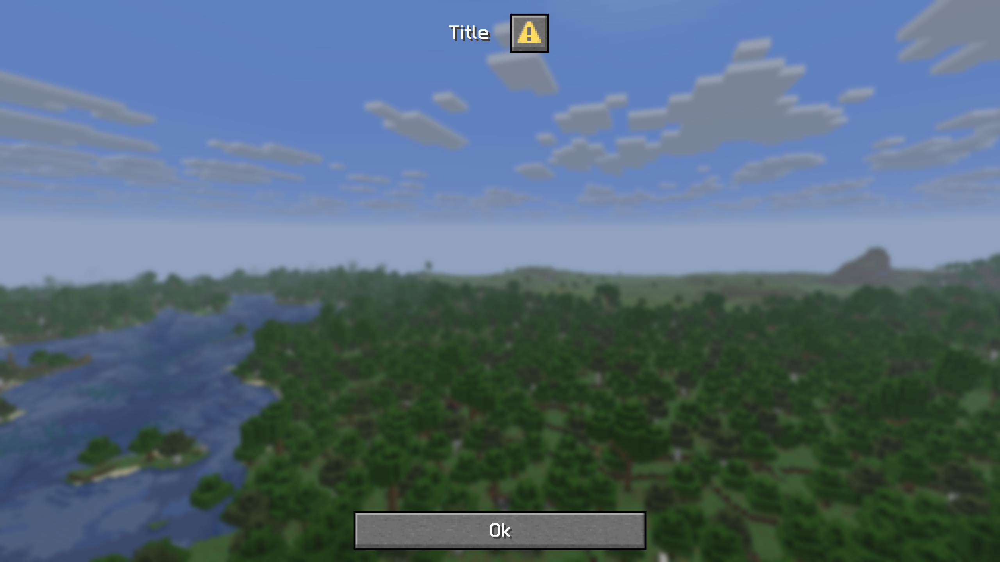

import Video from "/src/components/Video.astro";

import DialogShowcaseMp4 from "./assets/dialogs/dialog-showcase.mp4?url";
import InputDialogShowcaseMp4 from "./assets/dialogs/input-dialog-showcase.mp4?url";

:::danger[Experimental]

The dialog API is currently experimental and might change in the future.

:::

[Dialogs](https://minecraft.wiki/w/Dialog) are a feature added to Minecraft in the [1.21.6](https://minecraft.wiki/w/Java_Edition_1.21.6)
update. Paper released developer API for creating custom dialogs in 1.21.7. This section is meant
as an introduction to this API and what you can and cannot do with dialogs.

## What is a dialog?
Dialogs are a way for servers to send custom in-game menus to clients. They allow for displaying various information
or provide an easy way to gather user input.

Dialogs can be shown to players during the configuration phase or normal gameplay, which makes them a very
versatile tool. A simple dialog might look like this:



The dialog shown here is a **confirmation**-type dialog, which just means it always contains two buttons, one meant for
confirmation and one meant for refusal.

## Showing dialogs
Dialogs can be shown in-game using the `/dialog show <players> <dialog>` command. Alternatively, you can show them
using the API by using [Audience#showDialog(DialogLike)](https://jd.advntr.dev/api/latest/net/kyori/adventure/audience/Audience.html#showDialog(net.kyori.adventure.dialog.DialogLike)).
You can get built-in dialogs statically from the [`Dialog`](jd:paper:io.papermc.paper.dialog.Dialog) interface.
New dialogs can be created dynamically using [`Dialog#create`](jd:paper:io.papermc.paper.dialog.Dialog#create(java.util.function.Consumer))
or, if registered during the bootstrap phase, retrieved from the dialog registry with `RegistryAccess.registryAccess().getRegistry(RegistryKey.DIALOG).get(Key)`.

## Built-in dialogs
There are three built-in dialogs:
- [Server Links](jd:paper:io.papermc.paper.registry.keys.DialogKeys#SERVER_LINKS)
- [Quick Actions](jd:paper:io.papermc.paper.registry.keys.DialogKeys#QUICK_ACTIONS)
- [Custom Options](jd:paper:io.papermc.paper.registry.keys.DialogKeys#CUSTOM_OPTIONS)

### Adding server links
You can add server links by retrieving the [`ServerLinks`](jd:paper:org.bukkit.ServerLinks) instance from
[`Bukkit.getServer().getServerLinks()`](jd:paper:org.bukkit.Server#getServerLinks()) and using the various mutation methods.
The player can open the server links menu at any time by opening the game menu (pressing `esc`) and clicking on
the `Server Links...` button. This button only appears if server links are present.

## Creating dialogs dynamically
You can build a [`Dialog`](jd:paper:io.papermc.paper.dialog.Dialog) object using the [`Dialog#create`](jd:paper:io.papermc.paper.dialog.Dialog#create(java.util.function.Consumer))
method. The consumer parameter allows you to build the dialog. **A dialog always requires a base and a type**, which
can be declared in the builder. You can either create a new dialog or alternatively use an existing
[registry-registered](#registering-dialogs-in-the-registry) dialog as a base instead.

For reference, a very simple (notice-type) dialog can be constructed and shown to a player with the following code:

<details>
  <summary>In-game preview</summary>
  
</details>

```java
Dialog dialog = Dialog.create(builder -> builder.empty()
    .base(DialogBase.builder(Component.text("Title")).build())
    .type(DialogType.notice())
);
player.showDialog(dialog);
```

### Dialog base
You can create a dialog base using its [builder](jd:paper:io.papermc.paper.registry.data.dialog.DialogBase$Builder), which can be created
using [`DialogBase.builder(Component title)`](jd:paper:io.papermc.paper.registry.data.dialog.DialogBase#builder(net.kyori.adventure.text.Component)).
A dialog base can declare the following values:

| Builder Method                                                                                                                                                                        | Description                                            |
|---------------------------------------------------------------------------------------------------------------------------------------------------------------------------------------|--------------------------------------------------------|
| [`afterAction(DialogAfterAction)`](jd:paper:io.papermc.paper.registry.data.dialog.DialogBase$Builder#afterAction(io.papermc.paper.registry.data.dialog.DialogBase.DialogAfterAction)) | The action to take after the dialog is closed          |
| [`canCloseWithEscape(boolean)`](jd:paper:io.papermc.paper.registry.data.dialog.DialogBase$Builder#canCloseWithEscape(boolean))                                                        | Whether the dialog can be closed with the `esc` key    |
| [`externalTitle(Component)`](jd:paper:io.papermc.paper.registry.data.dialog.DialogBase$Builder#externalTitle(net.kyori.adventure.text.Component))                                     | The title to display on buttons which open this dialog |
| [`body(List<? extends DialogBody>)`](jd:paper:io.papermc.paper.registry.data.dialog.DialogBase$Builder#body(java.util.List))                                                          | The body of the dialog.                                |
| [`inputs(List<? extends DialogInput>)`](jd:paper:io.papermc.paper.registry.data.dialog.DialogBase$Builder#inputs(java.util.List))                                                     | The inputs of the dialog.                              |

#### Dialog body
A dialog can contain an arbitrary number of body components. A body entry can be created using [`DialogBody.plainMessage(Component)`](jd:paper:io.papermc.paper.registry.data.dialog.body.DialogBody#plainMessage(net.kyori.adventure.text.Component))
for displaying text or [`DialogBody.item(ItemStack)`](jd:paper:io.papermc.paper.registry.data.dialog.body.DialogBody#item(org.bukkit.inventory.ItemStack))
for displaying items.

#### Dialog input
There are four ways to gather input:

- [`DialogInput.bool`](jd:paper:io.papermc.paper.registry.data.dialog.input.DialogInput#bool(java.lang.String,net.kyori.adventure.text.Component))

   A simple tick box representing a true or false state

   

- [`DialogInput.singleOption`](jd:paper:io.papermc.paper.registry.data.dialog.input.DialogInput#singleOption(java.lang.String,net.kyori.adventure.text.Component,java.util.List))

   A multiple-choice button

   

- [`DialogInput.text`](jd:paper:io.papermc.paper.registry.data.dialog.input.DialogInput#text(java.lang.String,net.kyori.adventure.text.Component))

   A simple string input field

   

- [`DialogInput.numberRange`](jd:paper:io.papermc.paper.registry.data.dialog.input.DialogInput#numberRange(java.lang.String,net.kyori.adventure.text.Component,float,float))

   A slider for number input

   


### Dialog type
The [`DialogType`](jd:paper:io.papermc.paper.registry.data.dialog.type.DialogType) interface defines a few static
methods for the various dialog types. The following types exist:

| Type             | Method                                                                                                                                                                                                                                              | Description                                |
|------------------|-----------------------------------------------------------------------------------------------------------------------------------------------------------------------------------------------------------------------------------------------------|--------------------------------------------|
| notice           | [`notice()`](jd:paper:io.papermc.paper.registry.data.dialog.type.DialogType#notice()) or [`notice(ActionButton button)`](jd:paper:io.papermc.paper.registry.data.dialog.type.DialogType#notice(io.papermc.paper.registry.data.dialog.ActionButton)) | A simple dialog with just one button       |
| confirmation     | [`confirmation(ActionButton yesButton, ActionButton noButton)`](jd:paper:io.papermc.paper.registry.data.dialog.type.DialogType#confirmation(io.papermc.paper.registry.data.dialog.ActionButton,io.papermc.paper.registry.data.dialog.ActionButton)) | A dialog with a yes and no button          |
| dialog list      | [`dialogList(RegistrySet dialogs)`](jd:paper:io.papermc.paper.registry.data.dialog.type.DialogType#dialogList(io.papermc.paper.registry.set.RegistrySet))                                                                                           | A dialog for opening the specified dialogs |
| multiple actions | [`multiAction(List<ActionButton> actions)`](jd:paper:io.papermc.paper.registry.data.dialog.type.DialogType#multiAction(java.util.List))                                                                                                             | A dialog for displaying multiple buttons   |
| server links     | [`serverLinks(ActionButton exitAction, int columns, int buttonWidth)`](jd:paper:io.papermc.paper.registry.data.dialog.type.DialogType#serverLinks(io.papermc.paper.registry.data.dialog.ActionButton,int,int))                                      | A server links dialog                      |

The type primarily influences the bottom part of the dialog.

## Registering dialogs in the registry
If you want dialogs to be registered in the dialogs registry, you must register them inside a registry modification lifecycle
event in your plugin's bootstrapper. Some general information on that can be read [here](/paper/dev/registries).

:::tip

The advantage of registering dialogs in the registry is that it allows you to use that same dialog
elsewhere in your code without having to pass around the `Dialog` object. This also allows the dialog
to be referenced in commands with a dialog parameter.

:::

The general registration looks fairly similar to dynamically created dialogs:
```java title="YourPluginBootstrapper.java" showLineNumbers
@Override
public void bootstrap(BootstrapContext context) {
    context.getLifecycleManager().registerEventHandler(RegistryEvents.DIALOG.compose()
        .newHandler(event -> event.registry().register(
            DialogKeys.create(Key.key("papermc:custom_dialog")),
            builder -> builder
                // Build your dialog here ...
                .base(DialogBase.builder(Component.text("Title")).build())
                .type(DialogType.notice())
        )));
}
```

## Closing dialogs
Dialogs can be closed from the API. There are two ways to achieve that:

- The intended way of using [`Adventure#closeDialog()`](https://jd.advntr.dev/api/latest/net/kyori/adventure/audience/Audience.html#closeDialog()).
- The slightly hacky way of using [`Player#closeInventory()`](jd:paper:org.bukkit.entity.HumanEntity#closeInventory()).

Using `closeDialog()` will result in the dialog being closed and the player returning to the previous non-dialog or game menu screen they were on.
This means any previously open inventories will be kept open.

In contrast, `closeInventory()` will close not only the currently open dialog, but also any other screens, like an open inventory.

## Example: A blocking confirmation dialog
If you want your players to read some information, agree to something, or give general input before they join your server,
you can send them a dialog during the configuration phase. For this example, we will be creating the dialog shown at
the start.

### The dialog
The dialog is a simple confirmation-type dialog with a single plain message body components. We will register it in
the bootstrapper so that we can easily retrieve it from the `AsyncPlayerConnectionConfigureEvent`, where the dialog will
be sent from.

```java title="CustomPluginBootstrapper.java" showLineNumbers
ctx.getLifecycleManager().registerEventHandler(RegistryEvents.DIALOG.compose(),
    e -> e.registry().register(
        DialogKeys.create(Key.key("papermc:praise_paperchan")),
        builder -> builder
            .base(DialogBase.builder(Component.text("Accept our rules!", NamedTextColor.LIGHT_PURPLE))
                .canCloseWithEscape(false)
                .body(List.of(
                    DialogBody.plainMessage(Component.text("By joining our server you agree that Paper-chan is cute!"))
                ))
                .build()
            )
            .type(DialogType.confirmation(
                ActionButton.builder(Component.text("Paper-chan is cute!", TextColor.color(0xEDC7FF)))
                    .tooltip(Component.text("Click to agree!"))
                    .action(DialogAction.customClick(Key.key("papermc:paperchan/agree"), null))
                    .build(),
                ActionButton.builder(Component.text("I hate Paper-chan!", TextColor.color(0xFF8B8E)))
                    .tooltip(Component.text("Click this if you are a bad person!"))
                    .action(DialogAction.customClick(Key.key("papermc:paperchan/disagree"), null))
                    .build()
            ))
    )
);
```

Notice the `.action` methods on the confirmation `ActionButton`s. These hold a key and an optional, custom NBT payload
that will be sent from the client to the server when the player clicks one of the buttons. We use that to identify
the click event.

This example uses two separate keys for both keys, but you can also use only one and set a custom NBT payload.

### Requiring the player to agree before allowing them to join
In order to block the player from joining the server, we send them the dialog and await a response. We do
this by constructing a `CompletableFuture`, putting it into a map, and waiting until the future gets
completed, will only happen as soon the player pressed one of the two confirmation buttons of the dialog.

The code for that would look something like this:

<details>
  <summary>In-game preview</summary>
  <Video src={DialogShowcaseMp4} />
</details>

```java title="ServerJoinListener.java" showLineNumbers
@NullMarked
public class ServerJoinListener implements Listener {

    /**
     * A map for holding all currently connecting players.
     */
    private final Map<PlayerCommonConnection, CompletableFuture<Boolean>> awaitingResponse = new HashMap<>();

    @EventHandler
    void onPlayerConfigure(AsyncPlayerConnectionConfigureEvent event) {
        Dialog dialog = RegistryAccess.registryAccess().getRegistry(RegistryKey.DIALOG).get(Key.key("papermc:praise_paperchan"));
        if (dialog == null) {
            // The dialog failed to load :(
            // This would happen if the dialog could not be found in the registry by the provided key.
            // Usually that is an indicator that the used key is different from the one used to register your
            // dialog, your bootstrapper might not be registered, or an exception occurred in the bootstrap phase.
            return;
        }

        // Construct a new completable future without a task.
        CompletableFuture<Boolean> response = new CompletableFuture<>();

        // Put it into our map.
        awaitingResponse.put(event.getConnection(), response);

        // Show the connecting player the dialog.
        event.getConnection().getAudience().showDialog(dialog);

        // Wait until the future is complete. This step is necessary in order to keep the player in the configuration phase.
        if (!response.join()) {
            // If the response is false, they declined. Therefore, we kick them from the server.
            event.getConnection().disconnect(Component.text("You hate Paper-chan :(", NamedTextColor.RED));
        }

        // We clean the map to avoid unnecessary entry buildup.
        awaitingResponse.remove(event.getConnection());
    }

    /**
     * An event for handling dialog button click events.
     */
    @EventHandler
    void onHandleDialog(PlayerCustomClickEvent event) {
        Key key = event.getIdentifier();

        if (key.equals(Key.key("papermc:paperchan/disagree"))) {
            // If the identifier is the same as the disagree one, set the connection result to false.
            setConnectionJoinResult(event.getCommonConnection(), false);
        } else if (key.equals(Key.key("papermc:paperchan/agree"))) {
            // If it is the same as the agree one, set the result to true.
            setConnectionJoinResult(event.getCommonConnection(), true);
        }
    }

    /**
     * Simple utility method for setting a connection's dialog response result.
     */
    private void setConnectionJoinResult(PlayerCommonConnection connection, boolean value) {
        CompletableFuture<Boolean> future = awaitingResponse.get(connection);
        if (future != null) {
            future.complete(value);
        }
    }
}
```

And that's all there is to it. You can use this code to block players from joining your server before they should
be allowed to.

## Example: Retrieving and parsing user input
The dialog for this example will be fairly simple: We once again create a confirmation-type dialog which contains two number range inputs.
The top input will be for setting the level, the bottom input for setting the experience percentage towards the next level.
When the player clicks on the confirmation button, they should have their levels and exp set to the configured values.

```java showLineNumbers
Dialog.create(builder -> builder.empty()
    .base(DialogBase.builder(Component.text("Configure your new experience value"))
        .inputs(List.of(
            DialogInput.numberRange("level", Component.text("Level", NamedTextColor.GREEN), 0f, 100f)
                .step(1f)
                .initial(0f)
                .width(300)
                .build(),
            DialogInput.numberRange("experience", Component.text("Experience", NamedTextColor.GREEN), 0f, 100f)
                .step(1f)
                .initial(0f)
                .labelFormat("%s: %s percent to the next level")
                .width(300)
                .build()
        ))
        .build()
    )
    .type(DialogType.confirmation(
        ActionButton.create(
            Component.text("Confirm", TextColor.color(0xAEFFC1)),
            Component.text("Click to confirm your input."),
            100,
            DialogAction.customClick(Key.key("papermc:user_input/confirm"), null)
        ),
        ActionButton.create(
            Component.text("Discard", TextColor.color(0xFFA0B1)),
            Component.text("Click to discard your input."),
            100,
            null // If we set the action to null, it doesn't do anything and closes the dialog
        )
    ))
);
```

### Reading the input
To retrieve the values the user put into the dialog, we can once again listen to a `PlayerCustomClickEvent`.
We first check the identifier of the action. After that, we can retrieve the input values from the
[`DialogResponseView`](jd:paper:io.papermc.paper.dialog.DialogResponseView) retrievable from
[`PlayerCustomClickEvent#getDialogResponseView()`](jd:paper:io.papermc.paper.event.player.PlayerCustomClickEvent#getDialogResponseView()).

This view allows us to retrieve the value of an input field with the field's key. Those are declared as the first
parameter of the `DialogInput.numberRange` method.

The last issue is getting a player object from this event. We cannot just call `event.getPlayer()`. Instead, we have
to cast the connection retrievable from [`PlayerCustomClickEvent#getCommonConnection()`](jd:paper:io.papermc.paper.event.player.PlayerCustomClickEvent#getCommonConnection()).
to a [`PlayerGameConnection`](jd:paper:io.papermc.paper.connection.PlayerGameConnection), from which we can get the player.

The full event handler code looks like this:

<details>
  <summary>In-game preview</summary>
  <Video src={InputDialogShowcaseMp4} />
</details>

```java
@EventHandler
void handleLevelsDialog(PlayerCustomClickEvent event) {
    if (!event.getIdentifier().equals(Key.key("papermc:user_input/confirm"))) {
        return;
    }

    DialogResponseView view = event.getDialogResponseView();
    if (view == null) {
        return;
    }

    int levels = view.getFloat("level").intValue();
    float exp = view.getFloat("experience").floatValue();

    if (event.getCommonConnection() instanceof PlayerGameConnection conn) {
        Player player = conn.getPlayer();
        player.sendRichMessage("You selected <color:#ccfffd><level> levels</color> and <color:#ccfffd><exp>% exp</color> to the next level!",
            Placeholder.component("level", Component.text(levels)),
            Placeholder.component("exp", Component.text(exp))
        );
        player.setLevel(levels);
        player.setExp(exp / 100);
    }
}
```

### Using callbacks

Instead of registering another event handler, you can instead use the
[`DialogAction.customClick(DialogActionCallback, ClickCallback.Options)`](jd:paper:io.papermc.paper.registry.data.dialog.action.DialogAction#customClick(io.papermc.paper.registry.data.dialog.action.DialogActionCallback,net.kyori.adventure.text.event.ClickCallback.Options))
method to register a callback locally.

The code for the dialog action would therefore look like this:

```java showLineNumbers
DialogAction.customClick(
    (view, audience) -> {
        int levels = view.getFloat("level").intValue();
        float exp = view.getFloat("experience").floatValue();

        if (audience instanceof Player player) {
            player.sendRichMessage("You selected <color:#ccfffd><level> levels</color> and <color:#ccfffd><exp>% exp</color> to the next level!",
                Placeholder.component("level", Component.text(levels)),
                Placeholder.component("exp", Component.text(exp))
            );

            player.setLevel(levels);
            player.setExp(exp / 100);
        }
    },
    ClickCallback.Options.builder()
        .uses(1) // Set the number of uses for this callback. Defaults to 1
        .lifetime(ClickCallback.DEFAULT_LIFETIME) // Set the lifetime of the callback. Defaults to 12 hours
        .build()
)
```
