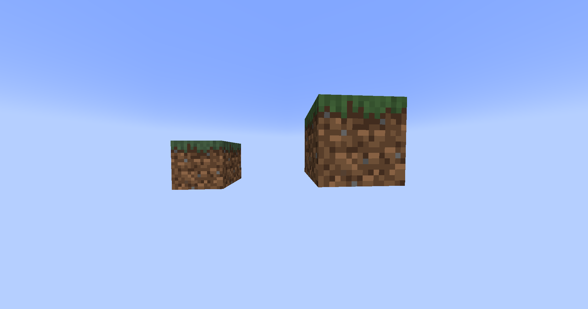
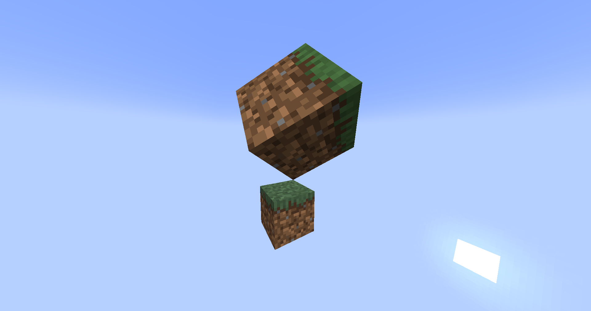
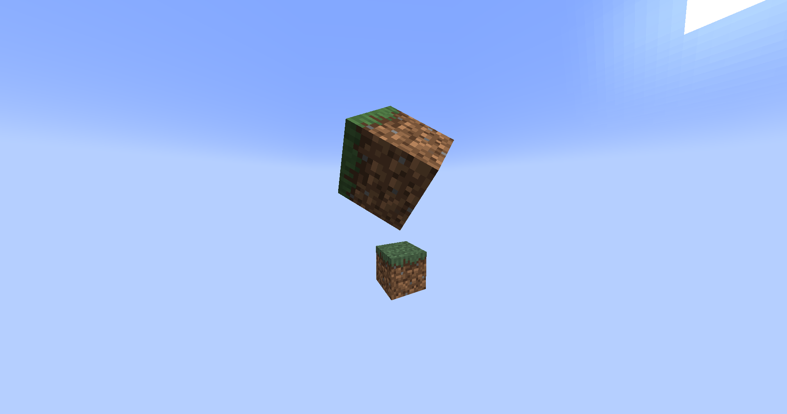
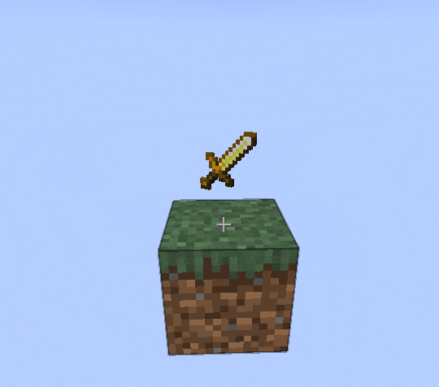

Added in 1.19.4, [display entities](https://minecraft.wiki/w/Display) are a powerful way to display
various things in the world, like blocks, items and text.

By default, these entities have no hitbox, don't move, make sounds or take damage,
making them the perfect for all kinds of applications, like holograms.

## Types

### Text

Text can be displayed via a [`TextDisplay`](jd:paper:org.bukkit.entity.TextDisplay)
entity.

```java
TextDisplay display = world.spawn(location, TextDisplay.class, entity -> {
    // customize the entity!
    entity.text(Component.text("Some awesome content", NamedTextColor.BLACK));
    entity.setBillboard(Display.Billboard.VERTICAL); // pivot only around the vertical axis
    entity.setBackgroundColor(Color.RED); // make the background red

    // see the Display and TextDisplay Javadoc, there are many more options
});
```

### Blocks

Blocks can be displayed via a [`BlockDisplay`](jd:paper:org.bukkit.entity.BlockDisplay)
entity.

```java
BlockDisplay display = world.spawn(location, BlockDisplay.class, entity -> {
    // customize the entity!
    entity.setBlock(Material.GRASS_BLOCK.createBlockData());
});
```

### Items

Items can be displayed via an [`ItemDisplay`](jd:paper:org.bukkit.entity.ItemDisplay)
entity.

Despite its name, an _item_ display can also display _blocks_, with the difference being the
position in the model - an item display has its position in the center, whereas a block display has
its position in the corner of the block (this can be seen with the hitbox debug mode - F3+B).

```java
ItemDisplay display = world.spawn(location, ItemDisplay.class, entity -> {
    // customize the entity!
    entity.setItemStack(ItemStack.of(Material.SKELETON_SKULL));
});
```

## Transformation

Displays can have an arbitrary affine transformation applied to them, allowing you to position and
warp them as you choose in 3D space.

Transformations are applied to the display in this order:

```d2
style.fill: transparent
direction: right

Translation -> "Left rotation"
"Left rotation" -> Scale
Scale -> "Right rotation"
```

:::tip[Visualizing transformations]

Use the [Transformation Visualizer](https://misode.github.io/transformation/) website to visualize
a transformation for quick prototyping!

:::

### Scale

The most basic transformation is scaling, let's take a grass block and scale it up:

```java
world.spawn(location, BlockDisplay.class, entity -> {
    entity.setBlock(Material.GRASS_BLOCK.createBlockData());
    entity.setTransformation(
        new Transformation(
                new Vector3f(), // no translation
                new AxisAngle4f(), // no left rotation
                new Vector3f(2, 2, 2), // scale up by a factor of 2 on all axes
                new AxisAngle4f() // no right rotation
        )
    );
    // or set a raw transformation matrix from JOML
    // entity.setTransformationMatrix(
    //         new Matrix4f()
    //                 .scale(2) // scale up by a factor of 2 on all axes
    // );
});
```



### Rotation

You can also rotate it, let's tip it on its corner:

```java {6, 8, 15-19}
world.spawn(location, BlockDisplay.class, entity -> {
    entity.setBlock(Material.GRASS_BLOCK.createBlockData());
    entity.setTransformation(
        new Transformation(
                new Vector3f(), // no translation
                new AxisAngle4f((float) -Math.toRadians(45), 1, 0, 0), // rotate -45 degrees on the X axis
                new Vector3f(2, 2, 2), // scale up by a factor of 2 on all axes
                new AxisAngle4f((float) Math.toRadians(45), 0, 0, 1) // rotate +45 degrees on the Z axis
        )
    );
    // or set a raw transformation matrix from JOML
    // entity.setTransformationMatrix(
    //         new Matrix4f()
    //                 .scale(2) // scale up by a factor of 2 on all axes
    //                 .rotateXYZ(
    //                         (float) Math.toRadians(360 - 45), // rotate -45 degrees on the X axis
    //                         0,
    //                         (float) Math.toRadians(45) // rotate +45 degrees on the Z axis
    //                 )
    // );
});
```



### Translation

Finally, we can also apply a translation transformation (position offset) to the display, for example:

```java {5, 14}
world.spawn(location, BlockDisplay.class, entity -> {
    entity.setBlock(Material.GRASS_BLOCK.createBlockData());
    entity.setTransformation(
        new Transformation(
                new Vector3f(0.5F, 0.5F, 0.5F), // offset by half a block on all axes
                new AxisAngle4f((float) -Math.toRadians(45), 1, 0, 0), // rotate -45 degrees on the X axis
                new Vector3f(2, 2, 2), // scale up by a factor of 2 on all axes
                new AxisAngle4f((float) Math.toRadians(45), 0, 0, 1) // rotate +45 degrees on the Z axis
        )
    );
    // or set a raw transformation matrix from JOML
    // entity.setTransformationMatrix(
    //         new Matrix4f()
    //                 .translate(0.5F, 0.5F, 0.5F) // offset by half a block on all axes
    //                 .scale(2) // scale up by a factor of 2 on all axes
    //                 .rotateXYZ(
    //                         (float) Math.toRadians(360 - 45), // rotate -45 degrees on the X axis
    //                         0,
    //                         (float) Math.toRadians(45) // rotate +45 degrees on the Z axis
    //                 )
    // );
});
```



## Interpolation

Transformations and teleports can be linearly interpolated by the client to create a smooth animation,
switching from one transformation/location to the next.

### Transformation

An example of this would be smoothly rotating a block/item/text in-place. In conjunction with the
[Scheduler API](/paper/dev/scheduler), the animation can be restarted after it's done,
making the display spin indefinitely:

```java
ItemDisplay display = location.getWorld().spawn(location, ItemDisplay.class, entity -> {
    entity.setItemStack(ItemStack.of(Material.GOLDEN_SWORD));
});

int duration = 5 * 20; // duration of half a revolution (5 * 20 ticks = 5 seconds)

Matrix4f mat = new Matrix4f().scale(0.5F); // scale to 0.5x - smaller item
Bukkit.getScheduler().runTaskTimer(plugin, task -> {
    if (!display.isValid()) { // display was removed from the world, abort task
        task.cancel();
        return;
    }

    display.setTransformationMatrix(mat.rotateY(((float) Math.toRadians(180)) + 0.1F /* prevent the client from interpolating in reverse */));
    display.setInterpolationDelay(0); // no delay to the interpolation
    display.setInterpolationDuration(duration); // set the duration of the interpolated rotation
}, 1 /* delay the initial transformation by one tick from display creation */, duration);
```

<span class="img-inline-center"></span>

### Teleportation

Similarly to the transformation interpolation, you may also want to interpolate the movement
of the entire display entity between two points.

A similar effect may be achieved using an interpolated translation, however if you change
other properties of the transformation, those too will be interpolated, which may or may not be what you want.

```java
// new position will be 10 blocks higher
Location newLocation = display.getLocation().add(0, 10, 0);

display.setTeleportDuration(20 * 2); // the movement will take 2 seconds (1 second = 20 ticks)
display.teleport(newLocation); // perform the movement
```

## Use cases

Displays have many different use cases, ranging from stationary decoration to complex animation.

A popular, simple use case is to make a decoration that's visible to only specific players,
which can be achieved using standard entity API - [`Entity#setVisibleByDefault()`](jd:paper:org.bukkit.entity.Entity#setVisibleByDefault(boolean))
and [`Player#showEntity()`](jd:paper:org.bukkit.entity.Player#showEntity(org.bukkit.plugin.Plugin,org.bukkit.entity.Entity))/
[`Player#hideEntity()`](jd:paper:org.bukkit.entity.Player#hideEntity(org.bukkit.plugin.Plugin,org.bukkit.entity.Entity)).

:::caution

If the display is only used temporarily, its persistence can be disabled with
[`Entity#setPersistent()`](jd:paper:org.bukkit.entity.Entity#setPersistent(boolean)),
meaning it will disappear when the chunk unloads.

_However, if the display is located in a chunk that never unloads, i.e. a spawn chunk, it will never
be removed, creating a resource leak. Make sure to remove the display afterward with
[`Entity#remove()`](jd:paper:org.bukkit.entity.Entity#remove())._

:::

They can also be added as passengers to entities with the
[`Entity#addPassenger()`](jd:paper:org.bukkit.entity.Entity#addPassenger(org.bukkit.entity.Entity))/
[`Entity#removePassenger()`](jd:paper:org.bukkit.entity.Entity#removePassenger(org.bukkit.entity.Entity))
methods, useful for making styled name tags!

```java
TextDisplay display = world.spawn(location, TextDisplay.class, entity -> {
    // ...

    entity.setVisibleByDefault(false); // hide it for everyone
    entity.setPersistent(false); // don't save the display, it's temporary
});

entity.addPassenger(display); // mount it on top of an entity's head
player.showEntity(plugin, display); // show it to a player
// ...
display.remove(); // done with the display
```
