import { Tabs, TabItem, Badge } from "@astrojs/starlight/components";
import NoteParticleColorPicker from "/src/components/tools/NoteParticleColorPicker.svelte";

This guide explains how to spawn different types of particles.

If the particle you're trying to spawn isn't mentioned in this guide, then it most likely has no special behavior.

There are two ways to spawn particles.
The first option is using the [`ParticleBuilder`](jd:paper:com.destroystokyo.paper.ParticleBuilder) class, which is
preferred over the `spawnParticle()` methods. It is reusable and offers improved readability and clarity. The builder also includes
the method [`receivers()`](jd:paper:com.destroystokyo.paper.ParticleBuilder#receivers()), which provides you
with greater control over receivers.

An example of spawning 14 note particles in a 4x0.4x4 cuboid:
```java
Particle.NOTE.builder()
  .location(someLocation)
  .offset(2, 0.2, 2)
  .count(14)
  .receivers(32, true)
  .spawn();
```

:::note
The use of [`ParticleBuilder.receivers(32, true)`](jd:paper:com.destroystokyo.paper.ParticleBuilder#receivers(int,boolean))
select all players in a distance of 32 blocks from the particle's location,
resulting in a sphere shape. Setting the boolean parameter to `false` would select all players in a cube.
:::

The second way is using the `spawnParticle()` methods in `World` and `Player` classes:
- [`World.spawnParticle()`](jd:paper:org.bukkit.World#spawnParticle(org.bukkit.Particle,double,double,double,int)) which spawns the particle for all players and
- [`Player.spawnParticle()`](jd:paper:org.bukkit.entity.Player#spawnParticle(org.bukkit.Particle,double,double,double,int)) which spawns the particle only for the player.

## `count` argument behavior <Badge variant="danger" text="Important" size="large" />
When spawning particles, the Minecraft client behaves differently based on the `count` argument:
- If `count = 0`, a singular particle spawns and the client uses the provided location without modification.
The offset values are multiplied by the `extra` argument and passed to the particle constructor. The way these values are
used may vary between particle types.

- If `count > 0`, the client spawns `count` number of particles. For each particle, it generates new offset
values using a Gaussian (normal) distribution, multiplies them by the `extra` argument, and passes
them to the particle constructor.

## Directional particles
This type of particle has an initial velocity when spawned.

:::note
Effective speed varies between particles.
:::

In the following example 8 `FLAME` particles are spawned in a 1x1x1 cube shape randomly. `someLocation` serves as its center.
The `extra` argument is set to 0, so the particles don't move.
<Tabs syncKey="spawn-type">
  <TabItem label="ParticleBuilder">
    ```java
    Particle.FLAME.builder()
      .location(someLocation)
      .offset(0.5, 0.5, 0.5)
      .count(8)
      .extra(0)
      .receivers(32, true)
      .spawn();
    ```
  </TabItem>
  <TabItem label="spawnParticle">
    ```java
    someWorld.spawnParticle(Particle.FLAME, someLocation, 8, 0.5, 0.5, 0.5, 0);
    ```
  </TabItem>
</Tabs>

:::caution
Leaving the `extra` parameter unset will default it to `1`, likely resulting in unexpected behavior.
:::

### Random direction
Setting the `count` parameter to anything positive will yield a random direction for the velocity as described in
[`count` argument behavior](#count-argument-behavior).

An example of spawning 6 `CRIT` particles at a location, without offset, that will move in a random direction at a moderate speed:
<Tabs syncKey="spawn-type">
  <TabItem label="ParticleBuilder">
    ```java
    Particle.CRIT.builder()
      .location(someLocation)
      .count(6)
      .extra(0.6)
      .receivers(32, true)
      .spawn();
    ```
  </TabItem>
  <TabItem label="spawnParticle">
    ```java
    someWorld.spawnParticle(Particle.CRIT, someLocation, 6, 0, 0, 0, 0.6);
    ```
  </TabItem>
</Tabs>

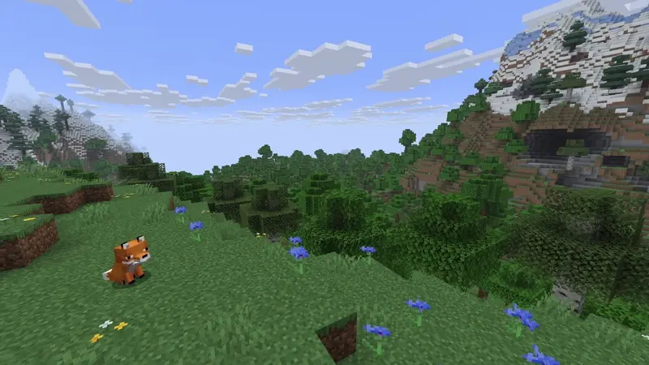

### Specified direction
To specify the velocity's direction, set the `count` argument to `0` and use the offset arguments as the direction vector.
See [`count` argument behavior](#count-argument-behavior) for more details.

An example of a repeating task spawning campfire smoke that slowly goes "up" (positive Y axis):
<Tabs syncKey="spawn-type">
  <TabItem label="ParticleBuilder">
    ```java
    ParticleBuilder particleBuilder = Particle.CAMPFIRE_SIGNAL_SMOKE.builder()
      .location(someLocation)
      .offset(0, 1, 0)
      .count(0)
      .extra(0.1);

    Bukkit.getScheduler().runTaskTimer(plugin,
      () -> particleBuilder.receivers(32, true).spawn(),
    0, 4);
    ```
  </TabItem>
  <TabItem label="spawnParticle">
    ```java
    Bukkit.getScheduler().runTaskTimer(plugin,
      () -> someWorld.spawnParticle(Particle.CAMPFIRE_SIGNAL_SMOKE, someLocation, 0, 0, 1, 0, 0.1),
      0, 4);
    ```
  </TabItem>
</Tabs>

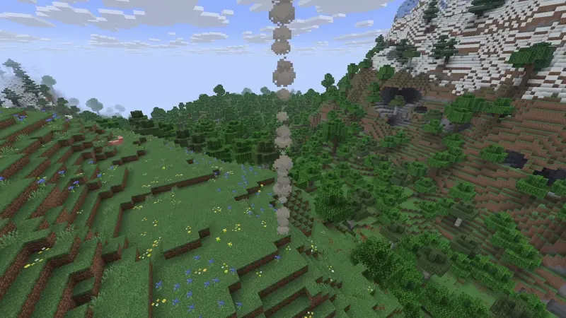

We could also make the smoke go down if we wanted to:
<Tabs syncKey="spawn-type">
  <TabItem label="ParticleBuilder">
    ```java
    ParticleBuilder particleBuilder = Particle.CAMPFIRE_SIGNAL_SMOKE.builder()
      .location(someLocation)
      .offset(0, -1, 0)
      .count(0)
      .extra(0.1);

    Bukkit.getScheduler().runTaskTimer(plugin,
      () -> particleBuilder.receivers(32, true).spawn(),
    0, 4);
    ```
  </TabItem>
  <TabItem label="spawnParticle">
    ```java
    Bukkit.getScheduler().runTaskTimer(plugin,
      () -> someWorld.spawnParticle(Particle.CAMPFIRE_SIGNAL_SMOKE, someLocation, 0, 0, -1, 0, 0.1),
      0, 4);
    ```
  </TabItem>
</Tabs>

{/* spellchecker:off */}
### List of directional particles
<details>
<summary>Show list</summary>
- BLOCK
- BUBBLE
- BUBBLE_COLUMN_UP
- BUBBLE_POP
- CAMPFIRE_COSY_SMOKE
- CAMPFIRE_SIGNAL_SMOKE
- CLOUD
- CRIT
- DAMAGE_INDICATOR
- DRAGON_BREATH
- DUST
- DUST_COLOR_TRANSITION
- DUST_PLUME
- ELECTRIC_SPARK
- ENCHANTED_HIT
- END_ROD
- FIREWORK
- FISHING
- FLAME
- FLASH
- GLOW_SQUID_INK
- ITEM
- LARGE_SMOKE
- POOF
- REVERSE_PORTAL
- SCRAPE
- SCULK_CHARGE
- SCULK_CHARGE_POP
- SCULK_SOUL
- SMALL_FLAME
- SMOKE
- SNEEZE
- SNOWFLAKE
- SOUL
- SOUL_FIRE_FLAME
- SPIT
- SQUID_INK
- TOTEM_OF_UNDYING
- TRIAL_SPAWNER_DETECTION
- TRIAL_SPAWNER_DETECTION_OMINOUS
- WAX_OFF
- WAX_ON
- WHITE_SMOKE

</details>
{/* spellchecker:on */}

## Colored particles
These particles can be colored by passing a [`Color`](jd:paper:org.bukkit.Color) object as the `data` argument.

Example of spawning 10 potion effect particles in a 2x2x2 area with a slightly translucent orange color:
<Tabs syncKey="spawn-type">
  <TabItem label="ParticleBuilder">
    ```java
    Particle.ENTITY_EFFECT.builder()
      .location(someLocation)
      .offset(1, 1, 1)
      .count(10)
      .data(Color.fromARGB(200, 255, 128, 0))
      .receivers(32, true)
      .spawn();
    ```
  </TabItem>
  <TabItem label="spawnParticle">
    ```java
    someWorld.spawnParticle(Particle.ENTITY_EFFECT, someLocation, 10, 1, 1, 1, Color.fromARGB(200, 255, 128, 0));
    ```
  </TabItem>
</Tabs>

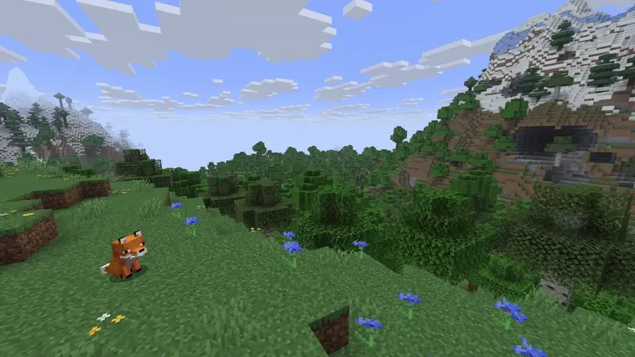

:::note
Only the `ENTITY_EFFECT` particle supports the alpha channel, which is used to create translucent particles.
:::

:::caution
While `FLASH` and `TINTED_LEAVES` particles take an ARGB color, the alpha channel is ignored.
:::

### Dust particles
Vanilla uses the dust particle for redstone particles. They can have a custom color by passing
[Particle.DustOptions](jd:paper:org.bukkit.Particle$DustOptions) as `data`.

:::note
The scale factor must be in the range of `0.01` to `4.0`. Values outside this range will be clamped to the nearest valid value.
:::

An example of creating a vertical line of blue dust particles, that are two times the regular size:
<Tabs syncKey="spawn-type">
  <TabItem label="ParticleBuilder">
    ```java
    ParticleBuilder particleBuilder = Particle.DUST.builder()
      .color(Color.BLUE, 2.0f);

    // We can reuse the builder
    for (double i = -1.0; i <= 1.0; i += 0.25) {
      particleBuilder.location(someLocation.clone().add(0, i, 0)).receivers(32, true).spawn();
    }
    ```
  </TabItem>
  <TabItem label="spawnParticle">
    ```java
    for (double i = -1.0; i <= 1.0; i += 0.25) {
      someWorld.spawnParticle(
        Particle.DUST,
        someLocation.clone().add(0, i, 0),
        1,
        new Particle.DustOptions(Color.BLUE, 2.0f)
      );
    }
    ```
  </TabItem>
</Tabs>

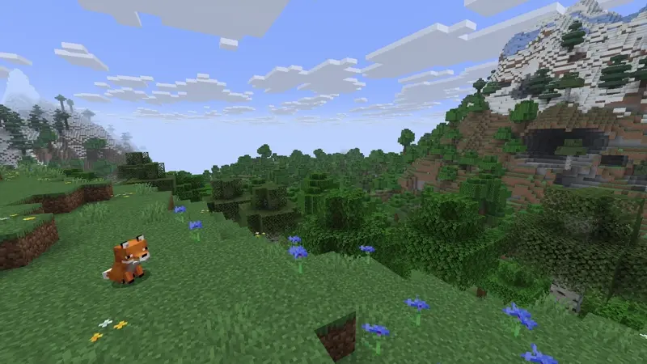

:::note
Here, adding a size argument would control the dust particle's lifetime, in ticks. By default, the value is a random
integer between 8 and 40, which is multiplied by the particle's scale, to get the final lifetime (with a minimum of 1).
:::

#### Dust transition particles
Dust transition particles work exactly like [dust particles](#dust-particles), but instead of having a static color, they **transition**
their color from one to another. A [Particle.DustTransition](jd:paper:org.bukkit.Particle$DustTransition) is used for
specifying the transition.

An example where three dust transition particles spawn on the x-axis within a 1-block length:
<Tabs syncKey="spawn-type">
  <TabItem label="ParticleBuilder">
    ```java
    Particle.DUST_COLOR_TRANSITION.builder()
      .location(someLocation)
      .offset(0.5, 0, 0)
      .count(3)
      .colorTransition(Color.RED, Color.BLUE)
      .receivers(32, true)
      .spawn();
    ```
  </TabItem>
  <TabItem label="spawnParticle">
    ```java
    someWorld.spawnParticle(
      Particle.DUST_COLOR_TRANSITION,
      someLocation,
      3,
      0.5, 0, 0,
      new Particle.DustTransition(Color.RED, Color.BLUE, 1.0f)
    );
    ```
  </TabItem>
</Tabs>

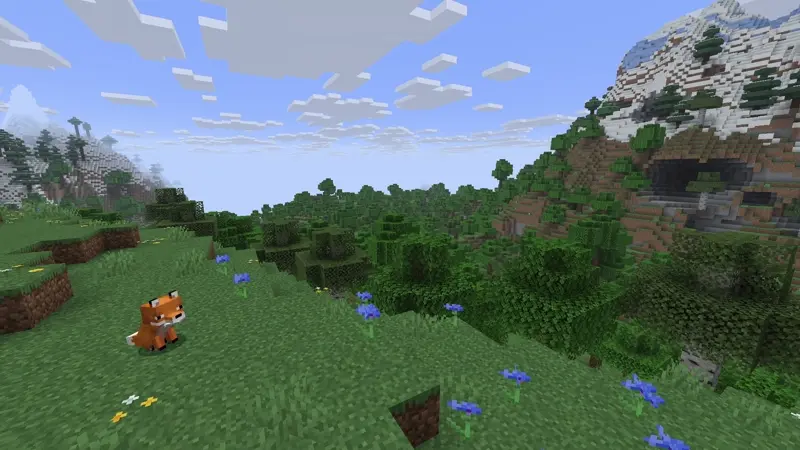

### Note particles
The note particles will use the `offsetX` argument in a custom function to determine the color,
see [Note particle color picker](#note-particle-color-picker) for more details. `offsetY` and `offsetZ` are ignored in this case.

Example:
<Tabs syncKey="spawn-type">
  <TabItem label="ParticleBuilder">
    ```java
    Particle.NOTE.builder()
      .location(someLocation)
      .offset(0.4f, 0, 0)
      .count(0)
      .receivers(32, true)
      .spawn();
    ```
  </TabItem>
  <TabItem label="spawnParticle">
    ```java
    someWorld.spawnParticle(Particle.NOTE, someLocation, 0, 0.4f, 0, 0);
    ```
  </TabItem>
</Tabs>

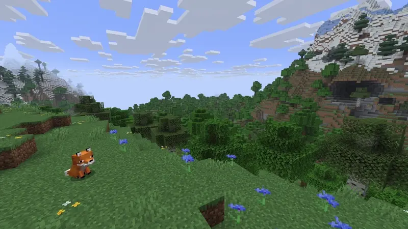

#### Note particle color picker
This tool allows you to pick a color for the note particle by adjusting the `offsetX` value. It only allows you to
choose `offsetX` values between `-1.0` and `1.0`; values outside this range will repeat the color pattern.
<NoteParticleColorPicker client:load />

:::tip
To achieve the Vanilla note particle colors you must set the offsetX to a fraction of 24.

Example:
<Tabs syncKey="spawn-type">
  <TabItem label="ParticleBuilder">
    ```java
    Particle.NOTE.builder()
      .location(someLocation)
      .offset(2.0f/24.0f, 0, 0)
      .count(0)
      .receivers(32, true)
      .spawn();
    ```
  </TabItem>
  <TabItem label="spawnParticle">
    ```java
    someWorld.spawnParticle(Particle.NOTE, someLocation, 0, 2.0f/24.0f, 0, 0);
    ```
  </TabItem>
</Tabs>
:::

### Trail particles
Trail particles require you to pass a [`Particle.Trail`](jd:paper:org.bukkit.Particle$Trail) object as `data`.

An example where eight randomly offset trail particles travel towards a specified location
(`someLocation.clone().add(-4, 0, 4)`) with a yellow color and a travel time of 40 ticks:
<Tabs syncKey="spawn-type">
  <TabItem label="ParticleBuilder">
    ```java
    Particle.TRAIL.builder()
      .location(someLocation)
      .offset(1, 1, 1)
      .count(8)
      .data(new Particle.Trail(someLocation.clone().add(-4, 0, 4), Color.YELLOW, 40))
      .receivers(32, true)
      .spawn();
    ```
  </TabItem>
  <TabItem label="spawnParticle">
    ```java
    someWorld.spawnParticle(
      Particle.TRAIL,
      someLocation,
      8,
      1, 1, 1,
      new Particle.Trail(someLocation.clone().add(-4, 0, 4), Color.YELLOW, 40)
    );
    ```
  </TabItem>
</Tabs>

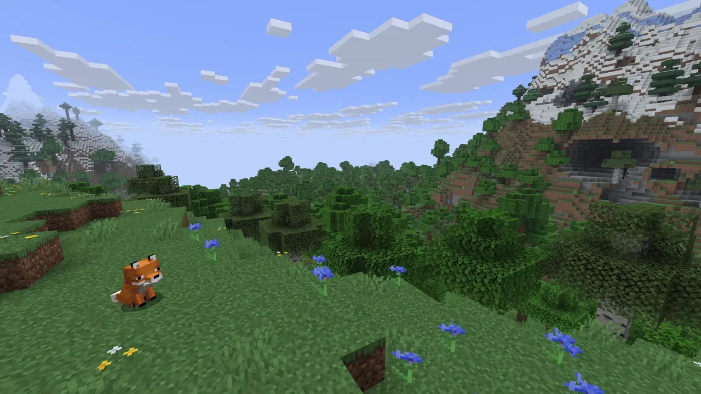

## Converging particles
As the name implies, this type of particle converges to a single point (location), which in this case is the supplied location.
Offset arguments are used to determine the relative spawn location of the particle.
The particle will then travel from this relative location to the supplied location.

An example where an enchantment particle will spawn at `someLocation.clone().add(-2, 0, 2)` and travel to `someLocation`:
<Tabs syncKey="spawn-type">
  <TabItem label="ParticleBuilder">
    ```java
    Particle.ENCHANT.builder()
      .location(someLocation)
      .offset(-2, 0, 2)
      .count(0)
      .receivers(32, true)
      .spawn();
    ```
  </TabItem>
  <TabItem label="spawnParticle">
    ```java
    someWorld.spawnParticle(Particle.ENCHANT, someLocation, 0, -2, 0, 2);
    ```
  </TabItem>
</Tabs>


:::note
There are two types of converging particles:

- **Curving**: Particles that follow a curved path to the specified location.
- **Straight**: Particles that move in a straight line to the specified location.

The `ENCHANT`, `NAUTILUS`, `PORTAL` and `VAULT_CONNECTION` particles use curved paths, while the `OMINOUS_SPAWNING` particle
travels in a straight line.
:::

### List of converging particles
<details>
<summary>Show list</summary>
- ENCHANT
- NAUTILUS
- OMINOUS_SPAWNING
- PORTAL
- VAULT_CONNECTION
</details>

## Material particles
### BlockData
To spawn particles that require `BlockData`, simply put `BlockData` as its `data` argument.

Example:
<Tabs syncKey="spawn-type">
  <TabItem label="ParticleBuilder">
    ```java
    Particle.BLOCK_CRUMBLE.builder()
      .location(someLocation)
      .count(4)
      .data(BlockType.GLOWSTONE.createBlockData())
      .receivers(32, true)
      .spawn();
    ```
  </TabItem>
  <TabItem label="spawnParticle">
    ```java
    someWorld.spawnParticle(Particle.BLOCK_CRUMBLE, someLocation, 4, BlockType.GLOWSTONE.createBlockData());
    ```
  </TabItem>
</Tabs>

:::note
This guide uses [`BlockType.createBlockData()`](jd:paper:org.bukkit.block.BlockType#createBlockData()). While using
[`Material.createBlockData()`](jd:paper:org.bukkit.Material#createBlockData()) or
[`Bukkit.createBlockData(Material)`](jd:paper:org.bukkit.Bukkit#createBlockData(org.bukkit.Material)) yields the same result,
they are considered **legacy**.
:::

:::tip
The `BLOCK` particle is a [directional particle](#directional-particles).

In this case, **velocity matters** a lot. A higher velocity will ensure the same general direction of the particle, while a lower one will
result in a more random direction.

To achieve this, the effective velocity vector's length should be high (around 10 is fine).
:::

### ItemStack
To spawn particles that require an `ItemStack`, simply put an `ItemStack` as its `data` argument.

Example:
<Tabs syncKey="spawn-type">
  <TabItem label="ParticleBuilder">
    ```java
    Particle.ITEM.builder()
      .location(someLocation)
      .count(4)
      .data(ItemStack.of(Material.DIAMOND_PICKAXE))
      .receivers(32, true)
      .spawn();
    ```
  </TabItem>
  <TabItem label="spawnParticle">
    ```java
    someWorld.spawnParticle(Particle.ITEM, someLocation, 4, ItemStack.of(Material.DIAMOND_PICKAXE));
    ```
  </TabItem>
</Tabs>

:::note
This guide uses [`ItemStack.of(Material)`](jd:paper:org.bukkit.inventory.ItemStack#of(org.bukkit.Material)). While using
[`new ItemStack(Material)`](jd:paper:org.bukkit.inventory.ItemStack) yields the same result,
it is considered **legacy**. [`ItemType.createItemStack()`](jd:paper:org.bukkit.inventory.ItemType#createItemStack())
also yields the same result, but is more likely to get removed in the future.
:::

:::tip
The `ITEM` particle is a [directional particle](#directional-particles).
:::

## Sculk particles
### Sculk charge
The `SCULK_CHARGE` particle takes a `float` as its `data` argument. This is used as the particle's "roll." Or, more formally,
the angle the particle displays at in **radians**.

Example of spawning a sculk charge particle at 45° that doesn't move:
<Tabs syncKey="spawn-type">
  <TabItem label="ParticleBuilder">
    ```java
    Particle.SCULK_CHARGE.builder()
      .location(someLocation)
      .data((float) Math.toRadians(45))
      .extra(0)
      .receivers(32, true)
      .spawn();
    ```
  </TabItem>
  <TabItem label="spawnParticle">
    ```java
    someWorld.spawnParticle(Particle.SCULK_CHARGE, someLocation, 1, 0, 0, 0, 0, (float) Math.toRadians(45));
    ```
  </TabItem>
</Tabs>

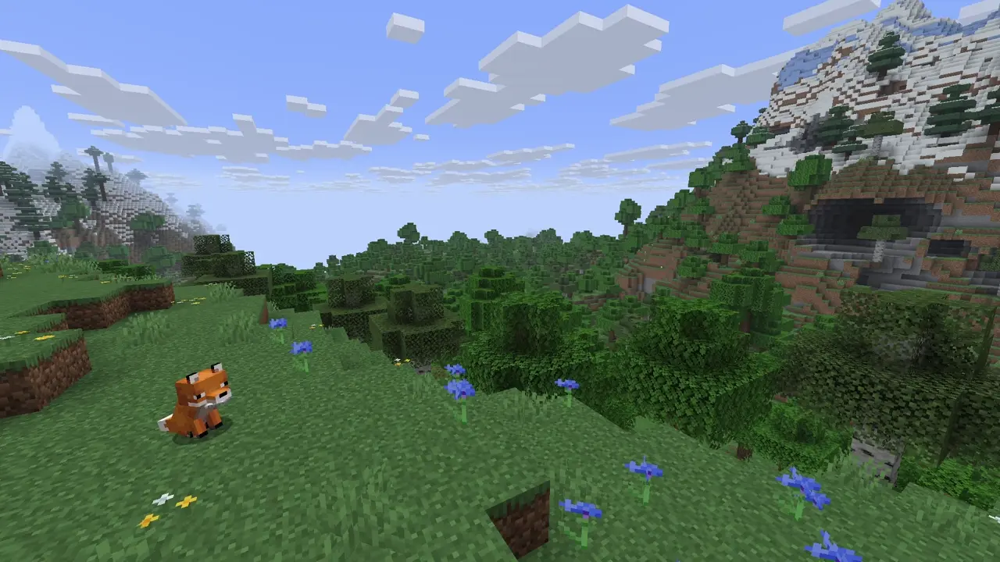

:::tip
The `SCULK_CHARGE` particle is a [directional particle](#directional-particles).
:::

### Shriek
The `SHRIEK` particle takes an `integer` as its `data` argument. This is used to set the delay **in ticks** before the particle spawns.

It is completely up to your implementation when choosing to use `data` or a scheduler.

Example where a shriek particle will spawn after one second:
<Tabs syncKey="spawn-type">
  <TabItem label="ParticleBuilder">
    ```java
    Particle.SHRIEK.builder()
      .location(someLocation)
      .data(20)
      .receivers(32, true)
      .spawn();
    ```
  </TabItem>
  <TabItem label="spawnParticle">
    ```java
    someWorld.spawnParticle(Particle.SHRIEK, someLocation, 1, 20);
    ```
  </TabItem>
</Tabs>

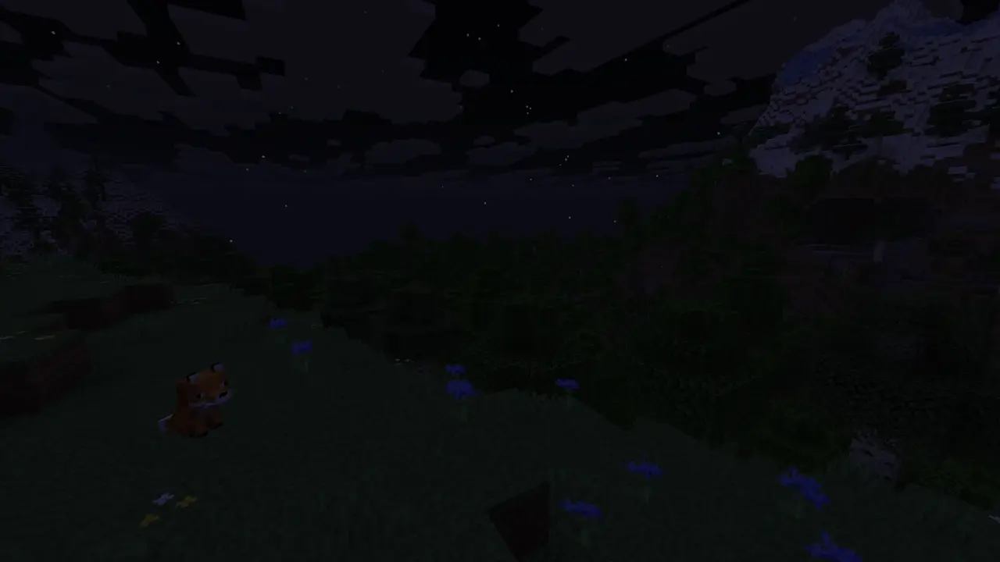

### Vibration
Vibration particles require you to pass a [`Vibration`](jd:paper:org.bukkit.Vibration) object as `data`, where you can choose between a
location ([`Vibration.Destination.BlockDestination`](jd:paper:org.bukkit.Vibration\$Destination\$BlockDestination))
or an entity target ([`Vibration.Destination.EntityDestination`](jd:paper:org.bukkit.Vibration\$Destination\$EntityDestination)).
The constructor's second argument is the travel time in **ticks**.

An example where a vibration particle will spawn at `someLocation` and travel to `otherLocation` in 40 ticks:
<Tabs syncKey="spawn-type">
  <TabItem label="ParticleBuilder">
    ```java
    Particle.VIBRATION.builder()
      .location(someLocation)
      .data(new Vibration(new Vibration.Destination.BlockDestination(otherLocation), 40))
      .receivers(32, true)
      .spawn();
    ```
  </TabItem>
  <TabItem label="spawnParticle">
    ```java
    someWorld.spawnParticle(
      Particle.VIBRATION,
      someLocation,
      1,
      new Vibration(new Vibration.Destination.BlockDestination(otherLocation), 40)
    );
    ```
  </TabItem>
</Tabs>

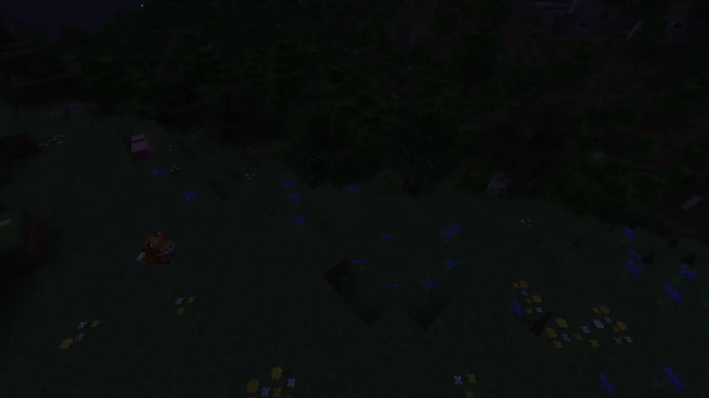

## Rising particles
These particles will use `offsetY` as the particle's y-axis velocity.

If you set `offsetX` AND `offsetZ` to `0`, the particle will have almost no x or z-axis velocity, but will still have
a y-axis velocity set by the `offsetY` argument. In both cases, `offsetX` and `offsetZ` are not used in the velocity vector.

:::caution
`EFFECT` and `INSTANT_EFFECT` are [powered particles](#powered-particles) and use [`Particle.Spell`](jd:paper:org.bukkit.Particle$Spell)
as their data. Due to the nature of rising particles' final calculated vertical velocity being very low (in range \[-0.056, 0.056\])
and how powered particles calculate the vertical velocity, the resulting vertical velocity will always be the opposite of
`power` value's sign.
:::

Example of spawning a `GLOW` particle that moves up:
<Tabs syncKey="spawn-type">
  <TabItem label="ParticleBuilder">
    ```java
    Particle.GLOW.builder()
      .location(someLocation)
      .count(0)
      .offset(0, 2, 0)
      .receivers(32, true)
      .spawn();
    ```
  </TabItem>
  <TabItem label="spawnParticle">
    ```java
    someWorld.spawnParticle(Particle.GLOW, someLocation, 0, 0, 2, 0);
    ```
  </TabItem>
</Tabs>

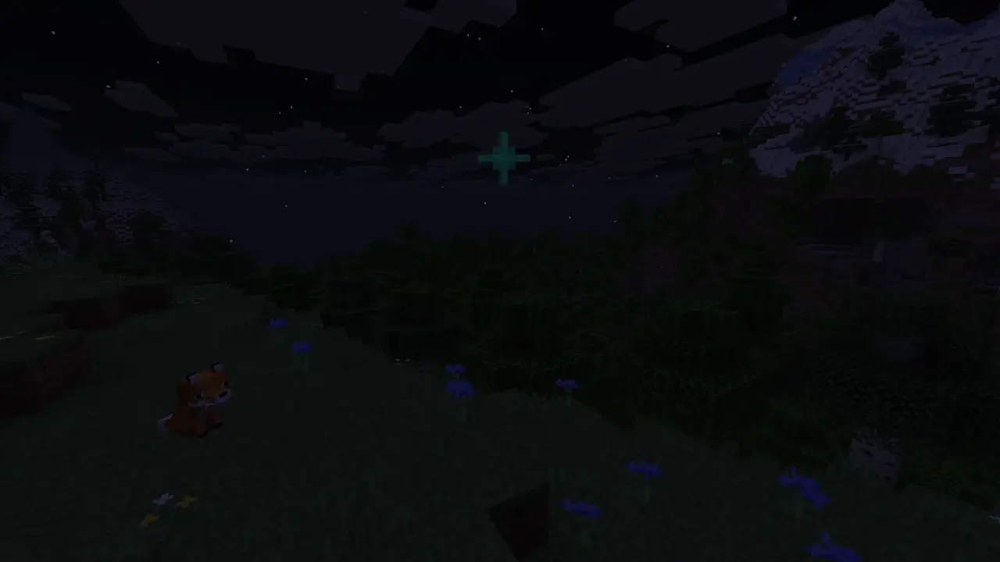

:::note
These particles rise up, meaning that the initial velocity will be used only briefly, and the particle will
start to travel up after a short time. Therefore, negative vertical velocity will only stop the particle from rising temporarily,
while a positive vertical velocity will make the particle rise immediately.
:::

### List of rising particles
<details>
  <summary>Show list</summary>
  - EFFECT
  - ENTITY_EFFECT
  - GLOW
  - INFESTED
  - INSTANT_EFFECT
  - RAID_OMEN
  - TRIAL_OMEN
  - WITCH
</details>

## Scalable particles
These particles can be scaled with `offsetX`, while `offsetY` and `offsetZ` are ignored. This chapter does not include dust particles,
those particles are covered in [Dust particles](#dust-particles) and [Dust transition particles](#dust-transition-particles) chapters.

:::note
If the final calculated scale is negative, the particle will appear mirrored.
:::

### Sweep attack particles
The `SWEEP_ATTACK` particle's scale is calculated as `1.0 - offsetX * 0.5`.

An example where two sweep attack particles will spawn at `someLocation`. First one with a scale of `1.0` and the second
one with a scale of `2.0` right after:
<Tabs syncKey="spawn-type">
  <TabItem label="ParticleBuilder">
    ```java
    ParticleBuilder sweepAttackParticleBuilder = Particle.SWEEP_ATTACK.builder()
      .location(someLocation)
      .count(0)
      .receivers(32, true)
      .spawn();

    Bukkit.getScheduler().runTaskLater(plugin,
      () -> sweepAttackParticleBuilder.offset(-2.0, 0, 0).spawn(), 10);
    ```
  </TabItem>
  <TabItem label="spawnParticle">
    ```java
    someWorld.spawnParticle(Particle.SWEEP_ATTACK, someLocation, 0);

    Bukkit.getScheduler().runTaskLater(plugin,
      () -> someWorld.spawnParticle(Particle.SWEEP_ATTACK, someLocation, 0, -2.0, 0, 0), 10);
    ```
  </TabItem>
</Tabs>

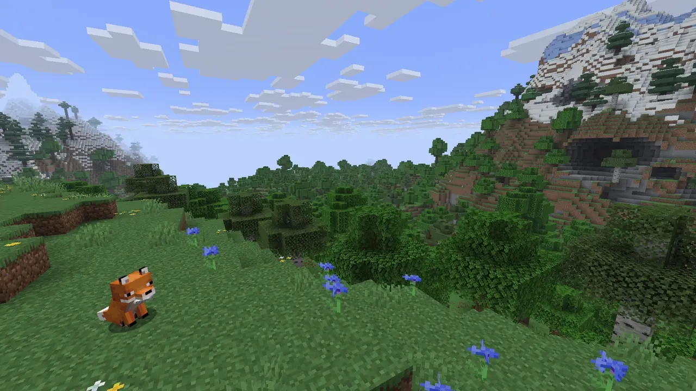

### Explosion particles
The `EXPLOSION` particle's scale is calculated as `2.0 * (1.0 - offsetX * 0.5)`.

An example where two explosion particles will spawn at `someLocation`. First one with a scale of `1.0` and the second
one with a scale of `4.0` right after:
<Tabs syncKey="spawn-type">
  <TabItem label="ParticleBuilder">
    ```java
    ParticleBuilder explosionParticleBuilder = Particle.EXPLOSION.builder()
      .location(someLocation)
      .offset(1, 0, 0)
      .count(0)
      .receivers(32, true)
      .spawn();

    Bukkit.getScheduler().runTaskLater(plugin,
      () -> explosionParticleBuilder.offset(-2.0, 0, 0).spawn(), 10);
    ```
  </TabItem>
  <TabItem label="spawnParticle">
    ```java
    someWorld.spawnParticle(Particle.EXPLOSION, someLocation, 0, 1, 0, 0);

    Bukkit.getScheduler().runTaskLater(plugin,
      () -> someWorld.spawnParticle(Particle.EXPLOSION, someLocation, 0, -2.0, 0, 0), 10);
    ```
  </TabItem>
</Tabs>

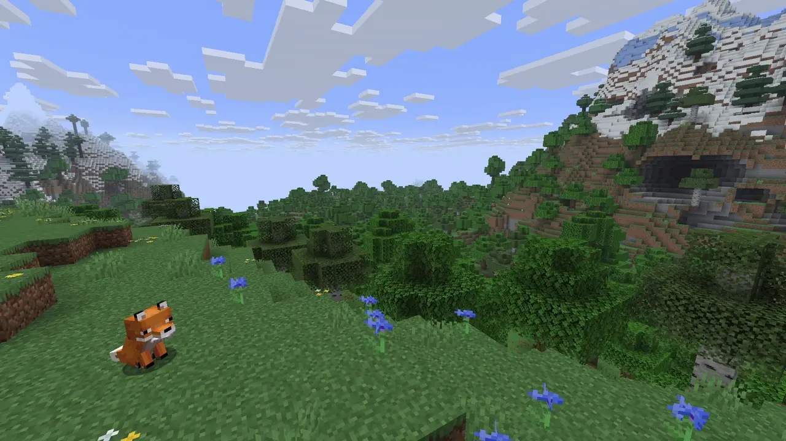

## Miscellaneous behaviors
This chapter covers particles that have unique behaviors when spawning.

### Angry villager particles
The `ANGRY_VILLAGER` particle always spawns `0.5` higher (y-axis) than the supplied location.

### Cloud particles
The `CLOUD` and `SNEEZE` particles move towards the player's y level, if they are within two blocks distance from the player's
location. When they reach the player's y level, their vertical velocity will be greatly reduced.

If the player is moving vertically, the particles will attempt to match the player's vertical velocity.

### Damage indicator particles
The `DAMAGE_INDICATOR` particle adds `1.0` to the provided `offsetY`.

### Dust pillar particles
The `DUST_PILLAR` particle uses `offsetY` for the y-axis velocity, while `offsetX` and `offsetZ` are ignored.

### Dust plume particles
The `DUST_PLUME` particle adds `0.15` to the provided `offsetY`.

### Firefly particles
The `FIREFLY` particle uses `offsetY` as the particle's initial y-axis velocity, however, there is 50% chance for the `offsetY`'s
sign to be inverted. This means that the particle will either move up or down, with equal probability.

### Powered particles
The powered particles multiply the particle's velocity vector by the supplied argument.
:::note
The y component of the vector is calculated as `(verticalVelocity - 0.1) * power + 0.1`.
:::

#### List of powered particles
- EFFECT
- INSTANT_EFFECT
- DRAGON_BREATH

### Splash particles
The `SPLASH` particle uses the `offsetX` and `offsetZ` arguments to determine the particle's velocity vector, if two conditions are met:
1. `offsetY` is `0`
2. Either `offsetX` or `offsetZ` are not `0`
