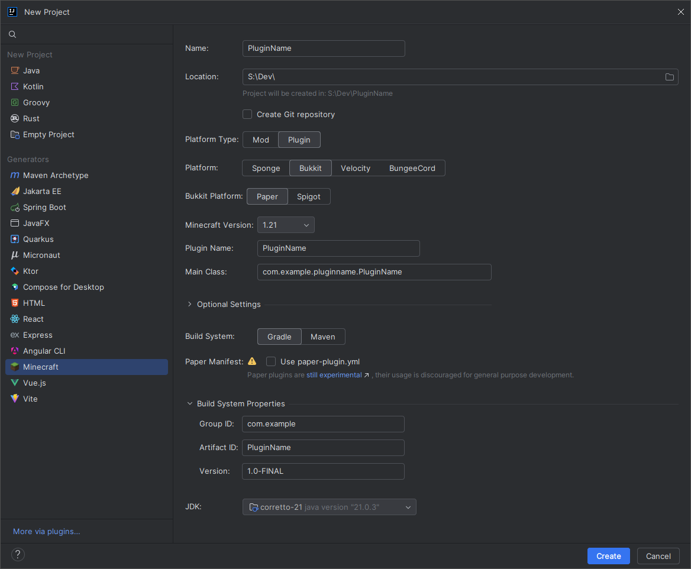

import { FileTree, Tabs, TabItem } from "@astrojs/starlight/components";

As the Paper team primarily uses [IntelliJ IDEA](https://www.jetbrains.com/idea/), this guide will be focused on that IDE.
However, the steps below should apply to other IDEs as well, with some minor changes.

The Paper team uses [Gradle](https://gradle.org/) as its build system, and its tools are implemented for Gradle.
Most of the code below can be altered to work with other build systems, such as Maven, but this guide will only cover Gradle.

Follow the guide [here](https://docs.gradle.org/current/userguide/migrating_from_maven.html) to learn how to migrate from Maven to Gradle.

## Creating a new project

Open your IDE and select the option to create a new project.
In IntelliJ, you will get the option to select the type of project you want to create - select `New Project`.
Select `Gradle - Kotlin DSL` and click `Create`.

You will land into the `build.gradle.kts` file where you can add your dependencies.

### Adding Paper as a dependency

To add Paper as a dependency, you will need to add the Paper repository to your `build.gradle.kts` or `pom.xml` file as well as the dependency itself.

<Tabs syncKey="build-system">
  <TabItem label="Gradle (Kotlin)">
    ```kotlin title="build.gradle.kts" replace
    repositories {
      maven {
        name = "papermc"
        url = uri("https://repo.papermc.io/repository/maven-public/")
      }
    }

    dependencies {
      compileOnly("io.papermc.paper:paper-api:\{LATEST_PAPER_RELEASE}-R0.1-SNAPSHOT")
    }

    java {
      toolchain.languageVersion.set(JavaLanguageVersion.of(21))
    }
    ```
  </TabItem>
  <TabItem label="Gradle (Groovy)">
    ```groovy title="build.gradle" replace
    repositories {
      maven {
        name = 'papermc'
        url = 'https://repo.papermc.io/repository/maven-public/'
      }
    }

    dependencies {
      compileOnly 'io.papermc.paper:paper-api:\{LATEST_PAPER_RELEASE}-R0.1-SNAPSHOT'
    }
    ```
  </TabItem>
  <TabItem label="Maven">
    ```xml title="pom.xml" replace
    <project>
      <repositories>
        <repository>
          <id>papermc</id>
          <url>https://repo.papermc.io/repository/maven-public/</url>
        </repository>
      </repositories>

      <dependencies>
        <dependency>
          <groupId>io.papermc.paper</groupId>
          <artifactId>paper-api</artifactId>
          <version>\{LATEST_PAPER_RELEASE}-R0.1-SNAPSHOT</version>
          <scope>provided</scope>
        </dependency>
      </dependencies>
    </project>
    ```
  </TabItem>
</Tabs>

### Setting up the `src` directory

:::note

If your IDE creates a `src` directory automatically, you can skip this step.

:::

To set up the `src` directory, you will need to create a new directory called `src` and then create a new directory called `main` inside of it.
Inside of `main`, create two new directories called `java` and `resources`.

It should look like this:

<FileTree>
  - example-plugin/
    - build.gradle.kts
    - settings.gradle.kts
    - src/
      - main/
        - java/
        - resources/
</FileTree>

### Setting up the `java` directory

You will place your Java source files in the `java` directory. You first need to create some packages to organize your code.
For this example, we will create three packages called `io.papermc.testplugin` and then create a class called `ExamplePlugin` inside of it.

<FileTree>
  - example-plugin/
    - build.gradle.kts
    - settings.gradle.kts
    - src/
      - main/
        - java/
          - io/
            - papermc/
              - testplugin/
                - ExamplePlugin.java
        - resources/
</FileTree>

### Packages

You can see here that the `ExamplePlugin` class is inside the `io.papermc.testplugin` package.
A package is a way to organize your code - essentially, it's a folder. Java packages are used to group related classes.
Oracle has a guide on [packages](https://docs.oracle.com/javase/tutorial/java/package/packages.html) if you want to learn more.

When [naming](https://docs.oracle.com/javase/tutorial/java/package/namingpkgs.html) your packages, you should use your domain name in reverse order. For example, if your domain name is `papermc.io`,
your package name should be `io.papermc`. If you do not have a domain name, you could use something like your GitHub username.
If you were Linus Torvalds, your package would be `io.github.torvalds`.

This is then followed by the name of your project.
For example, if your project was called `ExamplePlugin`, your package would be `io.github.torvalds.exampleplugin`.
This allows for a unique package name for every plugin.

### The _main_ class

The main class is the entry point to your plugin and will be the only class that extends
[`JavaPlugin`](jd:paper:org.bukkit.plugin.java.JavaPlugin) in your plugin.
This is an example of what your `ExamplePlugin` class could look like:

```java title="ExamplePlugin.java"
package io.papermc.testplugin;

import net.kyori.adventure.text.Component;
import org.bukkit.Bukkit;
import org.bukkit.event.EventHandler;
import org.bukkit.event.Listener;
import org.bukkit.event.player.PlayerJoinEvent;
import org.bukkit.plugin.java.JavaPlugin;

public class ExamplePlugin extends JavaPlugin implements Listener {
  @Override
  public void onEnable() {
    Bukkit.getPluginManager().registerEvents(this, this);
  }

  @EventHandler
  public void onPlayerJoin(PlayerJoinEvent event) {
    event.getPlayer().sendMessage(Component.text("Hello, " + event.getPlayer().getName() + "!"));
  }
}
```

### Setting up the `resources`

The `resources` directory is where you will place your plugin's `plugin.yml` file. See the [Plugin YML](/paper/dev/plugin-yml) page for more information.

## Using the Minecraft Development IntelliJ plugin

Alternatively, you can use the [Minecraft Development IntelliJ plugin](https://plugins.jetbrains.com/plugin/8327-minecraft-development)
to create a new project.

:::note

This tutorial only works with IntelliJ IDEA. If you are using another IDE, please follow the manual project setup guide described above.

:::

### Installing the Minecraft Development plugin
The first thing you need to do is install the [Minecraft Development](https://plugins.jetbrains.com/plugin/8327-minecraft-development) plugin.
You can do this by going to `File > Settings > Plugins` and searching for `Minecraft Development` under the `Marketplace` section.


Once you have installed the plugin, you will need to restart IntelliJ.
To do that you can click the `Restart IDE` button that appears after installing the plugin.


### Creating a new project
Once you have installed the plugin, you can create a new project by going to `File > New > Project...` and selecting `Minecraft` from the list of options.



You will be asked to provide some information about your project.

| Field                 | Explanation                                                                                                                                                                                                                                                          |
|-----------------------|----------------------------------------------------------------------------------------------------------------------------------------------------------------------------------------------------------------------------------------------------------------------|
| **Name**              | The name of your project.                                                                                                                                                                                                                                            |
| **Location**          | The location of your project. This is where the project files will be stored.                                                                                                                                                                                        |
| **Platform Type**     | The platform type you are developing for. This should be `Plugin`.                                                                                                                                                                                                   |
| **Platform**          | The platform you are developing for. This should be `Paper`.                                                                                                                                                                                                         |
| **Minecraft Version** | The version of Minecraft you are developing for.                                                                                                                                                                                                                     |
| **Plugin Name**       | The name of your plugin.                                                                                                                                                                                                                                             |
| **Main Class**        | The main class of your plugin. This should be the class that extends `JavaPlugin`.                                                                                                                                                                                   |
| **Optional Settings** | Here you can define things like authors, website, description, etc. These are optional and not required for the plugin to work.                                                                                                                                      |
| **Build System**      | The build system you want to use. Paper recommends using Gradle but you can use Maven if you prefer.                                                                                                                                                                 |
| **Paper Manifest**    | Whether you want to use the new Paper plugins or not. For now this is not recommended as it is still in development.                                                                                                                                                 |
| **Group ID**          | The group ID of your project. This is used for Maven and Gradle. This is usually your domain name in reverse. If you don't know what you should put here, you can use something like `io.github.<yourname>` or if you don't have GitHub you can use `me.<yourname>`. |
| **Artifact ID**       | The artifact ID of your project. This is used for Maven and Gradle. This is usually the name of your project. This is usually the same as the `Name` field.                                                                                                          |
| **Version**           | The version of your project. This is used for Maven and Gradle. This is usually `1.0-SNAPSHOT` and does not really matter for now.                                                                                                                                   |
| **JDK**               | The JDK you want to use. This can be anything from Java 21 and above.                                                                                                                                                                                                |

Now you can click on the `Create` button and IntelliJ will create the project for you.
If everything went well, you should see something like this:


## Plugin remapping

As of 1.20.5, Paper ships with a Mojang-mapped runtime instead of reobfuscating the server to Spigot mappings.
If you are using Spigot/Bukkit plugins, your plugin will be assumed to be Spigot-mapped.
This means that the server will have to deobfuscate and remap the plugin JAR when it's loaded for the first time.

:::note

`paperweight-userdev` already sets this attribute automatically. For more information see the [userdev](/paper/dev/userdev) documentation.

:::

### Mojang mappings

To tell the server that your plugin is Mojang-mapped, you need to add the following code to your build script:

:::note[Paper plugins]

If you are using Paper plugins, this step is not needed as plugins will be assumed to be Mojang-mapped.

:::

<Tabs syncKey="build-system">
  <TabItem label="Gradle (Kotlin)">
    ```kotlin title="build.gradle.kts"
    tasks.jar {
      manifest {
        attributes["paperweight-mappings-namespace"] = "mojang"
      }
    }
    // if you have shadowJar configured
    tasks.shadowJar {
      manifest {
        attributes["paperweight-mappings-namespace"] = "mojang"
      }
    }
    ```
  </TabItem>
  <TabItem label="Gradle (Groovy)">
    ```groovy title="build.gradle"
    jar {
      manifest {
        attributes(
          'paperweight-mappings-namespace': 'mojang'
        )
      }
    }
    // if you have shadowJar configured
    shadowJar {
      manifest {
        attributes(
          'paperweight-mappings-namespace': 'mojang'
        )
      }
    }
    ```
  </TabItem>
  <TabItem label="Maven">
    ```xml title="pom.xml"
    <plugin>
      <groupId>org.apache.maven.plugins</groupId>
      <artifactId>maven-jar-plugin</artifactId>
      <version>3.4.1</version>
      <configuration>
        <archive>
          <manifestEntries>
            <paperweight-mappings-namespace>mojang</paperweight-mappings-namespace>
          </manifestEntries>
        </archive>
      </configuration>
    </plugin>
    ```
  </TabItem>
</Tabs>

### Spigot mappings

If you explicitly want to tell the server that your plugin is Spigot-mapped, you need to add the following code to your build script:

<Tabs syncKey="build-system">
  <TabItem label="Gradle (Kotlin)">
    ```kotlin title="build.gradle.kts"
    tasks.jar {
      manifest {
        attributes["paperweight-mappings-namespace"] = "spigot"
      }
    }
    // if you have shadowJar configured
    tasks.shadowJar {
      manifest {
        attributes["paperweight-mappings-namespace"] = "spigot"
      }
    }
    ```
  </TabItem>
  <TabItem label="Gradle (Groovy)">
    ```groovy title="build.gradle"
    jar {
      manifest {
        attributes(
          'paperweight-mappings-namespace': 'spigot'
        )
      }
    }
    // if you have shadowJar configured
    shadowJar {
      manifest {
        attributes(
          'paperweight-mappings-namespace': 'spigot'
        )
      }
    }
    ```
  </TabItem>
  <TabItem label="Maven">
    ```xml title="pom.xml"
    <plugin>
      <groupId>org.apache.maven.plugins</groupId>
      <artifactId>maven-jar-plugin</artifactId>
      <version>3.4.1</version>
      <configuration>
        <archive>
          <manifestEntries>
            <paperweight-mappings-namespace>spigot</paperweight-mappings-namespace>
          </manifestEntries>
        </archive>
      </configuration>
    </plugin>
    ```
  </TabItem>
</Tabs>

## Conclusion

You should now have a project set up with Paper as a dependency.
All you have left to do now is to compile your plugin and run it on a Paper server.

:::note

If you want to streamline the process of testing a plugin, you can use the [Run-Task](https://github.com/jpenilla/run-task) Gradle plugin.
It will automatically download a Paper server and run it for you.

:::

:::note

If you are using IntelliJ, you can use the Gradle GUI `Build` menu to compile your plugin - found on the top right of your IDE.
The output JAR of your plugin will be in the `build/libs` directory.

:::
