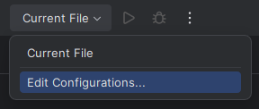
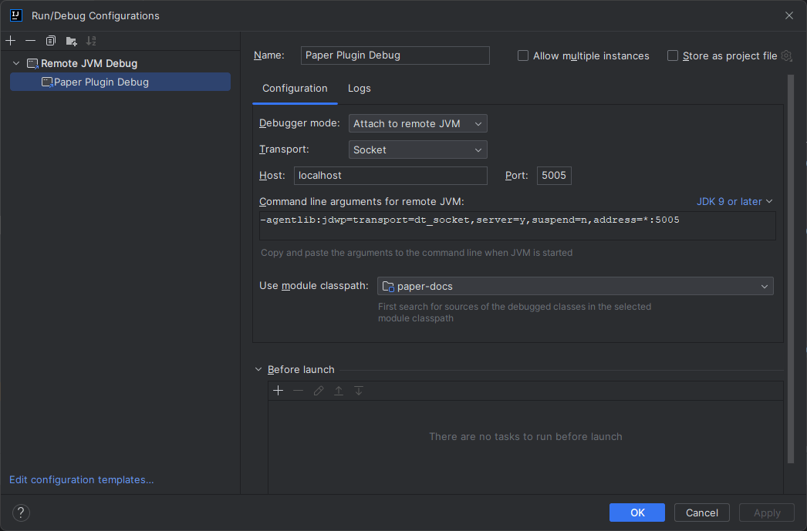
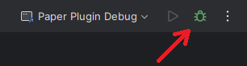
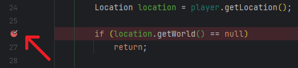
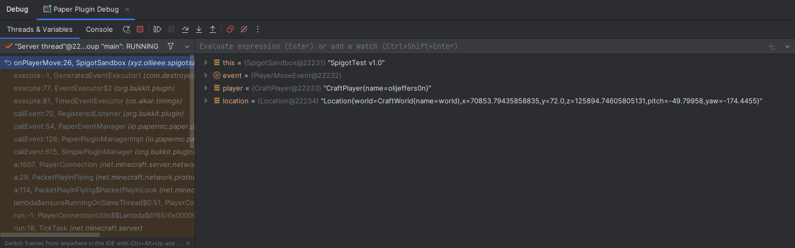

Debugging your plugin is vital to being able to fix bugs and issues in your plugin. This page will cover some of the most common debugging techniques.

## Printing to the console

One of the most common debugging techniques is to print to the console. This is likely something you've done before, as it's very simple.
This has a few downsides, though. It can be hard to find the print statements in the console, and it can be hard to remove them all when you're done debugging. Most notably, you have to recompile your plugin and restart the server to add or remove debugging.

When debugging, you can use `System.out.println("");` to print to the console. It is recommended to use your plugin's logger instead though,
as it will be easier to know which plugin the log has come from. This can be done simply with:

```java
plugin.getComponentLogger().debug(Component.text("SuperDuperBad Thing has happened"));
```

:::note[Logger Levels]

In some consoles, using the `warning` level will print the message in different colors.
This can be useful for finding your print statements in the console.

:::

## Using a remote debugger

A debugger is a tool that allows you to pause your code at a certain point and inspect the values of variables.
This can be very useful for finding out why your code isn't working as expected and also for finding out where your code is going wrong.

### Setting up the debugger

To use a debugger, you need to set up your IDE to use it. This is different for each IDE, but for the sake of this guide, we will be using IntelliJ IDEA.

To set up a debugger in IntelliJ, you need to create a new run configuration.
You can do this by clicking the dropdown next to the run button and clicking `Edit Configurations...`:



Then, click the `+` button in the top left and select `Remote JVM Debug`. You can then name the configuration whatever you want, and click `Apply`:



Finally, copy the command line arguments from the window, and paste these into your server's startup script.
These will go after the `java` command and before `-jar`. Once you have done this, you can click `OK`. For example:

```shell replace
java -agentlib:jdwp=transport=dt_socket,server=y,suspend=n,address=*:5005 -jar paper-\{LATEST_PAPER_RELEASE}.jar nogui
```

Once your server is running, you can use the bug icon in the top right to connect your debugger to the server:



#### Using the debugger

Let's say we have this code:

```java
@EventHandler
public void onPlayerMove(PlayerMoveEvent event) {
  Player player = event.getPlayer();
  Location location = player.getLocation();

  if (location.getWorld() == null)
    return;

  if (location.getWorld().getEnvironment() == World.Environment.NETHER) {
    player.sendMessage("You are in the nether!");
  }
}
```

You can add a breakpoint to the line by clicking on the line number:



This will pause the code when it reaches that line. You can then use the debugger to inspect the values of variables:



You can inspect the values of each of the variables in the current scope.
You can also use the buttons in the top to step from one breakpoint to the next.
If needed, you can also use the text box at the top to evaluate expressions for debugging purposes.

### Using direct debugging

Direct debugging will allow you to run the server directly from your IDE, and will allow you to use breakpoints and step through your code.
We can achieve this by using [JPenilla's Gradle plugin](https://github.com/jpenilla/run-task) to run the server directly from the IDE.
See [here](https://github.com/jpenilla/run-task#basic-usage) for instructions on how to set up the plugin.
