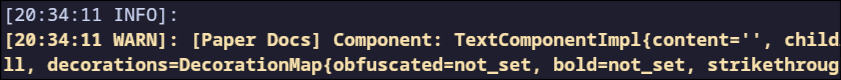

Adding proper logging to your plugin can help both yourself and users of your plugin to find bugs and issues quickly.
This page serves as a general overview on the different types of loggers you can use in your plugin, when to use
each type, and other tips and tricks!

## Different types of loggers

Paper plugins (through their main class, the class extending [`JavaPlugin`](jd:paper:org.bukkit.plugin.java.JavaPlugin))
have direct access to three different types of logger classes.

### The java.util logger

The [`java.util.logging.Logger`](jd:java:java.util.Logger) (accessible via
[`JavaPlugin#getLogger()`](jd:paper:org.bukkit.plugin.java.JavaPlugin#getLogger())),
commonly referred to as the **java.util logger**, is a simple Java built-in logger class. It allows for standard
level-based logging, as well as a way to log exception stacktraces directly.

Example usage:
```java
@Override
public void onEnable() {
  int id = loadDatabaseId();
  try {
    getLogger().info("Starting database load for id = %d".formatted(id));
    initDatabase(id);
  } catch (SQLException e) {
    getLogger().log(Level.SEVERE, "Failed to init database", e);
  }
}
```

### The SLF4J logger

[SLF4J](https://slf4j.org/) is a "Simple Logging Facade for Java" that serves as an abstraction for multiple logging
frameworks to implement. You can obtain a SLF4J [`Logger`](jd:slf4j:org.slf4j.Logger) instance via the
[`JavaPlugin#getSLF4JLogger()`](jd:paper:org.bukkit.plugin.java.JavaPlugin#getSLF4JLogger()) method.

SLF4J also allows for level-based logging, however it provides a nicer interface for parameterized logging
(log messages with parameters) and better usability when printing exception stacktraces. It additionally supports
markers, which can be very useful for advanced logging setups.

Example usage:
```java
@Override
public void onEnable() {
  int id = loadDatabaseId();
  try {
    getSLF4JLogger().info("Starting database load for id = {}", id);
    initDatabase(id);
  } catch (SQLException e) {
    getSLF4JLogger().error("Failed to init database", e);
  }
}
```

The SLF4J logger is generally shorter and easier to use than the java.util logger.

### The component logger

Adventure's [`ComponentLogger`](jd:adventure:net.kyori.adventure.text.logger.slf4j:net.kyori.adventure.text.logger.slf4j.ComponentLogger)
is an extension of the SLF4J logger (meaning it inherits all of its features) which additionally provides support
for printing [`Component`](jd:adventure:net.kyori.adventure.text.Component)s directly. This includes support for colored
log output in supported environments. An instance of it can be retrieved via the
[`JavaPlugin#getComponentLogger()`](jd:paper:org.bukkit.plugin.java.JavaPlugin#getComponentLogger())
method.

Example usage:
```java
@Override
public void onEnable() {
  int id = loadDatabaseId();
  try {
    getComponentLogger().info(
      MiniMessage.miniMessage().deserialize("Starting database load for <red>id<gray> = <aqua>{}</red>"),
      id
    );
    initDatabase(id);
  } catch (SQLException e) {
    getComponentLogger().error("Failed to init database", e);
  }
}
```

The component logger is the only way you can properly out components to console. The following code fragment
would yield the below console output:

```java
Component output = constructComponent();
getComponentLogger().warn("Component: {}", output);
```


Whereas the java.util or regular SLF4J logger would simply call `#toString()` on the component,
resulting in basically unusable output:



### Other

:::danger[System.out.println()]

Paper **strongly** advises against using `System.out.println()` calls in your code. This includes calls such as
`Exception#printStackTrace()`. You should always prefer to use a proper logger for more fine-grained control over
your logging level and output.

:::

:::caution[JavaPlugin#getLog4JLogger()]

This method has been deprecated. You should prefer to use the [SLF4J logger](#the-slf4j-logger) instead.

:::

## Which logger should you use?

Nowadays, the overall recommendation is to use the [SLF4J logger](#the-slf4j-logger), as it is the simplest, most
feature-complete logger. The [component logger](#the-component-logger) should be used if you frequently interact
with and may need to log Adventure components.
