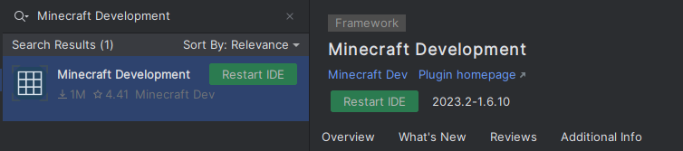

import { Tabs, TabItem } from "@astrojs/starlight/components";
import { LATEST_VELOCITY_RELEASE } from "/src/utils/versions";

It is very simple to create a plugin for Velocity. This section will teach you how to set up your
IDE, your plugin identifiers, and give you an introduction to the basics of the Velocity API.

## Before you continue...

You will need proficiency in the Java programming language. If you don't know Java yet, we strongly
recommend you learn some basic Java before you continue.

## Set up your environment

You're going to need the [JDK](/misc/java-install) and an IDE. If you don't have an IDE, IntelliJ
IDEA is recommended.

## Creating the project in your IDE

- Open your IDE
- Click `Create New Project` or the equivalent
- Select either `Gradle` or `Maven`
- Make sure your **Project JDK** is Java 17 or later
- **Finish** the dialog and open the project.

Now we have created our project, we need configure our build system.

## I know how to do this. Give me what I need!

### Maven repository

| Name      | URL                                                |
|-----------|----------------------------------------------------|
| `papermc` | `https://repo.papermc.io/repository/maven-public/` |

### Dependency

| Group ID              | Artifact ID    | Version                   |
|-----------------------|----------------|---------------------------|
| `com.velocitypowered` | `velocity-api` | {LATEST_VELOCITY_RELEASE} |

### Javadocs

Javadocs are available at [jd.papermc.io](jd:velocity).

## Set up your build system

You will need to set up a build system before you continue. While it is possible to write Velocity
plugins without one, having a build system will make your life a lot less difficult.

How to set up a build system is outside the scope of this page, but you can look at your build
system's documentation ([Gradle](https://docs.gradle.org/current/userguide/userguide.html) or
[Maven](https://maven.apache.org/guides/getting-started/index.html)) for assistance.

### Setting up the dependency

<Tabs syncKey="build-system">
  <TabItem label="Gradle (Kotlin)">
    ```kotlin title="build.gradle.kts" replace
    repositories {
      maven {
        name = "papermc"
        url = uri("https://repo.papermc.io/repository/maven-public/")
      }
    }

    dependencies {
      compileOnly("com.velocitypowered:velocity-api:\{LATEST_VELOCITY_RELEASE}")
      annotationProcessor("com.velocitypowered:velocity-api:\{LATEST_VELOCITY_RELEASE}")
    }
    ```
  </TabItem>
  <TabItem label="Gradle (Groovy)">
    ```groovy title="build.gradle" replace
    repositories {
      maven {
        name = 'papermc'
        url = 'https://repo.papermc.io/repository/maven-public/'
      }
    }

    dependencies {
      compileOnly 'com.velocitypowered:velocity-api:\{LATEST_VELOCITY_RELEASE}'
      annotationProcessor 'com.velocitypowered:velocity-api:\{LATEST_VELOCITY_RELEASE}'
    }
    ```
  </TabItem>
  <TabItem label="Maven">
    ```xml title="pom.xml" replace
    <project>
      <repositories>
        <repository>
          <id>papermc</id>
          <url>https://repo.papermc.io/repository/maven-public/</url>
        </repository>
      </repositories>

      <dependencies>
        <dependency>
          <groupId>com.velocitypowered</groupId>
          <artifactId>velocity-api</artifactId>
          <version>\{LATEST_VELOCITY_RELEASE}</version>
          <scope>provided</scope>
        </dependency>
      </dependencies>
    </project>
    ```
  </TabItem>
</Tabs>

## Using the Minecraft Development IntelliJ plugin

Alternatively, you can use the [Minecraft Development IntelliJ plugin](https://plugins.jetbrains.com/plugin/8327-minecraft-development)
to create a new project. To do that you need to install the plugin first.

:::note

This tutorial only works with IntelliJ IDEA. If you are using another IDE, please follow the manual project setup guide described above.

:::

### Installing the Minecraft Development plugin

The first thing you need to do is install the [Minecraft Development](https://plugins.jetbrains.com/plugin/8327-minecraft-development) plugin.
You can do this by going to `File > Settings > Plugins` and searching for `Minecraft Development` under the `Marketplace` section.


Once you have installed the plugin, you will need to restart IntelliJ.
To do that you can click the `Restart IDE` button that appears after installing the plugin.



### Creating a new project

Now that you have installed the plugin, you can create a new project by going to `File > New > Project...` and selecting `Minecraft` from the list of options.

### Setting up a Velocity project


You will be asked to provide some information about your project.

| Field                | Explanation                                                                                                                                                                                                                                                               |
|----------------------|---------------------------------------------------------------------------------------------------------------------------------------------------------------------------------------------------------------------------------------------------------------------------|
| **Name**             | The name of your project.                                                                                                                                                                                                                                                 |
| **Location**         | The location of your project. This is where the project files will be stored.                                                                                                                                                                                             |
| **Platform Type**    | The platform type you are developing for. This should be `Plugin`.                                                                                                                                                                                                        |
| **Platform**         | The platform you are developing for. This should be `Velocity`.                                                                                                                                                                                                           |
| **Velocity Version** | The version of Velocity you are developing for.                                                                                                                                                                                                                           |
| **Plugin Id**        | The id of your plugin.                                                                                                                                                                                                                                                    |
| **Plugin Name**      | The name of your plugin.                                                                                                                                                                                                                                                  |
| **Main Class**       | The main class of your plugin. This class should have the `@Plugin` annotation.                                                                                                                                                                                           |
| **Optional Setting** | Here you can define things like authors, website, description, etc. These are optional and not required for the plugin to work.                                                                                                                                           |
| **Build System**     | The build system you want to use. Paper recommends using Gradle but you can use Maven if you prefer.                                                                                                                                                                      |
| **Group ID**         | The group ID of your project. This is used for Maven and Gradle. This is usually your domain name in reverse. If you don't know what you should put here, you can use something like `io.github.<yourname>` or if you don't have GitHub you can just use `me.<yourname>`. |
| **Artifact ID**      | The artifact ID of your project. This is used for Maven and Gradle. This is usually the name of your project. This is usually the same as the `Name` field.                                                                                                               |
| **Version**          | The version of your project. This is used for Maven and Gradle. This is usually `1.0-SNAPSHOT` and does not really matter for now.                                                                                                                                        |
| **JDK**              | The JDK you want to use. This can be anything from Java 17 and above.                                                                                                                                                                                                     |

Now you can click on the `Create` button and IntelliJ will create the project for you.
If everything went well, you should see something like this:


## Conclusion

You should now have a project set up with Velocity as a dependency.
All you have left to do now is to compile your plugin and run it on a Velocity server.

:::note

If you want to streamline the process of testing a plugin, you can use the [Run-Task](https://github.com/jpenilla/run-task) Gradle plugin.
It will automatically download a Velocity server and run it for you.

:::

:::note

If you are using IntelliJ, you can use the Gradle GUI `Build` menu to compile your plugin - found on the top right of your IDE.
The output JAR of your plugin will be in the `build/libs` directory.

:::
